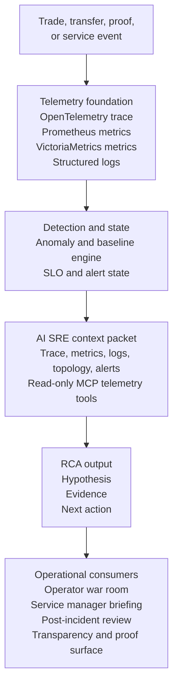
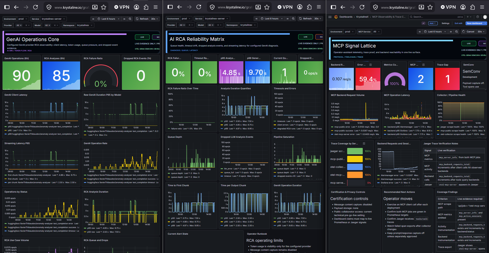

# Krystaline Observability Lab

Status: Public  
Audience: contributors, observability experts, SRE leaders, service managers, technical reviewers  
Classification: Public-safe overview

**Open-source crypto and DeFi observability lab for OpenTelemetry, AI SRE, proof systems, and service-manager operations.**

Krystaline Observability Lab is the public expression of the Krystaline thesis:
financial infrastructure should be traceable, measurable, explainable, and
verifiable before it asks anyone to trust it.

The lab uses realistic exchange and DeFi workflows as the stress test. Orders,
wallet updates, market-data paths, proof generation, queues, alerts, and service
health all become observable product signals. A trade-like flow can be captured
in a distributed trace, evaluated by statistical anomaly detection, summarized
by an AI SRE layer, correlated by Bayesian inference, and connected to
zero-knowledge proof concepts.

Krystaline Core is the private research and product-acceleration platform. This
repository shows the public architecture, operating model, demo experience, and
open implementation pieces without exposing private Core internals.

Some runtime identifiers still use legacy names such as `krystalinex`, `kx-*`,
or `kx_*` while public-facing prose moves to **Krystaline** and **Krystaline
Observability Lab**. See [Brand Positioning](docs/BRAND_POSITIONING.md) for the
naming policy.

**Live lab:** [krystaline.io](https://www.krystaline.io)  
**License:** [Apache-2.0](LICENSE)

## Quick Links

| Destination | Use it for |
|---|---|
| [Live Lab](https://www.krystaline.io) | Public demo environment. |
| [GenAI Observability Solution](docs/GENAI_OBSERVABILITY_SOLUTION.md) | AI SRE thesis, service-manager use case, Core/public boundaries. |
| [Demo Walkthrough](docs/product/03_DEMO_WALKTHROUGH.md) | Guided 15-minute product tour. |
| [Getting Started](docs/GETTING_STARTED.md) | Local setup, repo map, and useful commands. |
| [Architecture](docs/architecture/01_ARCHITECTURE.md) | System design, data flow, and service interactions. |
| [Public Documentation Catalog](docs/PUBLIC_DOCUMENTS.md) | Public-safe document map and disclosure boundaries. |

## Status Legend

This README follows the same evidence language as the GenAI observability
document. It separates what is public, what exists in Core, and what is still a
roadmap item.

| Tag | Meaning |
|---|---|
| `[PUBLIC]` | Present in this open repository, the public docs, or the public lab narrative. |
| `[CORE]` | Implemented in Krystaline Core or internal/live operational assets, but not fully published here. |
| `[BACKLOG]` | Planned or designed, but not yet a shipped public capability. |
| `[ASPIRATIONAL]` | Strategic direction. Do not market as shipped. |
| `[NON-GOAL]` | Deliberately not the product direction. |

## Executive Summary

Krystaline is not "AI on top of dashboards." The architecture starts with
observable facts: OpenTelemetry traces, Prometheus metrics, Loki logs, Jaeger
trace reconstruction, Alertmanager state, service topology, SLO context, and
proof status.

The GenAI layer turns those facts into operational understanding. It does not
replace deterministic alerting or SRE judgement. It compresses the slowest part
of incident response: moving from "an alert fired" to "this is the likely
failure mode, this is the blast radius, this is the evidence, and this is the
next action to validate."

For service managers, the value is a clearer answer to the question they keep
asking platform teams:

> Tell me what is happening to my service, what customer or business promise is
> at risk, why you believe that, and what action should happen next.

For observability experts, Krystaline is an opinionated reference architecture
for AI-assisted operations that keeps traceability, auditability, deterministic
paging, and human authority at the center.

## One-Page Visual



The strongest version of this system is evidence-backed at every layer. GenAI
is not the foundation. It is the translation layer that turns telemetry into an
operational explanation people can act on.

## Capability Status Map

| Capability | Status | Evidence / note |
|---|---|---|
| OpenTelemetry-first exchange flows | `[PUBLIC]` | Public docs describe trace-first trade, anomaly, and proof workflows. |
| Distributed trace context over RabbitMQ | `[PUBLIC]` | Trace context is propagated through message headers for trade-path reconstruction. |
| Unified observability dashboard | `[PUBLIC]` | Grafana dashboard assets, validation scripts, and monitoring docs live in this repo. |
| Statistical anomaly detection | `[PUBLIC]` | Welford-based baselines and severity classification are documented and implemented. |
| LLM-powered RCA metrics | `[PUBLIC]` | Public repo includes `kx_llm_analysis_total`, `kx_llm_analysis_duration_seconds`, `kx_llm_queue_depth`, and related dashboard panels. |
| Bayesian root-cause inference | `[PUBLIC]` | Python/PyMC Bayesian service and TypeScript orchestration are present in the repo. |
| Public proof APIs | `[PUBLIC]` | Public routes expose trade proof, verification, solvency, and proof-stat endpoints. |
| Dedicated GenAI dashboard pack | `[CORE]` | Core contains GenAI Operations Core, AI RCA Reliability Matrix, and MCP Signal Lattice dashboards. |
| Trace-centric RCA context builder | `[CORE]` | Core enriches alerts with traces, metrics, logs, topology, SLOs, and incident context. |
| Operator war-room assistant card | `[BACKLOG]` | Designed as the next service-manager workflow layer. |
| Human-approved remediation actions | `[ASPIRATIONAL]` | Requires a separate approved-actions interface and audit controls. |
| Replacing deterministic paging with AI | `[NON-GOAL]` | Alertmanager, GoAlert, and SLO rules remain the paging system of record. |

## Evidence Snapshot

| Signal | Current public story |
|---|---|
| Distributed traces | 17+ spans per trade-like flow with W3C context propagation. |
| Anomaly detection | 168 hourly buckets using Welford's online algorithm and adaptive thresholds. |
| AI diagnosis | Local-first Llama 3.2:1B RCA path with LoRA fine-tuning narrative and streaming structured analysis. |
| Bayesian inference | Hierarchical PyMC service for uncertainty-aware root-cause ranking. |
| Alerting | Prometheus and Alertmanager rules routed through GoAlert, ntfy, and email paths. |
| Self-healing | Deterministic escalation ladder for feed recovery and Kubernetes restart behavior. |
| Cryptographic proof | zk-SNARK trade integrity and solvency-proof concepts connected to traces. |
| Test posture | 940+ automated tests referenced across the public product and readiness docs. |
| Infrastructure | Docker Compose for local development; Helm and Kubernetes assets for deployed environments. |

## Thesis

Crypto and DeFi systems are a brutal proving ground for observability because
technical behavior and business trust are inseparable. A slow matching path is
not just latency. A stale price feed is not just an integration issue. A missing
trace is not just a telemetry gap. Each can become a question about fairness,
solvency, market integrity, customer funds, or regulatory evidence.

Krystaline treats observability as a product capability:

- Every important flow should have a traceable lifecycle.
- Every material service should expose health, latency, dependency, and SLO context.
- Every alert should be explainable with evidence.
- Every AI-generated answer should show its work.
- Every public trust claim should be backed by telemetry, proof, or both.

That is the "Proof of Observability" thesis: telemetry is not only an internal
operations tool. It can become part of how a financial platform earns trust.

## Service-Manager Operational Control

The flagship GenAI use case is not a chatbot. It is a service-manager operating
surface.

| Service manager demand | Krystaline answer |
|---|---|
| "Is my service healthy right now?" | Combine SLO state, active alerts, anomaly baselines, and dependency health. |
| "Is this my service or a downstream dependency?" | Use traces and topology to separate local failure from dependency impact. |
| "What customer or business flow is affected?" | Map degradation to order intake, matching, settlement, wallet, proof, or transparency workflows. |
| "What changed?" | Place anomalies in time and support deploy, dependency, and alert correlation when available. |
| "What should I tell leadership?" | Produce a concise incident summary with impact, evidence, and current mitigation state. |
| "Can I trust the recommendation?" | Keep deterministic alerts primary and expose the evidence behind the AI hypothesis. |
| "Can I ask a follow-up?" | Use MCP-enabled read-only telemetry tools for drill-in questions from the same incident context. |

The target response is compact and falsifiable:

```text
Settlement latency is above its current baseline and the latency SLO is at
risk. The slow path is concentrated in wallet persistence after matching, while
gateway and auth spans remain normal. Queue depth rose during the same window
but is now draining. Customer impact appears limited to delayed settlement
confirmation; trade submission is still healthy. Validate wallet DB latency and
watch queue drain rate before escalating.
```

## Dashboard Evidence Pack

The GenAI observability solution is easiest to understand through the Core
mission-control dashboards: one surface for GenAI provider health, one for RCA
reliability, and one for MCP/tool trace coverage.



| Dashboard | Status | What it proves |
|---|---|---|
| GenAI Operations Core | `[CORE]` | The GenAI provider path is observable: requests, latency, tokens, RCA throughput, queue pressure, and dropped events. |
| AI RCA Reliability Matrix | `[CORE]` | RCA can be operated like production infrastructure: failure ratio, timeout ratio, p95/p99 latency, queue depth, and alert state. |
| MCP Signal Lattice | `[CORE]` | The assistant tool layer is measurable: backend reachability, tool latency, trace coverage, and privacy posture. |

Visual language matters here. The dashboards are designed for fast operational
scanning: large signal tiles, explicit trace-gap warnings, provider filters,
runbook context beside metrics, and "live evidence only" privacy posture.

## Design Principles

| Principle | What it means |
|---|---|
| Evidence first | AI analysis is grounded in telemetry, alerts, traces, metrics, topology, and known service dependencies. |
| Deterministic paging remains primary | Alertmanager, GoAlert, and SLO burn alerts remain the system of record for paging and escalation. |
| Read-only by default | GenAI can summarize, correlate, and recommend. Mutating actions require separate controls and explicit approval. |
| Private data stays private | Prompt and response capture is disabled by default; sensitive fields are excluded from public or general-purpose AI paths. |
| The AI layer is observable | Model calls, latency, failures, token usage, queue depth, skipped analyses, and confidence signals are monitored. |
| Proof and telemetry reinforce each other | Traces explain the operational path; proof artifacts support integrity and transparency claims. |

## What Makes It Different

### 1. It is grounded in traces, not just logs

Most AI operations demos begin with log summarization. Krystaline starts with
distributed traces because traces preserve causality across services. A single
trade-like flow can be followed through browser, gateway, API, queue, matcher,
settlement, and verification.

### 2. It combines statistical, probabilistic, and generative intelligence

Statistical systems are better at saying "this is abnormal." Bayesian inference
is useful for ranking likely causes under uncertainty. Language models are
better at explaining "what this probably means" to a human. Krystaline keeps
those responsibilities separate.

### 3. It treats GenAI as a production dependency

The AI path must itself be observable before it can explain the rest of the
platform. Useful questions include: is the model endpoint healthy, are requests
timing out, is queue depth increasing, are analyses being dropped, and which
provider or model produced an answer?

### 4. It uses MCP as an investigative interface

The Model Context Protocol pattern gives an assistant disciplined access to
read-only observability tools for traces, metrics, alerts, topology, proof
status, and service health. Public tools expose public-safe data; operator
tools can be deeper and still governed.

### 5. It connects observability to verifiability

zk-SNARK trade integrity and solvency concepts are not a side quest. They make
the trust story sharper: telemetry explains what happened operationally, while
proof artifacts support integrity claims without exposing private data.

## Current Reality Matrix

| Area | Already there | Still backlog | Do not overclaim |
|---|---|---|---|
| Telemetry foundation | `[PUBLIC]` Trace, metric, log, dashboard, alerting, and proof documentation. | Keep expanding public examples and redacted evidence. | Claiming every private Core dashboard is shipped publicly. |
| GenAI operations | `[PUBLIC]` Baseline LLM/RCA metrics and public thesis. `[CORE]` Dedicated GenAI dashboard pack. | Publish redacted dashboard stories when safe. | Claiming complete GenAI standards maturity while conventions are still evolving. |
| RCA context | `[PUBLIC]` Context-enrichment concepts and code paths. `[CORE]` Full trace-centric context builder. | Improve public explanation without disclosing private prompts or internals. | Fully autonomous root-cause certainty. |
| Service-manager workflow | `[PUBLIC]` Thesis and product narrative. | War-room card, follow-up thread, evidence trail, and chat delivery flow. | AI as incident commander. |
| Provider strategy | `[CORE]` Local Ollama default plus controlled deploy-time external provider support. | Enterprise provider governance, cost controls, and tenant-safe key management. | Customer BYOK before scoped secrets and audit design are approved. |
| Remediation | `[PUBLIC]` Deterministic self-healing and alert routing narrative. | Human-approved action surface. | Unapproved AI rollback, restart, or scale actions. |

## Runtime Architecture

```text
Browser (React + OpenTelemetry SDK)
  -> Kong API Gateway
  -> Exchange API (Node/Express)
  -> PostgreSQL, Redis, RabbitMQ
  -> Order matching, wallet, proof, and monitoring flows
  -> OpenTelemetry Collector
  -> Jaeger, Prometheus, Loki, Grafana
  -> Anomaly detection and severity classification
  -> LLM RCA, Bayesian inference, Alertmanager, GoAlert
  -> Operator dashboards, public proof APIs, and transparency surfaces
```

All material services are expected to emit telemetry. Traces carry W3C context
through service boundaries so the system can reconstruct the path from user
action to backend execution and proof status.

## Local Quick Start

```bash
npm install --legacy-peer-deps
npm run dev
```

Then open <http://localhost:5173>.

Useful commands:

| Command | Purpose |
|---|---|
| `npm run check` | TypeScript check. |
| `npm test` | Vitest unit suite. |
| `npm run test:e2e:playwright` | Playwright browser tests. |
| `npm run validate:dashboard` | Validate Grafana dashboard structure. |
| `npm run ci:check-docs` | Check public docs for confidential markers. |
| `npm run docs:build` | Render diagrams and generate docs artifacts. |

For Kubernetes deployment, see
[K8s Deployment](docs/operations/02_DEPLOYMENT_K8S.md). For local setup details,
see [Getting Started](docs/GETTING_STARTED.md).

## Repository Map

| Path | Purpose |
|---|---|
| `client/` | React, TypeScript, Vite frontend. |
| `server/` | Node/Express API, monitoring, wallet, proof, MCP, and service logic. |
| `shared/` | Shared TypeScript types and telemetry attributes. |
| `bayesian-service/` | Python FastAPI and PyMC Bayesian inference service. |
| `otel-mcp-server/` | MCP observability tool server. |
| `config/` | Alerting, Grafana, Prometheus, and runtime configuration. |
| `k8s/` | Helm charts and Kubernetes deployment assets. |
| `docs/` | Architecture, observability, product, operations, and public thesis docs. |
| `scripts/` | Dev orchestration, validation, load testing, backups, and deployment utilities. |
| `tests/` and `e2e/` | Unit, smoke, and end-to-end tests. |

## Technical Stack

| Layer | Technologies |
|---|---|
| Frontend | React 18, TypeScript, Vite, TailwindCSS, Radix UI, Wouter |
| Backend | Node.js, Express, TypeScript, PostgreSQL, Drizzle schema |
| Messaging | RabbitMQ with W3C trace context propagation |
| Gateway | Kong with OpenTelemetry integration |
| Observability | OpenTelemetry SDK and Collector, Jaeger, Prometheus, Loki, Grafana, Alertmanager |
| Alerting | GoAlert, ntfy, email, SLO and burn-rate rules |
| AI / ML | Ollama, Llama 3.2:1B, LoRA fine-tuning narrative, PyMC Bayesian service |
| Cryptography | Circom, Groth16 zk-SNARK circuits, snarkjs |
| Testing | Vitest, Playwright, smoke tests, dashboard validation |
| Infrastructure | Docker Compose, Helm, Kubernetes |

## Documentation Map

| Guide | Description |
|---|---|
| [GenAI Observability Solution](docs/GENAI_OBSERVABILITY_SOLUTION.md) | AI SRE thesis, service-manager control, Core/public status, governance boundaries. |
| [Brand Positioning](docs/BRAND_POSITIONING.md) | Naming architecture for Krystaline, the lab, Core, and legacy runtime IDs. |
| [Public Documentation Catalog](docs/PUBLIC_DOCUMENTS.md) | Public-safe document plan, audience map, and redaction boundaries. |
| [Getting Started](docs/GETTING_STARTED.md) | Local setup and repo orientation. |
| [Demo Walkthrough](docs/product/03_DEMO_WALKTHROUGH.md) | Guided demo for the public lab. |
| [Architecture](docs/architecture/01_ARCHITECTURE.md) | System design, data flow, component interactions. |
| [Observability Whitepaper](docs/OBSERVABILITY_WHITEPAPER.md) | Philosophy, implementation, and mathematical foundations. |
| [Anomaly Detection Design](docs/observability/02_ANOMALY_DETECTION_DESIGN.md) | Welford baselines, time buckets, and adaptive thresholds. |
| [Bayesian Inference](docs/observability/05_BAYESIAN_INFERENCE.md) | Hierarchical models and dependency-aware root-cause analysis. |
| [Fine-Tuning Guide](docs/observability/04_FINE_TUNING.md) | LoRA training pipeline and synthetic training-data generation. |
| [K8s Deployment](docs/operations/02_DEPLOYMENT_K8S.md) | Helm charts, Kubernetes setup, and production configuration. |
| [Runbook](docs/operations/04_RUNBOOK.md) | Operational procedures and incident response. |
| [GoAlert Setup](docs/operations/GOALERT_SETUP.md) | On-call schedules, notification routing, and provisioning. |

## What To Showcase Now

| Showcase | Message |
|---|---|
| OpenTelemetry trade path | "Every important operation should leave a reconstructable telemetry trail." |
| AI SRE thesis | "The model explains verified telemetry; it does not invent operational reality." |
| Service-manager control | "The target user is also the owner who needs impact, evidence, and next action." |
| GenAI dashboard pack | "The AI path is itself observable and governed." |
| Crypto and DeFi fit | "Latency, traces, proofs, solvency, and transparency all become trust signals." |
| Deterministic paging | "AI assists triage; Alertmanager and GoAlert remain the escalation backbone." |

Use precise language:

| Do say | Avoid saying |
|---|---|
| "The public lab demonstrates the observability-first architecture." | "All private Core capabilities are fully published here." |
| "AI produces evidence-backed hypotheses." | "AI determines root cause with certainty." |
| "Paging remains deterministic." | "AI replaces on-call." |
| "Approved actions are a governed future phase." | "The AI can safely mutate production by itself." |
| "External provider routing is a controlled deployment option." | "Customer BYOK is shipped." |

## Contributing and Security

Contributions should preserve the evidence-first posture: public claims need
public evidence, sensitive internals stay private, and AI-assisted operations
must keep deterministic control paths intact.

Read [CONTRIBUTING.md](CONTRIBUTING.md), [SECURITY.md](SECURITY.md), and
[CODE_OF_CONDUCT.md](CODE_OF_CONDUCT.md) before opening substantial changes.

## Positioning Statement

> OpenTelemetry provides the facts. Statistical and Bayesian models identify
> abnormality and likelihood. GenAI turns the evidence into a usable
> explanation. Human operators retain authority.

That combination is the difference between an AI demo and an operationally
credible GenAI observability solution.
