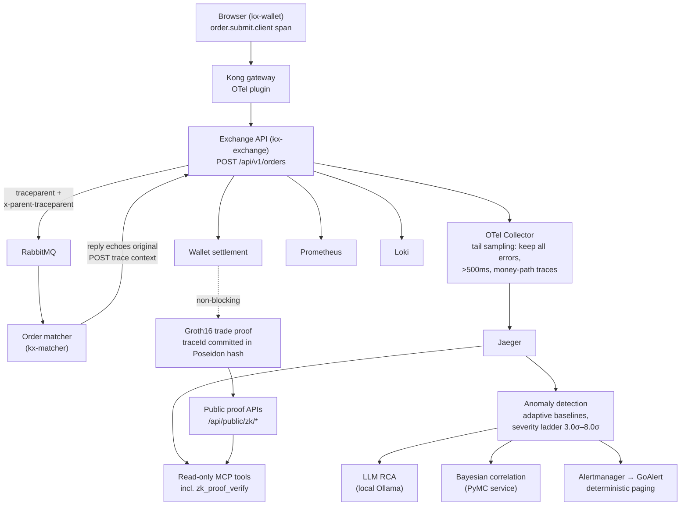

# Krystaline Observability Lab

**Open-source crypto and DeFi observability lab for OpenTelemetry, AI SRE, proof systems, and service-manager operations.**

Krystaline Observability Lab is the public expression of the Krystaline thesis:
financial infrastructure should be traceable, measurable, explainable, and
verifiable before it asks anyone to trust it.

The lab uses realistic exchange and DeFi workflows as the stress test. Orders,
wallet updates, market-data paths, proof generation, queues, alerts, and service
health all become observable product signals. A trade-like flow can be captured
in a distributed trace, evaluated by statistical anomaly detection, summarized
by an AI SRE layer, correlated by Bayesian inference, and cryptographically
bound to a zero-knowledge proof.

Krystaline Core is the private research and product-acceleration platform. This
repository shows the public architecture, operating model, demo experience, and
open implementation pieces without exposing private Core internals.

**Live lab:** [krystaline.io](https://www.krystaline.io)  
**License:** [Apache-2.0](LICENSE)

## Proof, Not Promises

Every claim below is one click from its evidence in this repository.

| Verified capability | Evidence |
|---|---|
| One W3C trace from browser click to settlement — typically 17+ spans on the full RabbitMQ trade path (observed in demo traces), stitched across the async hop by dual context headers (`traceparent` + `x-parent-traceparent`) | [`server/services/rabbitmq-client.ts`](server/services/rabbitmq-client.ts), [`payment-processor/index.ts`](payment-processor/index.ts) |
| A Groth16 proof fires (non-blocking) for every filled trade, committing the OTel 128-bit `traceId` into a Poseidon(5) hash so swapping the trace invalidates the proof — a 977-wire circuit with committed proving keys; a 2026-07-05 benchmark run against those artifacts measured warm proving at 129–152 ms and verification at 12–20 ms (724-byte proof) | [`server/circuits/trade_integrity.circom`](server/circuits/trade_integrity.circom), [`server/circuits/build/`](server/circuits/build/), [`server/services/zk-proof-service.ts`](server/services/zk-proof-service.ts) |
| Adaptive statistical baselines: Welford's online algorithm for trade-amount whale detection, plus 168 time buckets (7 days × 24 hours) per span key with thresholds learned from empirical 80–99.9th percentiles | [`server/monitor/amount-profiler.ts`](server/monitor/amount-profiler.ts), [`server/monitor/baseline-calculator.ts`](server/monitor/baseline-calculator.ts) |
| Local-first LLM RCA whose own pipeline is metered: 5 `kx_llm_*` Prometheus metric families, pre-initialized to zero, with a bounded queue (100) and labeled load-shedding | [`server/monitor/stream-analyzer.ts`](server/monitor/stream-analyzer.ts) |
| AI agents get read-only MCP access to traces, metrics, logs, and alerts — including cryptographic verification of trade proofs via a real `snarkjs.groth16.verify()` | [`server/mcp/index.ts`](server/mcp/index.ts) (28 tools), [`otel-mcp-server/`](otel-mcp-server/) (32 tools) |
| 1,100+ passing automated tests (1,088 main suite + 99 in otel-mcp-server); a confidential-marker scanner ships as the repo's `precommit` script to guard the public/private doc boundary | [`tests/`](tests/), [`otel-mcp-server/tests/`](otel-mcp-server/tests/), [`scripts/check-confidential-docs.cjs`](scripts/check-confidential-docs.cjs) |

## See It in Five Minutes

```bash
git clone https://github.com/MoebiusX/Krystaline.git
cd Krystaline
npm install --legacy-peer-deps
npm run dev   # Docker Desktop must be running; this starts 21 compose services + API + matcher + Vite
```

1. Open <http://localhost:5173> and register. Email verification arrives in
   MailDev at <http://localhost:1080>.
2. Buy 0.001 BTC. The success toast and the trade-verified modal both deep-link
   to your trade's trace; every row on the activity page links its `traceId`
   to Jaeger.
3. Open the trace in Jaeger at <http://localhost:16686> — typically 17+ spans
   across 4 services on the full RabbitMQ trade path, starting with the
   `order.submit.client` span from your own browser.
4. Verify the trade's zero-knowledge proof:
   `GET http://localhost:5000/api/public/zk/verify/:tradeId` runs a real
   Groth16 verification server-side and returns the mathematical verdict.

Other local URLs: Grafana <http://localhost:3000> (admin/admin), Prometheus
:9090, Alertmanager :9093, RabbitMQ :15672, Kong admin :8001, GoAlert :8081.
The Bayesian service is the one container `npm run dev` does not start — run
`docker compose up bayesian-service` separately.

## Quick Links

| Destination | Use it for |
|---|---|
| [Live Lab](https://www.krystaline.io) | Public demo environment. |
| [Observability Whitepaper](docs/OBSERVABILITY_WHITEPAPER.md) | Philosophy, architecture, and mathematical foundations of the AI SRE thesis. |
| [Demo Walkthrough](docs/product/03_DEMO_WALKTHROUGH.md) | Guided 15-minute product tour. |
| [Getting Started](docs/GETTING_STARTED.md) | Local setup, repo map, and useful commands. |
| [Architecture](docs/architecture/01_ARCHITECTURE.md) | System design, data flow, and service interactions. |
| [Public Documentation Catalog](docs/PUBLIC_DOCUMENTS.md) | Public-safe document map and disclosure boundaries. |

## Status Legend

This README uses the following evidence language. It separates what is public,
what exists in Core, and what is still a roadmap item.

| Tag | Meaning |
|---|---|
| `[PUBLIC]` | Present in this open repository, the public docs, or the public lab narrative. |
| `[CORE]` | Implemented in Krystaline Core or internal/live operational assets, but not fully published here. |
| `[BACKLOG]` | Planned or designed, but not yet a shipped public capability. |
| `[ASPIRATIONAL]` | Strategic direction. Do not market as shipped. |
| `[NON-GOAL]` | Deliberately not the product direction. |

## Executive Summary

Krystaline is not "AI on top of dashboards." The architecture starts with
observable facts: OpenTelemetry traces, Prometheus metrics, Loki logs, Jaeger
trace reconstruction, Alertmanager state, service topology, SLO context, and
proof status.

The GenAI layer turns those facts into operational understanding. It does not
replace deterministic alerting or SRE judgement. It compresses the slowest part
of incident response: moving from "an alert fired" to "this is the likely
failure mode, this is the blast radius, this is the evidence, and this is the
next action to validate."

For service managers, the value is a clearer answer to the question they keep
asking platform teams:

> Tell me what is happening to my service, what customer or business promise is
> at risk, why you believe that, and what action should happen next.

For observability experts, Krystaline is an opinionated reference architecture
for AI-assisted operations that keeps traceability, auditability, deterministic
paging, and human authority at the center.

## Trade Lifecycle

One trade, one trace, one proof — this is the actual runtime path, not an
idealized one:



The strongest version of this system is evidence-backed at every layer. GenAI
is not the foundation. It is the translation layer that turns telemetry into an
operational explanation people can act on.

## How This Differs From Typical AIOps Demos

| Typical demo | Krystaline | Evidence |
|---|---|---|
| Summarize logs and hope for causality | Trace-first: baselines and RCA context are built from Jaeger spans, so causality across services is preserved | [`server/monitor/trace-profiler.ts`](server/monitor/trace-profiler.ts), [`server/monitor/context-enricher.ts`](server/monitor/context-enricher.ts) |
| Ship telemetry to a cloud LLM API | Local-first: RCA runs on Ollama inside the compose stack, with an in-repo LoRA fine-tuning pipeline (r=16/α=32) | [`docker-compose.yml`](docker-compose.yml), [`axolotl-config.yaml`](axolotl-config.yaml) |
| Put AI in the paging loop | Deterministic paging stays primary: 48 Prometheus alert rules in 11 groups route through Alertmanager and GoAlert; AI assists triage | [`config/alerting-rules.yml`](config/alerting-rules.yml), [`config/alertmanager.yml`](config/alertmanager.yml) |
| Monitoring only | Monitoring plus cryptographic verifiability: 2 compiled Groth16 circuits with committed proving keys, a proof per filled trade, a 60-second solvency prover | [`server/circuits/`](server/circuits/), [`server/services/zk-proof-service.ts`](server/services/zk-proof-service.ts) |
| A chatbot with screenshots | Agents get governed, read-only MCP tools — and can cryptographically verify a trade proof, not just read a status field | [`otel-mcp-server/src/tools/zk-proofs.ts`](otel-mcp-server/src/tools/zk-proofs.ts), [`server/mcp/index.ts`](server/mcp/index.ts) |

## Capability Status

| Capability | Status | Evidence / note |
|---|---|---|
| OpenTelemetry-first exchange flows; the browser is a traced service (`kx-wallet`, OTel Web SDK) | `[PUBLIC]` | [`server/otel.ts`](server/otel.ts), [`client/src/lib/otel.ts`](client/src/lib/otel.ts) |
| Distributed trace context over RabbitMQ (dual W3C headers; reply re-joins the original HTTP trace) | `[PUBLIC]` | [`server/services/rabbitmq-client.ts`](server/services/rabbitmq-client.ts) |
| Tail-based sampling: 4 explicit policies (errors, >500 ms, money-path services, 10% probabilistic); config validated in CI by the real collector binary | `[PUBLIC]` | [`config/otel-collector-config.yaml`](config/otel-collector-config.yaml) |
| Statistical anomaly detection: severity ladder 3.0σ–8.0σ (MIN_SAMPLES=10), whale ladder 3–7σ, baselines frozen during chaos injection | `[PUBLIC]` | [`server/monitor/anomaly-detector.ts`](server/monitor/anomaly-detector.ts), [`server/monitor/chaos-controller.ts`](server/monitor/chaos-controller.ts) |
| Trace-centric RCA context builder: fuses span critical path, Loki logs, topology blast radius, metrics, firing alerts, SLO status, and zk proof health from a single `traceId` | `[PUBLIC]` | [`server/monitor/context-enricher.ts`](server/monitor/context-enricher.ts) |
| LLM RCA with a self-metered pipeline (5 `kx_llm_*` metric families) and an RLHF-style correction loop feeding LoRA fine-tuning | `[PUBLIC]` | [`server/monitor/stream-analyzer.ts`](server/monitor/stream-analyzer.ts), [`server/monitor/training-store.ts`](server/monitor/training-store.ts) |
| Bayesian inference: hierarchical PyMC latency model plus a Noisy-OR alert-correlation network auto-trained from resolved incidents | `[PUBLIC]` | [`bayesian-service/`](bayesian-service/) |
| zk proof system: 2 compiled Groth16 circuits with committed proving keys (977 / 1,256 wires), non-blocking proof per filled trade, 60-second solvency prover | `[PUBLIC]` | [`server/circuits/`](server/circuits/), [`server/services/zk-proof-service.ts`](server/services/zk-proof-service.ts) |
| Public transparency API: status, anonymized trades, trace verification, proof fetch/verify/stats, solvency — no auth required | `[PUBLIC]` | [`server/api/public-routes.ts`](server/api/public-routes.ts) |
| Deterministic self-healing: 4-action allowlist behind a kill switch with an audit trail; 4-stage price-feed escalation ladder | `[PUBLIC]` | [`server/monitor/auto-remediation.ts`](server/monitor/auto-remediation.ts), [`server/services/price-feed-manager.ts`](server/services/price-feed-manager.ts) |
| Dashboards tested like code: an 834-line validator runs PromQL against live Prometheus; the unified dashboard has 73 panels / 79 targets | `[PUBLIC]` | [`scripts/validate-dashboard.js`](scripts/validate-dashboard.js), [`scripts/dashboard-integrity-monitor.js`](scripts/dashboard-integrity-monitor.js) |
| Test posture: 1,100+ passing automated tests (1,088 main + 99 otel-mcp-server) | `[PUBLIC]` | [`tests/`](tests/), [`otel-mcp-server/tests/`](otel-mcp-server/tests/) |
| Per-commit / CI enforcement of the confidential-doc scanner (it ships as the `precommit` script; no git hook or CI wiring installs it yet) | `[BACKLOG]` | [`scripts/check-confidential-docs.cjs`](scripts/check-confidential-docs.cjs) |
| Dedicated GenAI dashboard pack (GenAI Operations Core, AI RCA Reliability Matrix, MCP Signal Lattice) | `[CORE]` | Core mission-control assets; see Dashboard Evidence Pack below. |
| Deploy-time external LLM provider routing and governance | `[CORE]` | Local Ollama is the public default; enterprise provider controls stay private. |
| Operator war-room assistant card | `[BACKLOG]` | Designed as the next service-manager workflow layer. |
| Human-approved remediation actions | `[ASPIRATIONAL]` | Requires a separate approved-actions interface and audit controls. |
| Replacing deterministic paging with AI | `[NON-GOAL]` | Alertmanager, GoAlert, and SLO rules remain the paging system of record. |

## Thesis

Crypto and DeFi systems are a brutal proving ground for observability because
technical behavior and business trust are inseparable. A slow matching path is
not just latency. A stale price feed is not just an integration issue. A missing
trace is not just a telemetry gap. Each can become a question about fairness,
solvency, market integrity, customer funds, or regulatory evidence.

Krystaline treats observability as a product capability:

- Every important flow should have a traceable lifecycle.
- Every material service should expose health, latency, dependency, and SLO context.
- Every alert should be explainable with evidence.
- Every AI-generated answer should show its work.
- Every public trust claim should be backed by telemetry, proof, or both.

That is the "Proof of Observability" thesis: telemetry is not only an internal
operations tool. It can become part of how a financial platform earns trust.

## Service-Manager Operational Control

The flagship GenAI use case is not a chatbot. It is a service-manager operating
surface.

| Service manager demand | Krystaline answer |
|---|---|
| "Is my service healthy right now?" | Combine SLO state, active alerts, anomaly baselines, and dependency health. |
| "Is this my service or a downstream dependency?" | Use traces and topology to separate local failure from dependency impact. |
| "What customer or business flow is affected?" | Map degradation to order intake, matching, settlement, wallet, proof, or transparency workflows. |
| "What changed?" | Place anomalies in time and support deploy, dependency, and alert correlation when available. |
| "What should I tell leadership?" | Produce a concise incident summary with impact, evidence, and current mitigation state. |
| "Can I trust the recommendation?" | Keep deterministic alerts primary and expose the evidence behind the AI hypothesis. |
| "Can I ask a follow-up?" | Use MCP-enabled read-only telemetry tools for drill-in questions from the same incident context. |

The target response is compact and falsifiable:

```text
Settlement latency is above its current baseline and the latency SLO is at
risk. The slow path is concentrated in wallet persistence after matching, while
gateway and auth spans remain normal. Queue depth rose during the same window
but is now draining. Customer impact appears limited to delayed settlement
confirmation; trade submission is still healthy. Validate wallet DB latency and
watch queue drain rate before escalating.
```

## Dashboard Evidence Pack

The GenAI observability solution is easiest to understand through the Core
mission-control dashboards: one surface for GenAI provider health, one for RCA
reliability, and one for MCP/tool trace coverage.


These dashboards are Core assets; the screenshot above is the public evidence.
The public-side equivalents are the `kx_llm_*` metric families in
[`server/monitor/stream-analyzer.ts`](server/monitor/stream-analyzer.ts).

| Dashboard | Status | What it shows |
|---|---|---|
| GenAI Operations Core | `[CORE]` | The GenAI provider path is observable: requests, latency, tokens, RCA throughput, queue pressure, and dropped events. |
| AI RCA Reliability Matrix | `[CORE]` | RCA can be operated like production infrastructure: failure ratio, timeout ratio, p95/p99 latency, queue depth, and alert state. |
| MCP Signal Lattice | `[CORE]` | The assistant tool layer is measurable: backend reachability, tool latency, trace coverage, and privacy posture. |

Visual language matters here. The dashboards are designed for fast operational
scanning: large signal tiles, explicit trace-gap warnings, provider filters,
runbook context beside metrics, and "live evidence only" privacy posture.

## Design Principles

| Principle | What it means |
|---|---|
| Evidence first | AI analysis is grounded in telemetry, alerts, traces, metrics, topology, and known service dependencies. |
| Deterministic paging remains primary | Alertmanager, GoAlert, and SLO burn alerts remain the system of record for paging and escalation. |
| Read-only by default | GenAI can summarize, correlate, and recommend. Mutating actions require separate controls and explicit approval. |
| Private data stays private | Prompt and response capture is disabled by default; sensitive fields are excluded from public or general-purpose AI paths. |
| The AI layer is observable | Model calls, latency, failures, token usage, queue depth, skipped analyses, and confidence signals are monitored. |
| Proof and telemetry reinforce each other | Traces explain the operational path; proof artifacts support integrity and transparency claims. |

## What Makes It Different

### 1. It is grounded in traces, not just logs

Most AI operations demos begin with log summarization. Krystaline starts with
distributed traces because traces preserve causality across services. A single
trade-like flow can be followed through browser, gateway, API, queue, matcher,
settlement, and verification
([`server/monitor/trace-profiler.ts`](server/monitor/trace-profiler.ts),
[`server/monitor/context-enricher.ts`](server/monitor/context-enricher.ts)).

### 2. It combines statistical, probabilistic, and generative intelligence

Statistical systems are better at saying "this is abnormal." Bayesian inference
is useful for ranking likely causes under uncertainty. Language models are
better at explaining "what this probably means" to a human. Krystaline keeps
those responsibilities separate
([`server/monitor/baseline-calculator.ts`](server/monitor/baseline-calculator.ts),
[`bayesian-service/`](bayesian-service/),
[`server/monitor/analysis-service.ts`](server/monitor/analysis-service.ts)).

### 3. It treats GenAI as a production dependency

The AI path must itself be observable before it can explain the rest of the
platform. Useful questions include: is the model endpoint healthy, are requests
timing out, is queue depth increasing, are analyses being dropped, and which
provider or model produced an answer?
([`server/monitor/stream-analyzer.ts`](server/monitor/stream-analyzer.ts))

### 4. It uses MCP as an investigative interface

The Model Context Protocol pattern gives an assistant disciplined access to
read-only observability tools for traces, metrics, alerts, topology, proof
status, and service health. Public tools expose public-safe data; operator
tools can be deeper and still governed
([`server/mcp/index.ts`](server/mcp/index.ts),
[`otel-mcp-server/`](otel-mcp-server/)).

### 5. It connects observability to verifiability

The zk layer is not a side quest: two compiled Groth16 circuits with committed
proving keys generate a proof for every filled trade — with the trade's OTel
trace ID committed inside the Poseidon hash — plus a solvency proof regenerated
on a 60-second timer (the reserve commitment is published; the proof is
verified server-side). Telemetry explains what happened operationally, while
proof artifacts support integrity claims without exposing private data
([`server/circuits/trade_integrity.circom`](server/circuits/trade_integrity.circom),
[`server/circuits/solvency.circom`](server/circuits/solvency.circom),
[`server/services/zk-proof-service.ts`](server/services/zk-proof-service.ts)).

## Local Quick Start

```bash
npm install --legacy-peer-deps
npm run dev
```

Then open <http://localhost:5173>. See
[See It in Five Minutes](#see-it-in-five-minutes) above for the guided path.

Useful commands:

| Command | Purpose |
|---|---|
| `npm run check` | TypeScript check. |
| `npm test` | Vitest unit suite. |
| `npm run test:e2e:playwright` | Playwright browser tests. |
| `npm run validate:dashboard` | Validate Grafana dashboards against live Prometheus data. |
| `npm run ci:check-docs` | Check public docs for confidential markers. |
| `npm run docs:build` | Render diagrams and generate docs artifacts. |

For Kubernetes deployment, see
[K8s Deployment](docs/operations/02_DEPLOYMENT_K8S.md). For local setup details,
see [Getting Started](docs/GETTING_STARTED.md).

## Repository Map

| Path | Purpose |
|---|---|
| `client/` | React, TypeScript, Vite frontend. |
| `server/` | Node/Express API, monitoring, wallet, proof, MCP, and service logic. |
| `shared/` | Shared TypeScript types and telemetry attributes. |
| `bayesian-service/` | Python FastAPI and PyMC Bayesian inference service. |
| `otel-mcp-server/` | MCP observability tool server. |
| `config/` | Alerting, Grafana, Prometheus, and runtime configuration. |
| `k8s/` | Helm charts and Kubernetes deployment assets. |
| `docs/` | Architecture, observability, product, operations, and public thesis docs. |
| `scripts/` | Dev orchestration, validation, load testing, backups, and deployment utilities. |
| `tests/` and `e2e/` | Unit, smoke, and end-to-end tests. |

## Technical Stack

| Layer | Technologies |
|---|---|
| Frontend | React 18, TypeScript, Vite, TailwindCSS, Radix UI, Wouter |
| Backend | Node.js, Express, TypeScript, PostgreSQL, Drizzle schema |
| Messaging | RabbitMQ with W3C trace context propagation |
| Gateway | Kong with OpenTelemetry integration |
| Observability | OpenTelemetry SDK and Collector, Jaeger, Prometheus, Loki, Grafana, Alertmanager |
| Alerting | GoAlert, ntfy, email, SLO and burn-rate rules |
| AI / ML | Ollama, Llama 3.2:1B, LoRA fine-tuning pipeline (r=16 / α=32), PyMC Bayesian service |
| Cryptography | Circom, Groth16 zk-SNARK circuits, snarkjs |
| Testing | Vitest, Playwright, smoke tests, dashboard validation |
| Infrastructure | Docker Compose, Helm, Kubernetes |

## Documentation Map

| Guide | Description |
|---|---|
| [LLM Monitoring Setup](docs/observability/03_LLM_MONITORING_SETUP.md) | LLM observability, RCA metrics, and monitoring of the AI path itself. |
| [Brand Positioning](docs/BRAND_POSITIONING.md) | Naming architecture for Krystaline, the lab, Core, and legacy runtime IDs. |
| [Public Documentation Catalog](docs/PUBLIC_DOCUMENTS.md) | Public-safe document plan, audience map, and redaction boundaries. |
| [Getting Started](docs/GETTING_STARTED.md) | Local setup and repo orientation. |
| [Demo Walkthrough](docs/product/03_DEMO_WALKTHROUGH.md) | Guided demo for the public lab. |
| [Architecture](docs/architecture/01_ARCHITECTURE.md) | System design, data flow, component interactions. |
| [Observability Whitepaper](docs/OBSERVABILITY_WHITEPAPER.md) | Philosophy, implementation, and mathematical foundations. |
| [Anomaly Detection Design](docs/observability/02_ANOMALY_DETECTION_DESIGN.md) | Baselines, time buckets, and adaptive thresholds. |
| [Bayesian Inference](docs/observability/05_BAYESIAN_INFERENCE.md) | Hierarchical models and dependency-aware root-cause analysis. |
| [Fine-Tuning Guide](docs/observability/04_FINE_TUNING.md) | LoRA training pipeline and synthetic training-data generation. |
| [K8s Deployment](docs/operations/02_DEPLOYMENT_K8S.md) | Helm charts, Kubernetes setup, and production configuration. |
| [Runbook](docs/operations/04_RUNBOOK.md) | Operational procedures and incident response. |
| [GoAlert Setup](docs/operations/06_GOALERT_SETUP.md) | On-call schedules, notification routing, and provisioning. |
| [Documentation Index](docs/README.md) | Every active doc, grouped by area. |
| [Anatomy of a Trade](docs/ANATOMY_OF_A_TRADE.md) | The canonical span-by-span trace of one market order. |

## A Note on Naming

Some runtime identifiers still use legacy names such as `krystalinex`, `kx-*`,
or `kx_*` while public-facing prose moves to **Krystaline** and **Krystaline
Observability Lab**. See [Brand Positioning](docs/BRAND_POSITIONING.md) for the
naming policy.

## Contributing and Security

Contributions should preserve the evidence-first posture: public claims need
public evidence, sensitive internals stay private, and AI-assisted operations
must keep deterministic control paths intact. For messaging guidance, see
[Brand Positioning](docs/BRAND_POSITIONING.md).

Read [CONTRIBUTING.md](CONTRIBUTING.md), [SECURITY.md](SECURITY.md), and
[CODE_OF_CONDUCT.md](CODE_OF_CONDUCT.md) before opening substantial changes.

## Positioning Statement

> OpenTelemetry provides the facts. Statistical and Bayesian models identify
> abnormality and likelihood. GenAI turns the evidence into a usable
> explanation. Human operators retain authority.

That combination is the difference between an AI demo and an operationally
credible GenAI observability solution.
