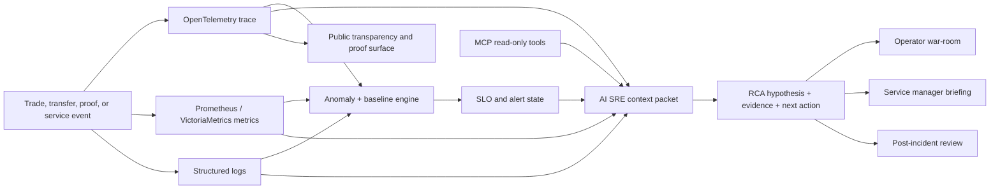
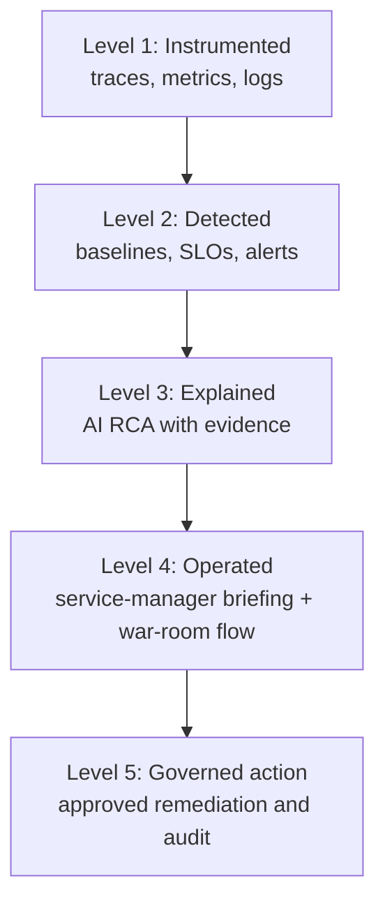

# GenAI Observability Solution: The AI SRE Thesis

Status: Draft  
Audience: Observability experts, SRE leaders, platform engineering leaders, CTO/CIO stakeholders  
Classification: Public-safe overview

## Status Legend

This document separates what exists from what is next. That distinction is part
of the trust story.

| Tag | Meaning |
|---|---|
| `[PUBLIC]` | Present in the open Krystaline Observability Lab repository or public documentation. |
| `[CORE]` | Implemented in Krystaline Core or visible in internal/live operational assets, but not fully published in this repository. |
| `[BACKLOG]` | Planned or designed, but not yet a shipped public capability. |
| `[ASPIRATIONAL]` | Strategic direction. Do not market as shipped. |
| `[NON-GOAL]` | Deliberately not the product direction. |

## Executive Summary

Krystaline Observability Lab is the public expression of the Krystaline thesis:
crypto and DeFi infrastructure should be observable before it asks anyone to
trust it. Every important action should be traceable, measurable, explainable,
and eventually verifiable.

Krystaline Core is where the private research and product acceleration happens.
The lab shows the promise, the operating model, the evidence surfaces, and the
OpenTelemetry-first architecture without revealing private implementation
details.

The GenAI solution is the operational layer that makes that telemetry usable at
incident speed. It does not ask a language model to "guess what is wrong" from a
dashboard screenshot or a pile of logs. It builds a structured context packet
from traces, metrics, alerts, topology, anomaly baselines, SLO state, and
incident context, then uses GenAI to produce an explainable diagnostic narrative
for service managers, engineers, and technical leadership.

The goal is not to replace SRE judgement. The goal is to compress the slowest
part of incident response: moving from "an alert fired" to "this is the most
likely failure mode, this is the blast radius, this is the evidence, and this is
the next action to validate."

For senior leadership, the value is reduced mean time to understand, stronger
operational governance, and a clearer bridge between engineering telemetry and
business risk. For observability experts, the value is an opinionated reference
architecture for AI-assisted operations that keeps deterministic alerting,
traceability, and auditability at the center. For service managers, it answers
the question they are increasingly demanding from platform teams:

> "Tell me what is happening to my service, what customer or business promise is
> at risk, why you believe that, and what action should happen next."

## One-Page Visual



The system is strongest when every box is evidence-backed. The GenAI layer is
not the foundation. It is the translation layer that turns the foundation into
operational understanding.

## Capability Status Map

| Capability | Status | Evidence / note |
|---|---|---|
| OpenTelemetry-first exchange flows | `[PUBLIC]` | Public docs describe trace-first trade, anomaly, and proof workflows. |
| LLM-powered RCA metrics | `[PUBLIC]` | Public repo includes `kx_llm_analysis_total`, `kx_llm_analysis_duration_seconds`, `kx_llm_queue_depth`, and related panels in the unified observability dashboard. |
| Trace-centric RCA context gathering | `[CORE]` | Core includes context enrichment from trace, metrics, logs, topology, alerts, and SLO state. |
| Dedicated GenAI dashboard pack | `[CORE]` | Core contains `genai-operations.json`, `ai-rca-reliability.json`, and `mcp-observability-trace-coverage.json`; these match the mission-control dashboards in the screenshot. |
| GenAI operational alert rules | `[CORE]` | Core validates GenAI latency, error-ratio, RCA failure, queue backlog, dropped-event, and token-burn rules. |
| Deploy-time provider selection | `[CORE]` | Core keeps local Ollama as the default/evidenced RCA path and supports optional deploy-time OpenAI-compatible or Hugging Face endpoint configuration. |
| Public-facing thesis document | `[PUBLIC]` | This file is the public-safe narrative. |
| War-room assistant card and follow-up thread | `[BACKLOG]` | Designed in US-002; needs chat adapter, identity mapping, and production workflow. |
| "Show my work" evidence trail in the card | `[BACKLOG]` | Designed; requires durable tool-call audit presentation. |
| Ack in GoAlert from chat | `[BACKLOG]` | Designed for a later phase with human identity mapping. |
| AI-controlled rollback/restart/scale | `[ASPIRATIONAL]` | Requires separate approved-actions interface and two-human approval. |
| Replacing deterministic paging with AI | `[NON-GOAL]` | GoAlert/SMS-style paging remains the system of record. |

## Thesis

Crypto and DeFi systems are a brutal proving ground for observability because
technical behavior and business trust are inseparable. A slow matching path is
not just latency. A stale price feed is not just an integration issue. A missing
trace is not just a telemetry gap. Each can become a question about fairness,
solvency, market integrity, customer funds, or regulatory evidence.

Krystaline treats observability as a product capability, not an internal
operations afterthought:

- Every trade should have a traceable lifecycle.
- Every material service should expose health, latency, and dependency context.
- Every alert should be explainable with evidence.
- Every operator-facing AI answer should show its work.
- Every public trust claim should be backed by telemetry, proof, or both.

The AI SRE operator assistant is the thesis made practical. When something
breaks, it receives the alert, enriches it with telemetry, builds a probable
root-cause hypothesis, links the relevant evidence, and lets the operator ask
follow-up questions in the same incident thread. The deterministic pager still
wakes the human. The AI layer collapses the context-gathering work.

## The Killer Use Case: Service Manager Operational Control

Service managers are being asked to own reliability, cost, risk, and customer
experience for services they do not personally operate minute by minute. They do
not want another dashboard wall. They want an answer they can act on.

The Krystaline GenAI layer is designed for that demand:

| Service manager demand | Krystaline answer |
|---|---|
| "Is my service healthy right now?" | Combines SLO state, active alerts, anomaly baselines, and dependency health. |
| "Is this actually my service or a downstream dependency?" | Uses traces and topology to separate local failure from dependency impact. |
| "What customers or business flows are affected?" | Maps service degradation to trade execution, settlement, wallet, price, proof, or transparency workflows. |
| "What changed?" | Places anomalies in time and supports deploy, dependency, and alert correlation when available. |
| "What should I tell leadership?" | Produces a concise incident summary with impact, evidence, and current mitigation status. |
| "Can I trust the recommendation?" | Keeps deterministic alerts primary and exposes the evidence behind the AI hypothesis. |
| "Can I ask a follow-up?" | Uses MCP-enabled telemetry tools so the assistant can answer drill-in questions from the same incident context. |

This is the difference between tool access and operational control. A service
manager should be able to ask:

```text
Why is the settlement service burning latency budget, is customer trading
affected, and is the issue in settlement, wallet persistence, or the queue?
```

The desired answer is not a generic paragraph. It is a compact, evidence-backed
brief:

```text
Settlement latency is above its current baseline and the latency SLO is at risk.
The slow path is concentrated in wallet persistence after matching, while gateway
and auth spans remain normal. Queue depth rose during the same window but is now
draining. Customer impact appears limited to delayed settlement confirmation;
trade submission is still healthy. Validate wallet DB latency and watch queue
drain rate before escalating.
```

That is the product surface service managers are asking for: not "AI for AI's
sake," but operational understanding on demand.

## Why Crypto and DeFi Make This Awesome

An observability-first exchange or DeFi company has a sharper story than a
generic cloud application because the platform can connect technical signals to
trust signals.

| Financial infrastructure concern | Observability-first response |
|---|---|
| Trade fairness | Trace the trade path and connect execution to price, matching, settlement, and proof-generation context. |
| Solvency confidence | Expose proof status, reserve transparency, and operational health without leaking individual balances. |
| Market integrity | Detect abnormal latency, price-feed degradation, queue backlog, and unusual transaction patterns. |
| Operational resilience | Keep deterministic paging, SLO burn alerts, and escalation independent from AI quality. |
| Auditability | Preserve trace IDs, alert history, model metadata, and evidence trails for incident review. |
| Customer trust | Turn platform health and proof status into public transparency instead of private claims. |

This is what makes Krystaline more than an observability demo. It shows how a
financial platform can make reliability, proof, and operational explanation part
of the product itself.

## Dashboard Evidence Pack

The GenAI observability solution is easiest to understand through the three
mission-control dashboards now present in Core. They are deliberately designed
as live evidence surfaces: large signal tiles for service managers, time-series
drill-downs for SREs, and policy/status notes for technical leadership.


The screenshot above shows the current visual direction: one surface for GenAI
provider health, one for RCA reliability, and one for MCP/tool trace coverage.
It is the dashboard expression of the thesis: the AI layer must itself be
observable before it can be trusted to explain the rest of the platform.

| Dashboard | Status | What it proves | Key signals |
|---|---|---|---|
| GenAI Operations Core | `[CORE]` | The GenAI provider path is observable: requests, latency, tokens, RCA throughput, queue pressure, and dropped events. | `gen_ai_client_operations_total`, `gen_ai_client_operation_duration_seconds`, `gen_ai_client_token_usage`, `kx_llm_analysis_total`, `kx_llm_queue_depth`, `kx_llm_dropped_events_total` |
| AI RCA Reliability Matrix | `[CORE]` | The RCA pipeline can be operated like production infrastructure: failure ratio, timeout ratio, p95/p99 latency, current queue, and current alert state. | `genai:rca_analysis:failure_ratio_5m`, `genai:rca_analysis_duration:p95_5m`, `kx_llm_analysis_total`, `kx_llm_queue_depth`, `kx_llm_dropped_events_total`, GenAI alert state |
| MCP Signal Lattice | `[CORE]` | The operator-assistant tool layer is measurable: backend requests, tool latency, scrape coverage, trace coverage, and privacy posture. | `mcp_backend_requests_total`, `mcp_backend_duration_seconds_bucket`, `mcp_server_operation_duration_seconds_bucket`, `mcp_active_sessions`, Jaeger service coverage |

Visual language matters here. The dashboards use a mission-control pattern:

- Large green/red/blue signal tiles for fast service-manager scanning.
- Time-window filters for "what changed in the last six hours?"
- Provider and model filters for local vs external GenAI paths.
- Explicit "live evidence only" and "no payload capture" callouts.
- Red trace-gap tiles when coverage is missing instead of hiding the gap.
- Operator runbook panels embedded beside the metrics.

This is the kind of dashboard surface that makes the project feel real: it does
not just say "we have AI." It shows whether the AI path is healthy, late,
expensive, noisy, degraded, or blind.

## Current Reality Matrix

| Area | Already there | Still backlog | Aspirational / do not overclaim |
|---|---|---|---|
| GenAI telemetry | `[CORE]` GenAI client operations, duration, streaming, token, status, queue, and dropped-event metrics. `[PUBLIC]` baseline LLM/RCA metrics in the open repo. | Publish or document the full Core dashboard pack in the public repo after redaction. | Claiming complete GenAI standards maturity while OTel GenAI semantic conventions remain in development. |
| RCA context | `[CORE]` Trace-centric enrichment can gather traces, metrics, logs, topology, alerts, and SLO context for analysis. | Improve public explanation of how context is assembled without publishing prompts or internals. | Fully autonomous root-cause certainty. The output remains a hypothesis with evidence. |
| AI SRE workflow | `[PUBLIC]` Thesis and US-002 narrative. `[CORE]` RCA metrics and dashboards support the workflow. | Chat/war-room card, follow-up thread, "show my work", card delivery SLO, and GoAlert ack identity mapping. | Replacing the on-call engineer or making AI the incident commander. |
| MCP investigation | `[PUBLIC]` MCP concepts and public transparency docs. `[CORE]` MCP signal dashboard and backend/tool metrics. | Close any live trace-coverage gaps and expose the operator-safe story publicly. | Giving public MCP access to private logs, user data, or mutating tools. |
| Provider strategy | `[CORE]` Local Ollama default plus deploy-time external provider plumbing. Hugging Face Inference Endpoints are supported as an optional configuration path, not the current production claim. | Mature provider governance, external smoke tests, cost controls, and enterprise key-management story. | Customer self-service BYOK before tenant-scoped KMS/secrets design is approved. |
| Remediation | `[PUBLIC]` Deterministic alerting and self-healing narrative. | Human-approved actions behind a separate action surface. | Unapproved AI rollback, restart, or scale actions. |

## Provider Reality Check

We should be precise about model externalization:

| Question | Answer |
|---|---|
| Is RCA currently presented as externalized to Hugging Face Inference Endpoints? | No. The documented, evidenced default remains local Ollama-backed RCA. |
| Does Core support a Hugging Face endpoint path? | Yes. Core has deploy-time provider plumbing for `GENAI_PROVIDER=huggingface` with `GENAI_BASE_URL` pointing at a compatible endpoint. |
| Is that the same as customer BYOK? | No. Customer self-service BYOK needs tenant-scoped key storage, audit events, spend limits, and security review. |
| What should we say publicly? | "Local-first by default; external provider routing is supported as a controlled deployment option; production rollout and governance remain backlog." |

For large-scale deployments that are not processing financial data or similarly
sensitive operational context, external inference endpoints are a natural
scaling path: they simplify capacity management, model selection, and regional
rollout. Krystaline keeps the financial-data posture more conservative:
local-first by default, external-provider capable by design, and governed before
use in sensitive environments.

This matters because the product thesis is stronger when the model path is
honest: Krystaline can observe and govern whichever GenAI provider is active,
but it should not imply a provider is live unless the target deployment is
actually using it.

## Design Principle

The Krystaline GenAI layer is built around a simple principle:

> GenAI should explain verified telemetry, not invent operational reality.

That principle leads to five design choices:

| Principle | What it means |
|---|---|
| Evidence first | LLM analysis is grounded in telemetry, alerts, traces, metrics, and known service dependencies. |
| Deterministic paging remains primary | Alertmanager, GoAlert, and SLO burn alerts remain the system of record for paging and escalation. |
| Read-only by default | GenAI can summarize, correlate, and recommend. Mutating actions require separate controls and explicit approval. |
| Private data stays private | Prompt and response capture is disabled by default; sensitive fields are excluded from public or general-purpose AI paths. |
| The AI layer is observable | Model calls, latency, failures, token usage, queue depth, skipped analyses, and confidence signals are monitored like any production dependency. |

## The Problem We Are Solving

Modern observability stacks produce more data than humans can inspect during an
incident. Teams already have dashboards, alerts, traces, and logs, but the
human workflow is still often manual:

1. Find the alert.
2. Identify the affected service.
3. Open dashboards.
4. Search traces.
5. Query logs.
6. Compare recent behavior against historical baselines.
7. Decide whether the issue is local, downstream, infrastructure-related, or
   business-impacting.
8. Write a summary for the incident channel or leadership.

That handoff from raw signal to useful explanation is the gap Krystaline
targets. The GenAI layer turns an observability stack into an investigative
assistant while preserving the underlying engineering controls.

## Solution Overview

Krystaline combines four layers:

| Layer | Purpose | Primary users |
|---|---|---|
| Telemetry foundation | OpenTelemetry traces, Prometheus metrics, Loki logs, Jaeger traces, Alertmanager alerts, Grafana dashboards | SRE, platform engineering |
| Statistical detection | Time-aware anomaly detection, service baselines, severity classification, SLO/burn-rate alerting | SRE, service owners |
| Probabilistic reasoning | Bayesian root-cause ranking, dependency-aware inference, alert storm reduction | Observability experts, incident commanders |
| GenAI explanation | Plain-language RCA, evidence summaries, recommended next checks, leadership-ready incident narrative | SRE, CTO/CIO, operations leadership |

The model is intentionally layered. GenAI is not the detector. It is the
explainer and triage assistant after deterministic and statistical systems have
found something worth investigating.

## How US-002 Fits the Thesis

US-002, the AI SRE operator-facing triage assistant, is the flagship internal
use case for the GenAI observability solution.

The story is simple:

```text
As an on-call engineer, platform owner, security operator, or service manager,
I want every meaningful alert to arrive with telemetry-backed context, a
probable root-cause hypothesis, blast-radius framing, and drill-in links,
so that I can move from page received to root cause identified in minutes.
```

The assistant is not a chatbot bolted onto monitoring. It is an incident
context engine:

| US-002 capability | Why it matters |
|---|---|
| Receives every alert | The AI layer starts from the same operational facts as the paging path. |
| Enriches with metrics, logs, traces, topology, and SLOs | The answer is grounded in cross-signal evidence. |
| Posts a war-room card | Service managers and on-call engineers get a single operational brief instead of tool hopping. |
| Answers follow-up questions | The incident thread becomes an investigative workspace. |
| Shows the evidence trail | Operators can inspect which tools were queried and why the hypothesis was formed. |
| Degrades gracefully | If AI, MCP, or chat is degraded, deterministic paging still works and the operator sees the fallback state. |
| Avoids mutating actions in early phases | The assistant recommends and explains before it is allowed to act. |

This is the pattern service managers are demanding: one operational narrative
that connects service ownership, SLOs, dependencies, customer impact, and next
actions.

## Maturity Ladder



| Level | Status | Meaning |
|---|---|---|
| Level 1: Instrumented | `[PUBLIC]` / `[CORE]` | The platform emits trace, metric, log, and proof signals. |
| Level 2: Detected | `[PUBLIC]` / `[CORE]` | Anomaly detection, SLOs, and alerting identify abnormal behavior. |
| Level 3: Explained | `[CORE]` | GenAI RCA and Bayesian inference convert evidence into hypotheses. |
| Level 4: Operated | `[BACKLOG]` | US-002 turns the hypothesis into a war-room workflow for service managers and on-call engineers. |
| Level 5: Governed action | `[ASPIRATIONAL]` | Approved, audited, human-gated actions can be proposed or executed. |

The project is strongest when we are precise: Krystaline is already beyond
"instrumented" and into "explained" for the Core operational slice. The full
service-manager cockpit is the next product step.

## Reference Flow

```text
Telemetry sources
  - traces, metrics, logs, alerts, topology, SLOs
        |
        v
Detection and correlation
  - anomaly classification
  - time-aware baselines
  - SLO burn state
  - trace exemplars
  - dependency graph context
        |
        v
GenAI context packet
  - affected service
  - relevant spans
  - correlated metrics
  - active alerts
  - recent changes when available
  - known runbook hints
        |
        v
AI-assisted RCA
  - summary
  - probable causes
  - confidence
  - blast radius
  - validation steps
  - recommended next action
        |
        v
Human and system consumers
  - monitor UI
  - incident channel
  - service manager briefing
  - post-incident review
  - executive/leadership summary
```

## Operator Assistant Experience

When an alert fires, the expected experience has two parallel paths:

| Path | Purpose | Required behavior |
|---|---|---|
| Tier 1: pager | Wake the human reliably | SMS or paging delivery remains deterministic and independent of AI health. |
| Tier 2: AI SRE | Explain what is happening | The assistant posts a telemetry-grounded incident card and supports follow-up questions. |

An incident card should answer the first five questions service managers ask:

1. What fired?
2. Which service or business capability is affected?
3. What is the likely root cause?
4. What evidence supports that hypothesis?
5. What should we validate or do next?

Example public-safe card shape:

```text
Alert:
HighSettlementLatency - settlement service - SEV2

Hypothesis:
Settlement confirmation latency increased after queue depth rose in the
matching-to-wallet path. Gateway and authentication are normal, so the likely
issue is downstream of order intake.

Evidence:
- p99 settlement latency is above the current service baseline.
- Slow traces share the same wallet persistence span.
- Queue depth rose during the alert window and is now draining.
- No corresponding spike in gateway errors.

Blast radius:
Trade submission remains healthy. Settlement confirmation is delayed. Solvency
and proof-generation status should be checked before declaring full recovery.

Next validation:
Open settlement traces for the alert window, check wallet persistence latency,
and confirm queue drain rate.
```

For a service manager, this turns telemetry into a decision briefing. For an
SRE, it turns the first few minutes of investigation into a guided workflow.
For senior leadership, it creates a clean path from technical symptoms to
business impact.

## What Makes It Different

### 1. It is grounded in traces, not just logs

Most AI operations demos start with log summarization. Krystaline starts with
distributed traces because traces preserve causality across services. A single
trade can be followed through browser, gateway, API, queue, matcher, settlement,
and verification. The GenAI layer can therefore reason about service order,
critical path latency, and downstream impact instead of treating logs as
disconnected text.

### 2. It combines statistical and generative intelligence

Statistical systems are better at saying "this is abnormal." Language models
are better at explaining "what this probably means" to a human. Krystaline
keeps those responsibilities separate:

- Time-aware baselines detect abnormal behavior.
- Severity classification prioritizes the signal.
- Bayesian inference ranks likely root causes under uncertainty.
- GenAI converts the evidence into a coherent operational explanation.

### 3. It treats GenAI as a production dependency

The GenAI path is instrumented and governed. Useful questions include:

- Is the model endpoint healthy?
- What is the analysis success rate?
- What is p95/p99 analysis latency?
- Are requests timing out?
- Is queue depth increasing?
- Is token usage growing unexpectedly?
- Are analyses being skipped, dropped, or rate-limited?
- Which model or provider produced an answer?

This avoids the common anti-pattern where AI is added to observability without
observability of the AI itself.

### 4. It uses MCP as an investigative interface

The Model Context Protocol pattern gives the assistant a disciplined way to
query observability tools. Instead of pasting static data into a prompt, the
assistant can call read-only tools for traces, metrics, alerts, topology, and
proof status. That makes follow-up questions useful:

- "Is this only production or also staging?"
- "Which downstream service changed first?"
- "Is the SLO burn fast enough to page leadership?"
- "Do the slow traces share the same span?"
- "Did proof generation or settlement degrade at the same time?"

The important design boundary is scope. Public transparency tools expose only
public data. Operator tools can see deeper telemetry for incident response.
Mutating actions belong behind a separate approval model.

### 5. It separates explanation from authority

Krystaline does not make the model the pager, the incident commander, or the
control plane. The GenAI layer can recommend and summarize, but paging,
acknowledgement, escalation, and remediation policies remain explicit and
auditable.

That distinction matters for regulated or high-trust environments. It lets
leaders adopt AI-assisted operations without weakening operational governance.

## Target Capabilities

| Capability | Description | Leadership value |
|---|---|---|
| AI RCA summaries | Structured incident explanations from telemetry evidence | Faster executive understanding during incidents |
| Trace-aware diagnosis | RCA grounded in the actual service path of a transaction | Higher diagnostic precision |
| Probabilistic root-cause ranking | Root causes ranked by evidence and dependency relationships | Better prioritization under uncertainty |
| Alert storm compression | Group related symptoms into a probable incident narrative | Less noise during major failures |
| SLO and business impact framing | Explain latency, availability, and user impact in one view | Clearer risk communication |
| Service manager briefing | Convert service telemetry into owner-ready status, risk, and next-action summaries | Better service ownership and faster escalation decisions |
| Model operations dashboard | Observe model latency, failure rate, timeout ratio, and token burn | Treat AI as governed infrastructure |
| Human feedback loop | Capture operator judgement to improve future analysis | Continuous improvement without blind automation |
| Public-safe transparency | Share health, proof, and trace summaries without exposing private internals | Trust-building with users and auditors |

## Example Output Shape

The target output is structured and falsifiable:

```text
Summary:
Order matching latency is elevated for BTC/USD trades. The likely bottleneck is
the matcher to wallet settlement path, not the API gateway.

Evidence:
- P95 order latency is above the current baseline for this service and hour.
- Slow traces share the same downstream settlement span.
- Gateway and authentication spans remain within normal range.
- Queue depth increased during the same time window.

Likely causes:
1. Settlement worker saturation.
2. Downstream wallet persistence latency.
3. Temporary queue backlog after traffic burst.

Recommended validation:
- Inspect recent matcher traces with settlement spans above baseline.
- Check wallet service persistence latency and error rate.
- Confirm whether queue depth is draining.

Confidence:
Medium-high. Evidence is consistent across traces and metrics, but logs should
be checked before declaring root cause.
```

The important feature is not that the text is polished. The important feature is
that the answer is backed by inspectable telemetry and tells an engineer exactly
what to verify next.

## Operating Model

Krystaline uses a two-tier operating model:

| Tier | Role | Technology posture |
|---|---|---|
| Tier 1: Deterministic alerting | Page humans, enforce escalation, preserve audit trail | Prometheus, Alertmanager, GoAlert, SLO rules |
| Tier 2: AI-assisted triage | Explain what is happening, correlate evidence, suggest next checks | GenAI RCA, Bayesian inference, MCP-accessible telemetry |

Tier 1 must work even if Tier 2 is unavailable. Tier 2 improves understanding,
but it is not required for the alert to fire or the on-call engineer to be
notified.

## Governance and Safety

For senior technical leadership, the governance model is as important as the
model quality.

| Risk | Control |
|---|---|
| Hallucinated diagnosis | Require source telemetry in the context packet and show evidence alongside conclusions. |
| Prompt or response leakage | Disable prompt/response capture by default and redact sensitive telemetry fields. |
| Over-automation | Keep mutation and remediation behind explicit policy and approval gates. |
| AI dependency outage | Preserve deterministic paging and provide fallback raw-alert workflows. |
| Cost or token growth | Monitor token usage, queue depth, and rate limits as first-class operational metrics. |
| Provider lock-in | Keep model/provider selection behind an abstraction and preserve a local-runtime fallback. |
| Audit gaps | Log model metadata, analysis status, timing, and operator feedback without storing sensitive payloads by default. |

## Metrics That Matter

The GenAI observability layer should be judged by operational outcomes, not by
demo novelty.

| Metric | Why it matters |
|---|---|
| Analysis success rate | Measures whether the RCA path is dependable. |
| Analysis latency p95/p99 | Determines whether AI helps during real incidents or arrives too late. |
| Timeout and failure ratio | Shows provider, gateway, or model reliability issues. |
| Queue depth and dropped analyses | Reveals backpressure during alert storms. |
| Token usage rate | Gives cost and capacity visibility. |
| Operator acceptance rate | Measures whether engineers trust the recommendations. |
| Time to first useful hypothesis | Best proxy for reduced mean time to understand. |
| Post-incident correction rate | Identifies model drift and weak prompts or context packets. |

## Why This Matters for Observability Leaders

The next wave of observability will not be "more dashboards." Mature teams will
need systems that can:

- Preserve causality across distributed systems.
- Reduce alert noise without hiding risk.
- Explain incidents across traces, metrics, logs, topology, and business impact.
- Keep AI outputs governed, auditable, and measurable.
- Support both deep technical diagnosis and leadership-level communication.

Krystaline is using the exchange domain as a demanding testbed because the
operational stakes are high: latency, correctness, trust, solvency, and
auditability all matter at the same time.

## What Stays Private

This public draft intentionally does not disclose:

- Exact prompts, prompt templates, or hidden model instructions.
- Private implementation details of the context builder.
- Internal runbooks, incident history, or provider-specific credentials.
- Security-sensitive alert rules or remediation mechanics.
- Raw logs, raw traces, customer identifiers, IP addresses, or private
  dashboard exports.
- Model weights, training datasets, or proprietary fine-tuning data.

## Roadmap Themes

| Phase | Theme | Status | Direction |
|---|---|---|---|
| Phase 0 | Evidence foundation | `[CORE]` | GenAI/RCA metrics, dedicated dashboards, alert rules, and privacy controls. |
| Phase 1 | Public thesis | `[PUBLIC]` | Explain why observability-first crypto infrastructure needs AI SRE and service-manager RCA. |
| Phase 2 | Operator cockpit | `[BACKLOG]` | Bring RCA summaries, live telemetry evidence, alert state, and validation steps into one operator view. |
| Phase 3 | War-room workflow | `[BACKLOG]` | Post chat cards, support follow-up questions, and show the assistant's evidence trail. |
| Phase 4 | Human-approved actions | `[ASPIRATIONAL]` | Add a separate approved-actions surface for a small, audited remediation allow-list. |
| Phase 5 | Enterprise provider governance | `[BACKLOG]` | Mature provider selection, cost controls, key management, and BYOK without exposing payloads. |

## What To Showcase Now

For external conversations with observability experts and senior leadership,
lead with what is real:

| Showcase | Message |
|---|---|
| GenAI Operations Core | "We operate the AI path as production infrastructure, with latency, tokens, errors, queue pressure, and dropped events visible." |
| AI RCA Reliability Matrix | "We measure whether the RCA system is dependable enough to trust during incidents." |
| MCP Signal Lattice | "We can inspect the assistant's tool layer, backend reachability, trace coverage, and privacy posture." |
| Service-manager thesis | "The end user is not just the SRE. It is the service manager who owns reliability, customer impact, and escalation." |
| Crypto/DeFi fit | "In financial infrastructure, latency, traces, proofs, solvency, and transparency all become trust signals." |

For product roadmap conversations, be explicit:

| Do say | Avoid saying |
|---|---|
| "The Core dashboard evidence pack exists." | "All of this is in the public repo today." |
| "The operator assistant workflow is designed and supported by existing telemetry." | "The war-room assistant is fully shipped." |
| "The AI makes evidence-backed hypotheses." | "The AI determines root cause with certainty." |
| "Paging remains deterministic." | "AI replaces on-call." |
| "Approved actions are a future governed phase." | "The AI can safely roll back production by itself." |

## Positioning Statement

Krystaline treats GenAI observability as a governed operations capability:

> OpenTelemetry provides the facts. Statistical and Bayesian models identify
> abnormality and likelihood. GenAI turns the evidence into a usable explanation.
> Human operators retain authority.

That combination is the difference between an AI demo and an operationally
credible GenAI observability solution.
