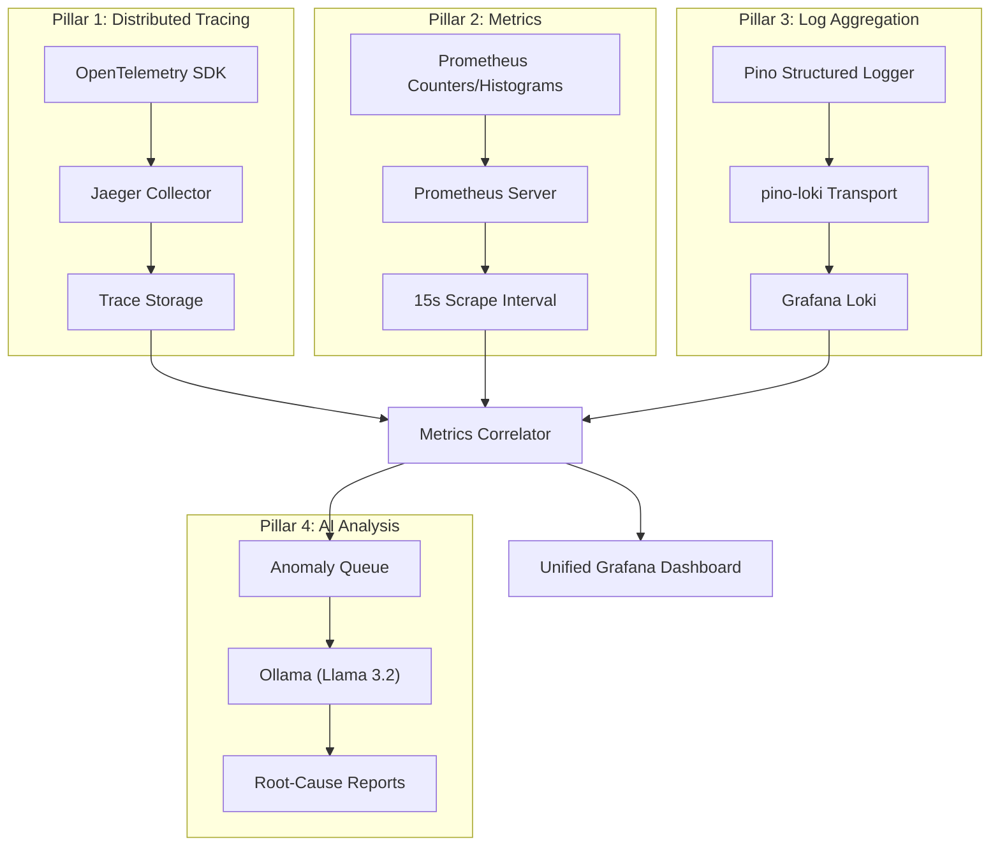
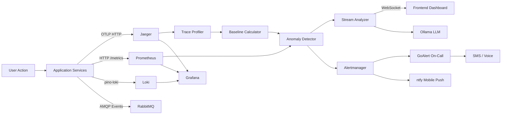
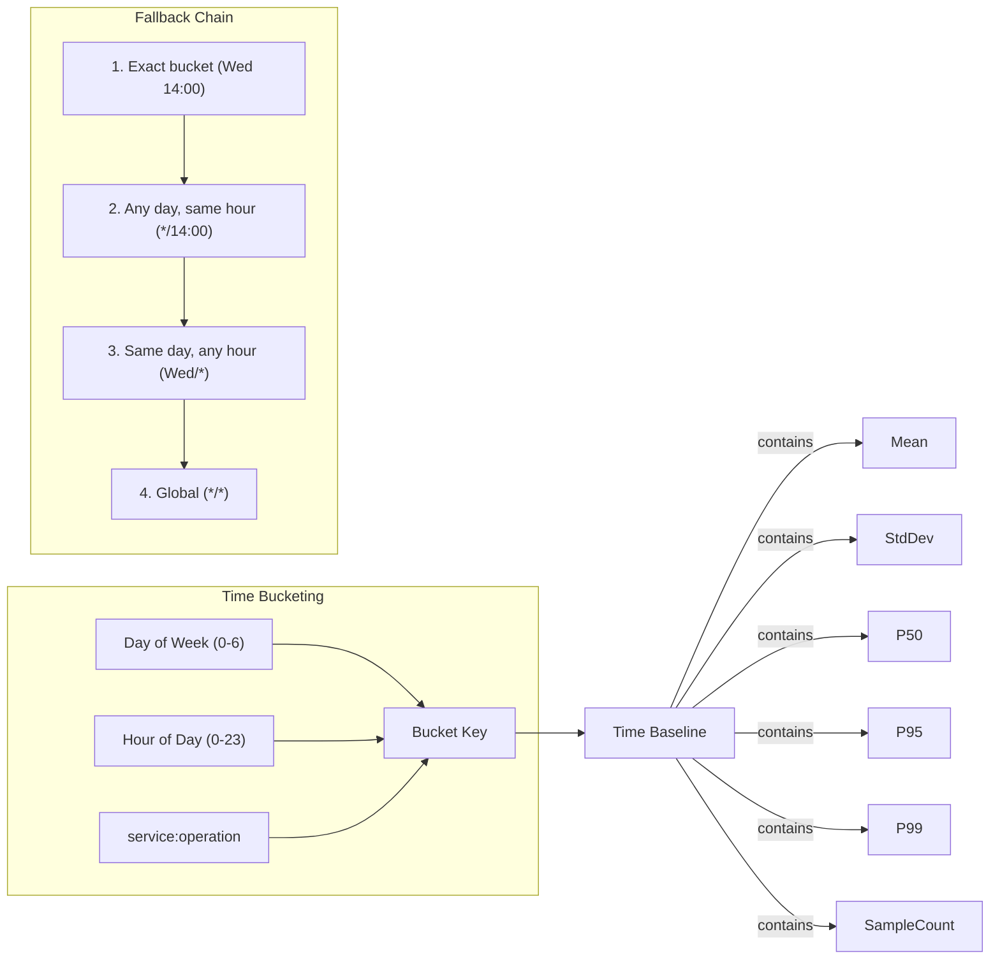
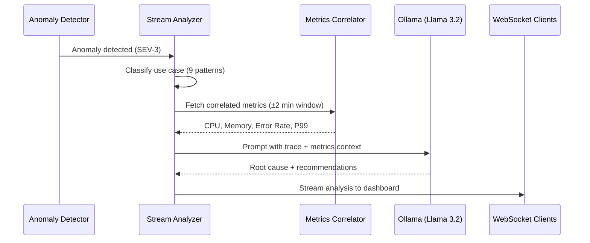
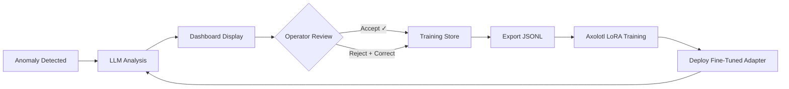
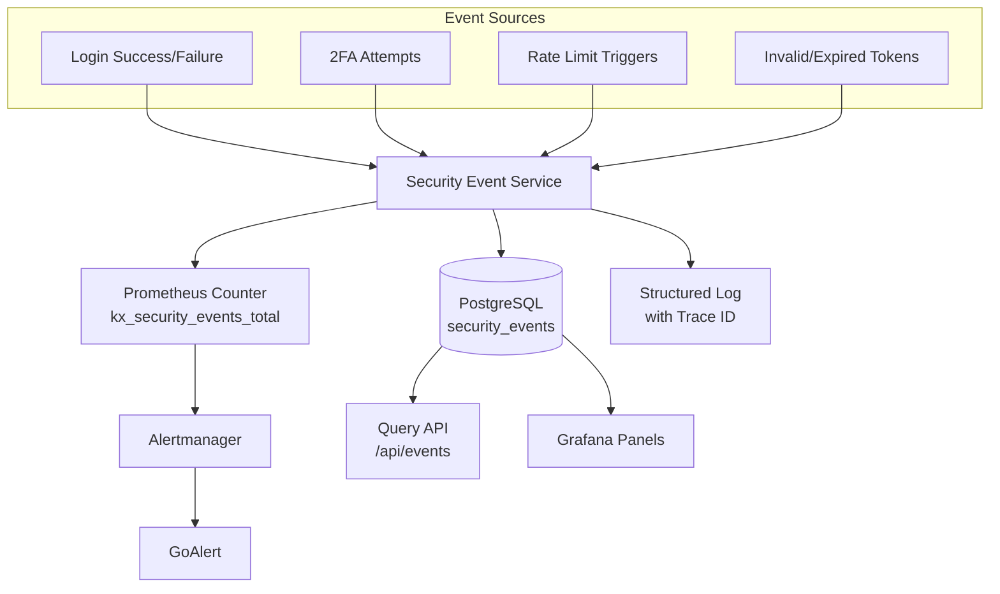
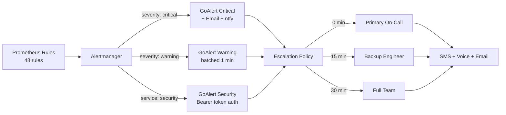
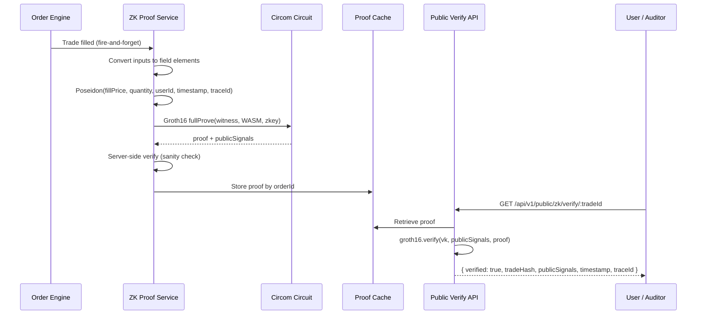

# Krystaline Observability Lab
### Technical Architecture & Capabilities Overview

**Version:** 2.1  
**Date:** July 5, 2026  
**Classification:** Public  
**Authors:** Carlos Montero & Antigravity (AI Assistant, Google DeepMind)  
**Sessions:**  
- `5dade5d5-ac60-4143-9ee9-97e7d22e1fa7` — v1.0 (Feb 7, 2026)  
- `f0615ab8-927d-47ef-97bf-e1eeb4f812c5` — v2.0 (Mar 6, 2026)  
- v2.1 (Jul 5, 2026) — accuracy revision: claims re-verified against the codebase; service table, trace tree, detector attribution, and metrics catalog corrected  

---

## 1. Executive Summary

Krystaline Observability Lab is a full-stack cryptocurrency exchange
observability demo built on a philosophy we call **Proof of Observability** —
the principle that every transaction, every service interaction, and every
system decision must be traced, verified, and auditable in real time.

Unlike traditional exchanges that treat monitoring as an afterthought, the lab
embeds observability into the architecture from the start. Every trade generates
a distributed trace typically spanning 17+ operations on the full RabbitMQ trade
path (observed in demo traces) and a **Groth16
zk-SNARK proof** anchoring execution to its timestamp and OTel trace. Every
latency measurement feeds into statistical baselines that power autonomous
anomaly detection. Every security event is persisted, correlated, and surfaced
through unified dashboards — all without requiring operators to switch between
disconnected tools.

The result is an exchange demo that pairs continuous telemetry with cryptographic proof: every filled trade carries a Groth16 integrity proof, and solvency is committed to on a rolling basis.
This architecture serves as a **scalable template for Unified, Consolidated Observability** — demonstrating how the same patterns can track and trace all operations across an entire organization, from trading to compliance to infrastructure.

**Key metrics:**
- **4 monitored business services** with 32+ tracked operations  
- **2 zk-SNARK circuits** (Groth16/BN128) — trade integrity + solvency  
- **5-tier severity model** (SEV1–SEV5) calibrated to normal distribution percentiles  
- **48 alert rules** across 11 groups with automated escalation  
- **Sub-second whale-transaction detection** — the event-driven amount detector updates baselines with Welford's online algorithm at execution time  
- **AI-powered root-cause analysis** via locally hosted Llama 3.2:1B (Ollama), with an in-repo LoRA fine-tuning pipeline  
- **1,100+ passing automated tests** (1,088 in the main suite + 99 in otel-mcp-server) ensuring regression-free deployments  

**How to read this document.** Claims are tagged for verifiability — **[PUBLIC]** (verifiable directly in the open-source repository, at the cited file), **[CORE]** (implemented in the private core, not in this repo), **[BACKLOG]** (tracked but not yet built), **[ASPIRATIONAL]** (direction, no committed timeline), **[NON-GOAL]** (deliberately out of scope) — and unless tagged otherwise, everything below is [PUBLIC], because the thesis of this platform is that it should be verifiable before it asks anyone to trust it.

---

## 2. Platform Introduction

Krystaline Observability Lab operates as a full-stack BTC/USD exchange demo. Four
services appear in every full trade trace:

| Service | Responsibility | Technology |
|---------|---------------|------------|
| **Browser Client** (`kx-wallet`) | Trading UI; starts each trade's trace with a client-side `order.submit.client` span (`client/src/lib/otel.ts`) | React + OTel Web SDK |
| **API Gateway** (`api-gateway`) | Request routing, rate limiting | Kong Gateway |
| **Trading Engine** (`kx-exchange`) | Express API: order lifecycle, wallet management and settlement, user accounts, zk proof generation | Node.js + PostgreSQL |
| **Order Matcher** (`kx-matcher`) | Order matching and execution — the `payment-processor/` process (formerly "Payment Processor"), consuming the legacy `payments` queue and replying on `payment_response` | Node.js + RabbitMQ |

The platform processes trades against a **live Binance WebSocket price feed**, ensuring non-simulated, deterministic pricing. Users interact through a React frontend that surfaces real-time system health, trace-verified activity feeds, and per-operation performance data — directly in the trading interface.

<!-- TODO: recapture screenshot — Krystaline Landing Dashboard — "Don't Trust. Verify." with live system status showing 3,879 trades and all services operational -->

---

## 3. Observability Architecture

### 3.1 Four Pillars of Observability

Krystaline implements a **four-pillar observability model** that unifies all telemetry signals into a single analysis plane:



### 3.2 End-to-End Data Flow

Every user action (login, trade, transfer) generates telemetry that flows through three distinct pipelines:



### 3.3 Technology Stack

| Layer | Technology | Purpose |
|-------|-----------|---------|
| Instrumentation | OpenTelemetry SDK | Distributed tracing across all services |
| Trace Backend | Jaeger (all-in-one) | Trace collection, storage, and query API |
| Metrics | Prometheus + Node Exporter + PG Exporter | Time-series metrics (app + infra + DB) |
| Log Aggregation | Loki + Promtail | Structured log ingestion and correlation |
| Dashboarding | Grafana | Unified multi-signal visualization |
| Alerting | Alertmanager → GoAlert | Tiered alert routing with on-call scheduling |
| AI Analysis | Ollama (Llama 3.2:1b) | Automated root-cause analysis of anomalies |
| Message Queue | RabbitMQ | Event-driven order processing and settlement |
| Databases | PostgreSQL (x3) | App data, Kong config, GoAlert state |

---

## 4. Statistical Anomaly Detection Engine [PUBLIC]

The core of Krystaline's intelligence layer is a **dual-mode statistical anomaly detection engine** that operates in real-time on both latency and transaction amount signals.

### 4.1 Latency Anomaly Detection

The **Trace Profiler** continuously polls the Jaeger API every 30 seconds, collecting spans from all four monitored services. Each poll computes per-operation batch statistics — sorted percentiles plus a two-pass mean/variance over the poll's spans (`server/monitor/trace-profiler.ts`, `updateBaselines`). On persistence, the **History Store** merges each batch **additively** into the stored baseline using weighted averaging for the mean and a pooled-variance formula for the standard deviation (`server/monitor/history-store.ts`), so restarts and new polls refine — rather than overwrite — institutional history. Separately, the **Baseline Calculator** recomputes time-bucketed baselines with a two-pass mean/variance calculation using Bessel's correction (`server/monitor/baseline-calculator.ts`, see §4.3).

The **Anomaly Detector** then evaluates each incoming span against its operation baseline using **Z-score deviation**:

```
deviation = (observedDuration - baselineMean) / baselineStdDev
```

Anomalies are classified into a **5-tier severity model** calibrated to the percentiles of a normal distribution:

| Severity | σ Threshold | Percentile | Meaning |
|----------|-------------|------------|---------|
| SEV-5 | >3.0σ | ~99.9th | Minor variance — monitoring only |
| SEV-4 | >4.0σ | ~99.997th | Notable deviation — investigate |
| SEV-3 | >5.0σ | ~99.99997th | Significant anomaly — alert |
| SEV-2 | >6.0σ | ~99.9999999th | Critical — immediate response |
| SEV-1 | >8.0σ | ≫99.9999999th (~10⁻¹⁵ tail) | Catastrophic — page on-call |

*Source: `server/monitor/anomaly-detector.ts`*

The system enforces a **minimum of 10 samples per baseline bucket (MIN_SAMPLES = 10)** before enabling detection, preventing false positives during the bootstrap phase when statistical distributions are unreliable.

### 4.2 Transaction Amount Anomaly Detection ("Whale Detector")

A separate **Amount Anomaly Detector** monitors transaction volumes using the same Z-score methodology but with **a more relaxed threshold ladder (3σ–7σ)** tuned to catch massive outliers in financial data spanning 6 orders of magnitude:

| Severity | σ Threshold | Example Detection |
|----------|-------------|-------------------|
| SEV-5 | >3.0σ | Unusually large retail order |
| SEV-4 | >4.0σ | Large institutional block trade |
| SEV-3 | >5.0σ | Whale transaction |
| SEV-2 | >6.0σ | Potential market manipulation |
| SEV-1 | >7.0σ | Systemic anomaly / 6+ orders of magnitude |

*Source: `server/monitor/types.ts` (WHALE_THRESHOLDS)*

This detector is **event-driven** — it evaluates every order and transfer at execution time, providing sub-millisecond detection without polling overhead. Its baselines are updated incrementally with **Welford's online algorithm** (`server/monitor/amount-profiler.ts`, `recordTransaction`) — an incremental method that computes mean and variance in a single pass without storing historical values:

```
# Welford's Online Algorithm (as implemented)
For each new observation x:
    count += 1
    delta = x - mean
    mean += delta / count
    delta2 = x - mean
    variance = ((variance * (count - 1)) + delta * delta2) / count
    stdDev = sqrt(variance)
```

This approach matters for an inline, event-driven detector because:
- **O(1) memory** — no need to store millions of raw data points  
- **Numerically stable** — avoids catastrophic cancellation in variance calculation  
- **Incremental** — baselines refine on every transaction without batch recomputation  

The detector calculates approximate USD values using live price feeds and generates human-readable explanations:

> *"BUY order of 150.000 BTC (~$13,500,000) is 14.7σ above the historical mean. This transaction is 3 orders of magnitude larger than typical activity. SEV-1 flagged for immediate review."*

### 4.3 Time-Aware Baselines with Adaptive Thresholds

The **Baseline Calculator** implements a sophisticated time-bucketed baseline system that accounts for natural traffic patterns:



**Key properties:**

- **168 time buckets** per operation (7 days × 24 hours) capture diurnal and weekly patterns  
- **Additive merging** — recalculations use weighted averaging to merge with existing baselines rather than overwriting them, preserving institutional history  
- **Watermark-based incremental updates** — only new traces (after the last processed timestamp) are fetched from Jaeger, reducing data transfer and compute  
- **PostgreSQL persistence** — all baselines survive application restarts and can be audited  
- **4-level fallback chain** ensures anomaly detection works even during the first hour of a new weekday  

### 4.4 Status Enrichment

Each span baseline is enriched with a real-time **status indicator** — a 7-state `BaselineStatus` that separates three distinct signals: deviation of the current mean, deviation of the *rate of change* (slope), and sustained directional trend:

| Status | Meaning | Dashboard Color |
|--------|---------|-----------------|
| `normal` | Performance within expected range | Green |
| `above_mean` | Running slower than historical average (1–3σ) | Amber |
| `below_mean` | Running faster than historical average (1–3σ) | Blue |
| `slope_above` | Rate of change increasing (1–3σ) | Orange |
| `slope_below` | Rate of change decreasing (1–3σ) | Cyan |
| `upward_trend` | Consistent upward latency movement | Yellow |
| `downward_trend` | Consistent downward latency movement | Teal |

*Source: `server/monitor/types.ts` (`BaselineStatus`), rendered by `client/src/components/ui/baseline-status-badge.tsx`.*

This feeds the **Deviation Mini-Chart** on the frontend — a spatial visualization plotting each latency point against its historical σ-bands, providing an instant "at a glance" performance proof.

### 4.5 Bayesian Root-Cause Ranking

Z-score detection gives a binary verdict. A dedicated Python microservice (`bayesian-service/`, FastAPI on port 8100) layers probabilistic reasoning on top of it, and the repo ships **two distinct Bayesian engines**:

**Engine 1 — Hierarchical latency model** (`bayesian-service/app/models.py`). A hierarchical PyMC model places global hyperpriors over the whole fleet and per-service Normal/HalfNormal priors beneath them, so a service with sparse data borrows statistical strength from its peers instead of producing unstable estimates. Inference runs MCMC with 500 draws; when full sampling is not viable, the engine falls back to an **analytical conjugate posterior** computed directly from summary statistics — the answer degrades gracefully rather than disappearing.

**Engine 2 — Noisy-OR alert correlation** (`bayesian-service/app/models.py` + `bayesian-service/app/poller.py`). When several alerts fire at once, a Noisy-OR Bayesian network ranks candidate root causes across them. Its parameters are not hand-tuned: an autonomous poller re-trains the network every 30 seconds (the default `POLL_INTERVAL`) from **resolved incidents** pulled from Alertmanager and enriched with **Prometheus exemplar trace IDs**, so each training example is anchored to the exact trace that was misbehaving when the alert fired.

The division of labor is deliberate: statistical detection answers *"is this abnormal?"*; the Bayesian layer answers *"how likely is each cause?"*

---

## 5. Distributed Trace Correlation

### 5.1 End-to-End Trace Propagation

Every trade's trace context is minted **in the browser** and propagates through the entire service chain (span-by-span breakdown with source links in [ANATOMY_OF_A_TRADE.md](ANATOMY_OF_A_TRADE.md)):

```
kx-wallet (browser) — order.submit.client
  └─ fetch POST (W3C traceparent leaves the browser)
      └─ api-gateway — Kong HTTP span (when routed through the gateway)
          └─ kx-exchange — POST /api/v1/orders (Express + middleware spans)
              ├─ pg.query:* (balance checks, order INSERT — auto-instrumented)
              ├─ publish orders (RabbitMQ producer span)
              │   └─ kx-matcher — order.match (consumer, separate process)
              │       └─ order.response (reply on payment_response queue)
              ├─ pg.query:* (wallet settlement UPDATEs + order status, back in kx-exchange)
              └─ zk.prove → zk.data.fetch / zk.witness.generate /
                            zk.proof.generate / zk.proof.verify (fire-and-forget)
```

A single trade typically generates **17+ spans** on the full RabbitMQ trade path (observed in demo traces), each with microsecond-precision timing. The **W3C Trace Context** standard (`traceparent` header) ensures lossless propagation through both HTTP and AMQP boundaries.

### 5.2 Trace-Verified Activity Feed

The Activity page surfaces every trade with its associated **Trace ID** — a clickable link that opens the complete distributed trace in Jaeger. This is not cosmetic; the platform **only displays trades for which a valid trace exists**, ensuring every record shown to the user has been verified through the observability pipeline.

<!-- TODO: recapture screenshot — Activity page showing trace-linked transactions — each trade has its Trace ID visible with a "View Trace" button linking to Jaeger -->

### 5.3 Cross-Signal Correlation

The **Metrics Correlator** is the bridge between trace-level anomalies and system-level reality. When an anomaly is detected, it automatically queries Prometheus for metrics within a ±2 minute window around the anomaly timestamp:

| Correlated Signal | Source | Purpose |
|-------------------|--------|---------|
| CPU usage % | Node Exporter | Detect resource saturation |
| Memory (MB) | Node Exporter | Identify memory pressure |
| Request rate/sec | Application metrics | Detect traffic spikes |
| Error rate % | HTTP status codes | Correlate with failures |
| P99 latency (ms) | Request duration histogram | Confirm latency measurements |
| Active connections | PostgreSQL Exporter | Detect connection pool exhaustion |

The correlator generates **human-readable insights** such as:
- *"High CPU usage (87%) during the anomaly window — possible resource saturation"*  
- *"Error rate spiked to 12% — correlated failures suggest upstream dependency issue"*  
- *"Connection pool at 93% capacity — database contention likely contributing to latency"*

These insights are attached to the anomaly record and served to both the LLM analysis engine and the operations dashboard.

---

## 6. AI-Powered Root-Cause Analysis [PUBLIC]

### 6.1 Architecture

Krystaline integrates a locally-hosted **Ollama** instance running **Llama 3.2 (1B parameter)** for automated root-cause analysis. The model runs entirely on-premises — no telemetry data leaves the infrastructure boundary.



### 6.2 Use-Case Specific Prompting

Rather than using a generic analysis prompt, the **Stream Analyzer** classifies each anomaly into one of **9 use-case patterns** with tiered priority:

| Priority | Use Case | Trigger Pattern |
|----------|----------|----------------|
| **P0** | Payment Gateway Down | Service name contains `payment` AND (HTTP status ≥500 OR error tag) |
| **P0** | Certificate Expired | `error.message` contains "cert" or "ssl" |
| **P0** | DoS Attack | Service name contains `gateway` AND HTTP status 429 |
| **P0** | Auth Service Down | Service name contains `auth` AND HTTP status ≥500 |
| **P1** | Cloud Provider Issue | Deviation >5σ AND duration >3× expected mean |
| **P1** | Queue Backlog | Service name contains `matcher` or `order` |
| **P1** | Third Party Timeout | Duration >10s AND operation contains "external" or "api" |
| **P2** | Database Issue | Operation contains "query" or "db" |
| **P2** | Performance Anomaly | Catch-all for unclassified patterns |

*Source: `match()` predicates in `server/monitor/stream-analyzer.ts` (`USE_CASES`).*

Each use case injects a **domain-specific prompt template** that guides the LLM toward the most relevant diagnosis, while the full trace context and correlated metrics provide factual grounding.

### 6.3 Structured Output

The LLM response is parsed into a structured format:

```json
{
  "traceId": "a1b2c3d4e5f6...",
  "summary": "Order matching exceeded 2.3s due to database lock contention",
  "rootCauses": [
    "PostgreSQL connection pool at 89% capacity during peak hour",
    "Concurrent wallet updates causing row-level locks on balances table"
  ],
  "recommendations": [
    "Increase connection pool from 20 to 40 for kx-matcher",
    "Implement optimistic locking for balance updates to reduce contention"
  ],
  "confidence": "high",
  "model": "llama3.2:1b",
  "processingTimeMs": 1847
}
```

### 6.4 Operational Metrics

The LLM pipeline itself is instrumented with Prometheus metrics:

| Metric | Type | Purpose |
|--------|------|---------|
| `kx_llm_analysis_total` | Counter | Total analyses by status and use case |
| `kx_llm_events_by_severity_total` | Counter | Input volume by severity level |
| `kx_llm_analysis_duration_seconds` | Histogram | LLM inference latency monitoring |
| `kx_llm_queue_depth` | Gauge | Current pending analysis queue size |
| `kx_llm_dropped_events_total` | Counter | Dropped analysis events by reason (`queue_full`, `llm_error`, `timeout`) |

These metrics feed into the Grafana dashboard, enabling operators to monitor the health of the AI pipeline itself — a meta-observability layer.

### 6.5 LoRA Fine-Tuning Pipeline

The base Llama 3.2:1B model can be **continuously improved** using production data via a LoRA (Low-Rank Adaptation) fine-tuning pipeline:

| Parameter | Value |
|-----------|-------|
| **Framework** | Axolotl LoRA (base model loaded in 8-bit — `axolotl-config.yaml`) |
| **Base model** | Llama 3.2:1B |
| **Adapter** | LoRA rank 16, alpha 32, dropout 0.05 |
| **Training data** | Human-validated anomaly analyses (accept/reject + freeform corrections) |
| **Data source** | `GET /api/v1/monitor/training/export` — exports validated analyses in Axolotl JSONL format |
| **Human feedback** | Operators rate AI analyses via the dashboard; corrections become training samples |



This closed-loop architecture means the AI improves from real production incidents — not synthetic benchmarks — creating a **flywheel effect** where every resolved anomaly makes the next diagnosis faster and more accurate.

### 6.6 Read-Only MCP Tool Surface

Everything the human operator sees, an AI agent can query through the **Model Context Protocol**. Two servers ship in the repo:

| Server | Location | Surface |
|--------|----------|---------|
| Embedded | `server/mcp/index.ts` | **28 tools** — traces, metrics, logs, zk proofs, anomalies, system health/topology, Bayesian train/infer — served in-process or over HTTP on port 3100 |
| Standalone | `otel-mcp-server/` (v1.2.0, maintained as a subtree with its own package, tests, and changelog) | **32 tools across 7 skill plugins** (traces, metrics, logs, Elasticsearch, Alertmanager, zk-proofs, system), selectable per deployment via a `--tools` flag |

The distinctive capability is that agents don't merely *retrieve* proofs — they **cryptographically verify** them. The `zk_proof_verify` tool calls `GET /api/public/zk/verify/:tradeId`, whose handler executes a real `snarkjs.groth16.verify()` against the committed verification key and returns the mathematical verdict. An agent investigating an incident can therefore *assert* trade integrity rather than assume it.

Both surfaces are **read-only by design**. Mutating actions — placing orders, silencing alerts, changing configuration — are a **[NON-GOAL]** for the MCP layer: an agent may observe and verify everything, and change nothing.

---

## 7. Security Observability

### 7.1 Security Event Architecture

Krystaline implements a dedicated **Security Event Service** that captures, persists, and exposes security-relevant events across the platform:



Every security event is stored with full context: event type, severity, user ID, IP address, user agent, resource path, and — critically — the **trace ID** that links the security event to its complete distributed trace.

### 7.2 Security Alert Rules

Ten dedicated Prometheus alert rules monitor for attack patterns:

| Alert | Expression | Severity |
|-------|-----------|----------|
| BruteForceAttack | >20 failed logins in 5 min | Critical |
| CredentialStuffingAttack | >50 failed logins in 15 min | Critical |
| TwoFactorAuthBypass | >10 2FA failures in 10 min | Critical |
| RateLimitAbuse | >30 rate limits in 5 min | Critical |
| AuthEndpointAbuse | >20 auth rate limits in 5 min | Critical |
| SensitiveOperationAbuse | >5 sensitive rate limits in 5 min | Critical |
| TokenEnumerationAttack | >15 invalid tokens in 5 min | Critical |
| HighSeveritySecurityEvents | >5 high/critical events in 10 min | Critical |
| AuthenticationFailures | >10 auth failures/sec (rate) | Warning |
| RateLimitExceeded | >1 rate-limited (HTTP 429) request/sec, sustained 5 min | Warning |

### 7.3 Audit Trail Compliance

The `security_events` table provides a complete, queryable audit trail with:
- Time-range filtering for compliance investigations  
- Per-user and per-IP event history  
- Real-time high-severity event feeds for the operations dashboard  
- Event count aggregation by type for trend analysis  

---

## 8. Unified Dashboard & Alert Routing

### 8.1 Grafana Unified Dashboard

All four observability pillars converge in a single **Grafana dashboard** that provides cross-signal correlation without context switching:

| Panel Group | Data Sources | Key Panels |
|-------------|-------------|------------|
| **Application Health** | Prometheus | Error rate, request rate, P50/P95/P99 latencies |
| **Infrastructure** | Prometheus + Node Exporter | CPU, memory, disk, network utilization |
| **Distributed Traces** | Jaeger | Recent traces, trace search, span breakdown |
| **Log Analysis** | Loki | Error log frequency, log search, pattern matching |
| **Security Events** | Prometheus + PostgreSQL | Event timeline, attack pattern graphs, per-IP heatmaps |
| **LLM Operations** | Prometheus | Analysis throughput, queue depth, inference latency |
| **Database Health** | PostgreSQL Exporter | Connection pool, query duration, table size |
| **Message Queue** | RabbitMQ (Prometheus) | Queue depth, consumer lag, publish rate |

<!-- TODO: recapture screenshot — Krystaline Unified Observability dashboard — Application Metrics section showing HTTP Request Rate, Response Latency (P50/P95), Error Rate, and Server Memory utilization -->

<!-- TODO: recapture screenshot — Order Matcher section showing 475 orders processed, order processing rate, P50/P95 matcher latency, 0.242% average slippage, and System Health panels (CPU 34.6%, Memory 59.7%, Disk 60.0%, 7 Services Up) -->

<!-- TODO: recapture screenshot — Logs & Traces section showing aggregated Application Logs from the OTEL Collector and Recent Traces panel for distributed trace analysis -->

#### Jaeger Distributed Trace Backend

The Jaeger UI provides deep-dive trace analysis with service-level span breakdowns, latency scatter plots, and cross-service dependency graphs:

<!-- TODO: recapture screenshot — Jaeger UI showing 20 distributed traces from api-gateway (Kong) — traces contain 30–32 spans across 3 services (api-gateway, kx-exchange, kx-matcher) with 130–240ms durations, demonstrating full end-to-end trace propagation through the order processing pipeline -->

### 8.2 Public Transparency Dashboard

Beyond internal monitoring, Krystaline exposes a **customer-facing transparency page** that displays real-time system health metrics directly within the trading application:

<!-- TODO: recapture screenshot — System Transparency page — 4 active services monitored, 99.9% uptime, 397ms average response, 32 operations tracked, with per-service health cards showing individual response times -->

This is not a static status page — it's a **live observability feed** that recalculates from actual trace data every refresh. Each service card shows:
- Current average response time (from Jaeger spans, not synthetic probes)
- Request count over the monitoring window
- Operational status derived from baseline deviation thresholds

### 8.3 Alert Escalation Chain

Alerts flow through a multi-tier escalation pipeline:



**Inhibition rules** prevent alert storms:
- Critical alerts suppress warnings for the same alert/service combination
- `ServiceDown` alerts suppress all other alerts for the affected service

---

## 9. SLO Compliance & MTTD / MTTR

### 9.1 SLO Framework

Krystaline defines and monitors two primary SLOs:

| SLO | Target | Alert Threshold | Measurement |
|-----|--------|-----------------|-------------|
| **Availability** | 99.9% | <99.5% for 5 min | `1 - (5xx responses / total responses)` |
| **Latency** | P95 < 500ms | P95 > 500ms for 10 min | `histogram_quantile(0.95, http_request_duration)` |

### 9.2 Minimizing MTTD (Mean Time to Detect)

The platform targets fast detection — including a 10-second anomaly detection loop — through multiple detection layers:

| Detection Layer | Polling Interval | MTTD |
|----------------|-----------------|------|
| Trace Profiler | 30 seconds | ~30s for new anomalies |
| Prometheus Scrape | 15 seconds | ~15s for metric thresholds |
| Amount Anomaly Detector | Event-driven | <1ms (inline with execution) |
| Alertmanager Group Wait | 10s (critical) / 1m (warning) | +10s (critical) to +1m (warning) for notification |
| **Effective MTTD** | — | **<60 seconds** for critical issues |

### 9.3 Minimizing MTTR (Mean Time to Resolve)

The AI-powered analysis pipeline shortens triage by automating the most time-consuming phase of incident response — **diagnosis**:

| MTTR Phase | Krystaline |
|------------|-------------|
| **Detection** | <60s (automated) |
| **Triage** | Instant (5-tier auto-classification) |
| **Diagnosis** | 2–5s (LLM analysis with context) |
| **Notification** | 10–30s (GoAlert auto-escalation) |
| **Resolution** | Variable + guided recommendations |

The combination of automated detection, instant severity classification, AI-generated root-cause analysis, and tiered escalation shortens triage for most incident categories.

### 9.4 Verification: Chaos as Falsification

A detection claim that cannot be made to fail is not a claim. Every detection capability in this document is reproducible — and falsifiable — via the chaos scenarios documented in [CHAOS_INJECTION.md](CHAOS_INJECTION.md): API-key-gated latency and error injection lets anyone trigger the exact fault a detector claims to catch and watch whether it actually fires.

Two design details keep the experiment honest:

- **Baselines freeze during chaos.** The chaos controller calls `freezeBaselines()` on the trace profiler (`server/monitor/trace-profiler.ts`) when a scenario starts and unfreezes it on stop, so the anomaly detector keeps comparing against pre-chaos normals — injected faults can never contaminate the learned baselines they are supposed to violate.
- **Trace propagation is proven by test, not asserted.** The end-to-end suite (`scripts/e2e-test.js`) mints a random 128-bit trace ID client-side, sends it through Kong as a `traceparent` header, and asserts that the *exact same ID* appears in Jaeger with spans across multiple services. This job runs in CI as a manually triggered `workflow_dispatch` workflow (it needs the full running stack), not on every pull request — a deliberate scope statement, not a per-commit guarantee.

---

## 10. Trade Execution Observability

### 10.1 Live Trace Integration

The trading interface integrates observability directly into the user workflow. The **Trade page** shows live traces and portfolio data side-by-side:

<!-- TODO: recapture screenshot — Trade page with BTC/USD trading interface, portfolio summary, and Live Traces panel linking to Jaeger and the monitoring dashboard -->

The **Live Traces** panel at the bottom-right is a WebSocket-powered stream of OpenTelemetry trace data. When a user executes a trade, the trace appears in real-time — providing instant confirmation that the operation was captured, measured, and verified by the observability pipeline.

### 10.2 Verified-Only Display Policy

The Activity feed implements a **Verified-Only** display policy: trades are only shown if they have a corresponding trace in Jaeger. This eliminates "ghost" transactions — records that might be in the database but weren't properly instrumented. It's a guarantee to users that what they see on screen reflects the actual state of the system, verified by an independent telemetry pipeline.

---

## 11. Cryptographic Trade Verification (zk-SNARKs) [PUBLIC]

Krystaline goes beyond observability into **cryptographic verification** — generating zero-knowledge proofs that mathematically guarantee trade integrity without revealing private inputs.

### 11.1 Architecture

The ZK proof pipeline uses **snarkjs** (Groth16 prover/verifier) with **circomlibjs** (Poseidon hasher) over the BN128 elliptic curve. Proof generation is **fire-and-forget** — it runs asynchronously after each filled trade and never blocks the trading path.



### 11.2 Trade Integrity Circuit (5-Input Poseidon)

The `trade_integrity.circom` circuit proves that a trade commitment was computed correctly without revealing the private trading inputs:

| Signal | Type | Purpose |
|--------|------|---------|
| `fillPrice` | Private | Execution price (×10⁸ field element) |
| `quantity` | Private | Trade quantity (×10⁸ field element) |
| `userId` | Private | SHA-256 hash of user ID, truncated to BN128 field |
| `timestamp` | Private | Unix epoch milliseconds — anchors trade to execution time |
| `traceId` | Private | OTel trace ID as field element — anchors trade to its distributed trace |
| `tradeHash` | Public | Poseidon(fillPrice, quantity, userId, timestamp, traceId) |
| `priceLow` / `priceHigh` | Public | ±0.5% of Binance price — range check |

**Tampering vectors closed:**

| Vector | How it's closed |
|--------|----------------|
| **Post-hoc price manipulation** | `fillPrice` is committed into the Poseidon hash; altering it invalidates the proof |
| **Backdated trades** | `timestamp` (Unix ms) is a private input; changing it changes the commitment |
| **Trace ID substitution** | `traceId` is committed; swapping the OTel trace breaks the proof |

### 11.3 Solvency Circuit

A separate circuit generates a solvency proof every 60 seconds without revealing individual balances. The Poseidon reserve commitment is published on the public endpoint; the Groth16 solvency proof itself is verified server-side (the trade-integrity proofs are the externally verifiable ones):

- **8-balance Poseidon commitment**: `Poseidon(balance₁, ..., balance₈) == reserveCommitment`
- **Sum constraint**: `SUM(balances) == claimedTotal`
- **Threshold constraint**: `claimedTotal >= threshold`
- Regenerated automatically on a 60-second timer from live PostgreSQL wallet data

### 11.4 Observability of the ZK Pipeline

The proof generation pipeline is itself fully instrumented with OpenTelemetry spans:

| Span | Purpose |
|------|---------|
| `zk.prove` | Parent span for full proof lifecycle |
| `zk.data.fetch` | Input conversion to field elements |
| `zk.witness.generate` | Witness computation |
| `zk.proof.generate` | Groth16 proving (computationally intensive) |
| `zk.proof.verify` | Server-side verification |
| `zk.solvency.prove` | Solvency proof generation |

This means **the cryptographic layer itself is observable** — proving time, verification success rate, and proof pipeline health are all tracked, alerted on, and dashboarded.

### 11.5 Measured Performance

| Circuit | Wires | Proving key size | Warm proving | Verify | Proof size |
|---------|-------|------------------|--------------|--------|------------|
| `trade_integrity` | 977 | 425,302 B | 129–152 ms | 12–20 ms | 724 B (serialized JSON) |
| `solvency` | 1,256 | 578,660 B | — | — | — |

*Benchmark run 2026-07-05 against the committed artifacts in `server/circuits/build/`; wire counts read from the zkey headers. Proving/verify timings are for the trade-integrity circuit (6 warm runs on a development machine); the solvency circuit was not separately timed.*

Three properties of this pipeline are deliberately stated at their actual strength, not above it:

- **Proofs are session-cached, in memory.** Generated proofs live in an in-process cache keyed by trade ID; they are not persisted to durable storage.
- **Verification is server-side, with independently verifiable payloads.** `GET /api/public/zk/verify/:tradeId` runs `groth16.verify()` on the server, and `GET /api/public/zk/proof/:tradeId` returns the proof, public signals, *and the verification key* — so any third party can re-run the verification with stock snarkjs and no trust in the server.
- **The trusted setup is dev-grade and single-party.** The committed proving keys were generated without a multi-party ceremony. No ceremony claims are made: securing real value would require a proper MPC trusted setup before deployment.

---

## 12. Infrastructure & Deployment

### 12.1 Container Architecture

The platform runs as a Docker Compose stack with 22 services in docker-compose.yml:

| Category | Services | Count |
|----------|----------|-------|
| API Gateway | Kong Gateway, Kong PostgreSQL, Kong migrations (one-shot job) | 3 |
| Message Queue | RabbitMQ (with Prometheus plugin) | 1 |
| Databases & Cache | App PostgreSQL, Redis | 2 |
| Observability | Jaeger, OTEL Collector, Prometheus, Loki, Promtail, Grafana | 6 |
| Alerting | Alertmanager, GoAlert, GoAlert PostgreSQL | 3 |
| AI | Ollama, Bayesian service (FastAPI) | 2 |
| Exporters | Node Exporter, PG Exporter ×2 (app + Kong), Redis Exporter | 4 |
| Utilities | MailDev (dev SMTP) | 1 |

The three Node.js processes — the `kx-exchange` API, the `kx-matcher` order matcher, and the Vite frontend — are **not** containers: they run natively on the host, started by `npm run dev` (docker-compose.yml notes this explicitly).

### 12.2 Kubernetes Readiness

The platform includes a complete **Helm chart** and Kubernetes manifests for production deployment, with:
- Health check probes (liveness + readiness) for all services
- Persistent volume claims for all stateful components
- ConfigMap-based configuration management
- Secret management for credentials and encryption keys
- Horizontal Pod Autoscaler (HPA) ready for production scaling

---

## 13. Related Work — What's Different

**Versus Merkle-tree proof-of-reserves.** Exchange proof-of-reserves schemes publish point-in-time attestations — a Merkle root of balances, audited quarterly or on demand. Krystaline's solvency commitment is regenerated **every 60 seconds** from live wallet data, and it is paired with something reserve schemes do not have: a **per-trade integrity circuit** that commits the OTel `traceId` into the Poseidon hash, while the proving pipeline emits its own spans inside that same trace. The proof commits to the trace, and the trace records the proof — attestation and telemetry are cryptographically interlocked rather than parallel artifacts.

**Versus the OpenTelemetry community demo.** The OpenTelemetry demo application is an excellent instrumentation reference — a telemetry showcase, and deliberately nothing more. It makes no financial-integrity claims about the data flowing through it. Krystaline treats the trace as evidence: trades only display if a trace exists, and the trace ID is bound into a zk-SNARK.

**Versus SaaS AIOps platforms.** Commercial AIOps products ship telemetry to cloud-hosted LLMs and rank incidents with closed detection logic. Krystaline is **local-first** (Ollama on-premises, no telemetry leaves the boundary), its detection logic is **inspectable** (every claim above cites the implementing file), and paging is **deterministic** — 48 Prometheus rules through Alertmanager to GoAlert — with the LLM confined to an advisory role.

---

## 14. References

- Welford, B. P. (1962). "Note on a Method for Calculating Corrected Sums of Squares and Products." *Technometrics*, 4(3).
- Groth, J. (2016). "On the Size of Pairing-Based Non-Interactive Arguments." *Advances in Cryptology — EUROCRYPT 2016*.
- Grassi, L., Khovratovich, D., Rechberger, C., Roy, A., & Schofnegger, M. (2021). "Poseidon: A New Hash Function for Zero-Knowledge Proof Systems." *30th USENIX Security Symposium*.
- W3C. *Trace Context*. W3C Recommendation.
- Hu, E. J., Shen, Y., Wallis, P., Allen-Zhu, Z., Li, Y., Wang, S., Wang, L., & Chen, W. (2021). "LoRA: Low-Rank Adaptation of Large Language Models." arXiv:2106.09685.
- OpenTelemetry. *Semantic Conventions for Generative AI Systems*. OpenTelemetry Specification.

---

## Appendix A: Alert Rules Summary

| Group | Alert Count | Key Rules |
|----------|------------|-----------|
| Application | 5 | HighErrorRate, HighLatencyP99, HighLatencyP99Critical, ServiceDown, … |
| Trading | 4 | OrderProcessingFailures, OrderQueueBackup, OrderQueueCritical, PriceFeedUnavailable |
| Database | 5 | PostgreSQLDown, DatabaseConnectionsHigh, DatabaseConnectionsCritical, SlowQueries, … |
| RabbitMQ | 4 | RabbitMQDown, RabbitMQHighMemory, RabbitMQNoConsumers, RabbitMQConsumerLag |
| Infrastructure | 4 | HighCPUUsage, HighMemoryUsage, DiskSpaceLow, DiskSpaceCritical |
| Resilience | 2 | CircuitBreakerOpen, CircuitBreakerHalfOpen |
| Security | 10 | AuthenticationFailures, BruteForceAttack, CredentialStuffingAttack, RateLimitAbuse, … |
| SLO Availability | 4 | SLOAvailabilityBurnRateCritical/High/Elevated/Slow (multi-window burn rates) |
| SLO Latency | 2 | SLOLatencyBurnRateCritical, SLOLatencyBurnRateHigh |
| Redis | 4 | RedisDown, RedisMemoryHigh, RedisConnectedClientsHigh, RedisKeyEviction |
| Container Health | 4 | ContainerCrashLooping, ContainerOOMKilled, PodNotReady, DeploymentReplicasMismatch |
| **Total** | **48** | Source: `config/alerting-rules.yml` (11 groups) |

## Appendix B: Prometheus Metrics Catalog

| Metric | Type | Source |
|--------|------|--------|
| `http_requests_total` | Counter | Application |
| `http_request_duration_seconds` | Histogram | Application |
| `orders_processed_total` (labels: `status`, `side`) | Counter | Trading Engine |
| `price_feed_last_update_timestamp` | Gauge | Price Service |
| `kx_security_events_total` | Counter | Security Service |
| `kx_llm_analysis_total` | Counter | Stream Analyzer |
| `kx_llm_analysis_duration_seconds` | Histogram | Stream Analyzer |
| `kx_llm_queue_depth` | Gauge | Stream Analyzer |
| `kx_llm_events_by_severity_total` | Counter | Stream Analyzer |
| `kx_llm_dropped_events_total` | Counter | Stream Analyzer |
| `pg_up` | Gauge | PostgreSQL Exporter |
| `pg_stat_activity_count` | Gauge | PostgreSQL Exporter |
| `node_cpu_seconds_total` | Counter | Node Exporter |
| `node_memory_MemAvailable_bytes` | Gauge | Node Exporter |
| `node_filesystem_avail_bytes` | Gauge | Node Exporter |
| `rabbitmq_queue_messages` | Gauge | RabbitMQ Plugin |

---

*Krystaline Observability Demo Platform — Technical Architecture Whitepaper v2.1. Apache-2.0 Licensed.*
