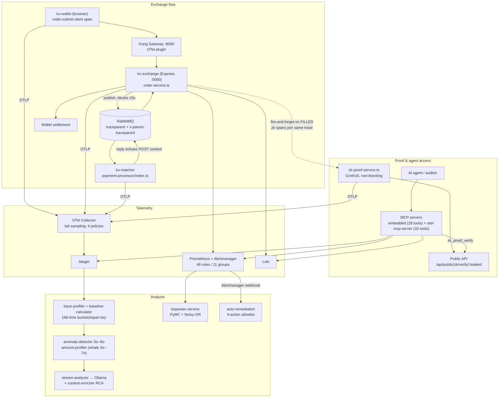

# Krystaline Architecture

Krystaline is a cryptocurrency exchange built so that every material flow can be independently checked: each trade is traced end-to-end (starting in the user's browser), analyzed for anomalies against learned baselines, and cryptographically bound to a zero-knowledge proof that commits to the OTel trace ID itself. The system is four cooperating planes — **Exchange flow**, **Telemetry**, **Analysis**, and **Proof & agent access** — all of which ship in this repository. Claims below carry evidence tags: [PUBLIC] means the code is in this repo, one click away. Where a number appears, it was measured or counted from the committed source, not estimated.

## Repository layout

```
client/                  React frontend (kx-wallet) — OTel Web SDK in src/lib/otel.ts
server/
  api/                   REST routes; public-routes.ts is the unauthenticated transparency API
  core/                  order-service.ts — validation, settlement, zk trigger
  services/              rabbitmq-client.ts, zk-proof-service.ts, kong-client.ts,
                         price-feed-manager.ts
  monitor/               anomaly detection, baselines, LLM RCA, chaos, remediation (20 files)
  bayesian/              Node client for the Python Bayesian service
  circuits/              Circom sources + committed Groth16 build artifacts
  mcp/                   embedded MCP server (28 tools)
  otel.ts                NodeSDK bootstrap — imported first
payment-processor/       kx-matcher — standalone order matcher
bayesian-service/        Python FastAPI — PyMC + Noisy-OR engines
otel-mcp-server/         standalone MCP server package (32 tools, v1.2.0)
config/                  collector, Prometheus, Alertmanager, alerting rules, Grafana provisioning
scripts/                 start-dev.js, dashboard validators, e2e-test.js
docker-compose.yml       22 infrastructure services
axolotl-config.yaml      LoRA fine-tune config (r=16, α=32)
```

## Four planes

### 1. Exchange flow [PUBLIC]

The trading system itself: three Node processes run natively on the host, backed by 22 Docker Compose services ([`docker-compose.yml`](../../docker-compose.yml)) for infrastructure (Kong + its Postgres + a run-once Kong migrations job, RabbitMQ, app PostgreSQL on host port 5433, Redis, Jaeger, OTel Collector, Prometheus, Alertmanager, Grafana, Loki, Promtail, Ollama, GoAlert + its Postgres, MailDev, bayesian-service, and 4 metrics exporters).

- **Frontend** (`kx-wallet`) — Vite/React on :5173 ([`client/src`](../../client/src)). The browser is a first-class traced service: [`client/src/lib/otel.ts`](../../client/src/lib/otel.ts) boots the OTel Web SDK, and the trade form opens a client span `order.submit.client` ([`client/src/components/trade-form.tsx`](../../client/src/components/trade-form.tsx)), so traces begin in the user's browser, not at the load balancer.
- **API server** (`kx-exchange`) — Express on :5000 ([`server/index.ts`](../../server/index.ts)). Registers itself with Kong at startup ([`server/services/kong-client.ts`](../../server/services/kong-client.ts)); rate limits are 300/60/15 requests per IP per 60 s for general/auth/sensitive routes ([`server/middleware/security.ts`](../../server/middleware/security.ts)).
- **Order matcher** (`kx-matcher`) — a standalone process ([`payment-processor/index.ts`](../../payment-processor/index.ts)) consuming a durable RabbitMQ queue, simulating fills with 0.01–0.5% slippage and replying on a response queue.
- **Order path** — `POST /api/v1/orders` → [`server/core/order-service.ts`](../../server/core/order-service.ts) validates wallets, then [`server/services/rabbitmq-client.ts`](../../server/services/rabbitmq-client.ts) publishes and blocks up to 5 s (behind a circuit breaker, failure threshold 3) on an exclusive per-instance reply queue — the exclusive queue exists so multiple API replicas can each receive their own responses. On FILLED: wallet settlement, then a **non-blocking** zk proof (`.catch`-guarded fire-and-forget at [`server/core/order-service.ts:286-294`](../../server/core/order-service.ts) — order flow never waits on proving).
- **Dev topology** — `npm run dev` ([`scripts/start-dev.js`](../../scripts/start-dev.js)) composes 21 of the 22 infrastructure services (all except bayesian-service), waits for Kong/RabbitMQ/Postgres health, enables Kong's OpenTelemetry and CORS plugins, then starts the API, matcher, and Vite in order. See [Getting Started](../GETTING_STARTED.md) for the 5-minute walkthrough ending in a verified proof.

### 2. Telemetry [PUBLIC]

Every hop emits OpenTelemetry; a full RabbitMQ trade trace typically shows 17+ spans across 4 services (kx-wallet → api-gateway → kx-exchange → kx-matcher, observed in demo traces).

- **Server SDK** — [`server/otel.ts`](../../server/otel.ts) boots the NodeSDK before any other import (ESM import-in-the-middle hook), with two span processors: a `SimpleSpanProcessor` feeding an in-process trace collector (last 100 business spans, for the local UI) and a `BatchSpanProcessor` exporting OTLP/HTTP. Auto-instrumentation covers HTTP and amqplib; `fs` and `undici` are disabled to cut noise. An `ignoreOutgoingRequestHook` (lines 148–161) drops spans for the system's own Jaeger/Prometheus polling so the anomaly detector can never flag its own monitoring loop.
- **Browser SDK** — the frontend exports OTLP/HTTP to the collector on :4319, so a trade trace's root span is created client-side before the request leaves the browser.
- **Broker propagation** — dual W3C context over RabbitMQ: the publisher injects both a `traceparent` (consumer parenting) and `x-parent-traceparent` (the original POST span context); the matcher echoes the POST context back as the reply's `traceparent`, so the async continuation — wallet update, zk proof spans — stitches into the original HTTP trace ([`server/services/rabbitmq-client.ts:183-212, 289-313`](../../server/services/rabbitmq-client.ts), [`payment-processor/index.ts:170-193, 260-268`](../../payment-processor/index.ts)).
- **Collector** — tail-based sampling with 4 explicit policies: keep all ERROR traces, all traces >500 ms, all traces touching kx-matcher/payment-processor, 10% probabilistic for the rest ([`config/otel-collector-config.yaml:35-55`](../../config/otel-collector-config.yaml)). CI validates this exact file with the real collector binary (`otel/opentelemetry-collector-contrib:0.120.0 validate`, [`.github/workflows/ci.yml:86-90`](../../.github/workflows/ci.yml)).
- **Metrics, logs, alerts** — Prometheus (12 h/2 GB retention, exemplar storage enabled) scrapes the app, the matcher's own metrics server on :3001, RabbitMQ, and four exporters (postgres, kong-postgres, node, redis); pino ships logs to Loki alongside Promtail. 48 alert rules in 11 groups ([`config/alerting-rules.yml`](../../config/alerting-rules.yml)) route through Alertmanager ([`config/alertmanager.yml`](../../config/alertmanager.yml)): critical → GoAlert + email + ntfy.sh push; `PriceFeedUnavailable` additionally hits the app's auto-remediation webhook; inhibition rules suppress warnings when the same service is critical.
- **Grafana provisioned from the repo** — 3 datasources with cross-links (Prometheus exemplars → Jaeger, Loki traceId-derived fields, Jaeger tracesToLogs/tracesToMetrics) and 5 dashboards, the largest being the unified dashboard with 73 panels backed by 79 query targets ([`config/grafana/provisioning/`](../../config/grafana/provisioning)).
- **Dashboards tested like code** — an 834-line validator executes every panel's PromQL against live Prometheus (data presence, query health, freshness, cross-panel invariants) with CI exit codes ([`scripts/validate-dashboard.js`](../../scripts/validate-dashboard.js)), and a 405-line integrity monitor pushes five `kx_dashboard_*` meta-metrics ([`scripts/dashboard-integrity-monitor.js`](../../scripts/dashboard-integrity-monitor.js)).

### 3. Analysis [PUBLIC]

Twenty files under [`server/monitor/`](../../server/monitor) plus a Python Bayesian microservice. The key components:

- **[`trace-profiler.ts`](../../server/monitor/trace-profiler.ts)** — polls Jaeger every 30 s, builds per-span duration baselines; freezable during chaos injection.
- **[`baseline-calculator.ts`](../../server/monitor/baseline-calculator.ts)** — time-aware baselines per (service:operation × day-of-week × hour-of-day) — 168 buckets per span key — with adaptive severity thresholds learned from empirical 80/90/95/99/99.9th percentiles of positive deviations, a 4-level bucket fallback chain, and incremental recomputation from a per-service DB watermark.
- **[`anomaly-detector.ts`](../../server/monitor/anomaly-detector.ts)** — 10 s checks; default severity ladder SEV5=3.0σ → SEV1=8.0σ, MIN_SAMPLES=10.
- **[`amount-profiler.ts`](../../server/monitor/amount-profiler.ts)** + amount-anomaly-detector — whale detection on trade amounts using Welford's online algorithm (mean/variance), ladder 3σ–7σ.
- **[`stream-analyzer.ts`](../../server/monitor/stream-analyzer.ts)** — batches anomalies to a local Ollama LLM; the AI layer is itself observed via 5 `kx_llm_*` Prometheus metric families (pre-initialized to zero) and a bounded queue (MAX_QUEUE_SIZE=100) that sheds load with a labeled drop counter.
- **[`context-enricher.ts`](../../server/monitor/context-enricher.ts)** — the trace-centric RCA context builder: from a single traceId it fuses span critical path, correlated Loki logs, Jaeger topology/blast radius, Prometheus metrics at trace time, firing alerts, SLO/error-budget status, and zk proof health into one RCA context.
- **[`auto-remediation.ts`](../../server/monitor/auto-remediation.ts)** — a 4-action allowlist behind an `AUTO_REMEDIATION_ENABLED` kill switch with an audit trail at `/remediation/history`; the price feed has a 4-stage escalation ladder (15 s soft reconnect → 30 s failover → 45 s reconnect-all → 60 s+ K8s liveness-driven restart) exported as a Prometheus gauge ([`server/services/price-feed-manager.ts`](../../server/services/price-feed-manager.ts)).
- **[`chaos-controller.ts`](../../server/monitor/chaos-controller.ts)** — API-key-gated fault injection that freezes baselines for the duration.
- **[`training-store.ts`](../../server/monitor/training-store.ts)** — RLHF-style loop: operator-corrected analyses export as JSONL (human correction = training completion, model's original kept as `original_completion`), feeding the Axolotl LoRA config in the repo root ([`axolotl-config.yaml`](../../axolotl-config.yaml): Llama-3.2-1B-Instruct, r=16, α=32).
- **Supporting components** — [`topology-service.ts`](../../server/monitor/topology-service.ts) (Jaeger dependency graph + BFS blast radius), [`metrics-correlator.ts`](../../server/monitor/metrics-correlator.ts) (Prometheus correlation at anomaly time), [`history-store.ts`](../../server/monitor/history-store.ts) (baselines/anomalies persisted to PostgreSQL via Drizzle), [`alertmanager-notifier.ts`](../../server/monitor/alertmanager-notifier.ts) (posts SEV1–3 anomalies as standard Alertmanager v2 alerts, auto-resolving after 5 min), and [`ws-server.ts`](../../server/monitor/ws-server.ts) (streams analysis over `/ws/monitor`).

**Two Bayesian engines** run side by side in [`bayesian-service/`](../../bayesian-service) (FastAPI, :8100): a hierarchical PyMC latency model (global hyperpriors → per-service Normal/HalfNormal, MCMC with 500 draws, analytical conjugate fallback) and a Noisy-OR alert-correlation network that an autonomous poller auto-trains every 30 s from resolved incidents enriched with Prometheus exemplar trace IDs ([`bayesian-service/app/models.py`](../../bayesian-service/app/models.py), [`bayesian-service/app/poller.py`](../../bayesian-service/app/poller.py)). The Node side integrates via [`server/bayesian/`](../../server/bayesian).

### 4. Proof & agent access [PUBLIC]

- **Circuits** — two Circom 2.0 circuits with committed Groth16 artifacts in [`server/circuits/build/`](../../server/circuits/build):
  - [`trade_integrity.circom`](../../server/circuits/trade_integrity.circom) proves `tradeHash == Poseidon(fillPrice, quantity, userId, timestamp, traceId)` with a `priceLow ≤ fillPrice ≤ priceHigh` range check. The OTel 128-bit trace ID (converted to a field element) is a private witness input, so **swapping the trace invalidates the proof** — this is the bind between the observability plane and the proof plane.
  - [`solvency.circom`](../../server/circuits/solvency.circom) proves `SUM(balances) == claimedTotal ≥ threshold` with a Poseidon reserve commitment, without revealing individual balances; solvency proofs regenerate on a timer.
  - Circuit sizes are statically verifiable from the committed zkey headers: 977 wires (trade, 425,302 B proving key) and 1,256 wires (solvency, 578,660 B).
- **Proving pipeline** — [`server/services/zk-proof-service.ts`](../../server/services/zk-proof-service.ts) records `zk.prove` / `zk.witness.generate` / `zk.proof.generate` / `zk.proof.verify` spans *inside the same trade trace* it is proving, so the proof of the trade and the act of proving are visible in one Jaeger view. Publicly exposed signals are only `tradeHash`, `priceLow`, `priceHigh` (±0.5% of the Binance reference price); fill price, quantity, user, timestamp, and traceId stay private witness inputs — best execution is provable without leaking the fill. Measured in a 2026-07-05 benchmark run against the committed artifacts: warm proving 129–152 ms, verification 12–20 ms, 724-byte serialized proof JSON.
- **Public transparency API** — unauthenticated, mounted at `/api/v1/public` and `/api/public` ([`server/api/public-routes.ts`](../../server/api/public-routes.ts)): `/status`, `/trades`, `/trace/:traceId`, `/zk/proof/:tradeId`, `/zk/verify/:tradeId` (server-side `snarkjs.groth16.verify()` against the committed verification key), `/zk/stats`, `/zk/solvency`.
- **MCP servers** — two:
  - The **embedded** server ([`server/mcp/index.ts`](../../server/mcp/index.ts)) registers 28 tools against the running exchange: 5 trace tools (`traces_*` + `trace_get`), 6 `metrics_*`, 4 `logs_*`, 4 `zk_*`, 2 `anomalies_*`, plus system health/topology, `bayesian_train`/`bayesian_insights`/`bayesian_health`, and alert-RCA tools. Run via `npm run mcp` (stdio) or `mcp:http` on :3100.
  - The **standalone** [`otel-mcp-server/`](../../otel-mcp-server) v1.2.0 is its own package (own tests and CHANGELOG) with 32 tools across 7 skill plugins — traces (5, Jaeger), metrics (6, Prometheus), logs (4, Loki), Elasticsearch (5), Alertmanager (4), zk-proofs (4), system (4) — selectable via a `--tools` flag, so it works against any OTel stack, not just this one.
  - The verification path is real: an agent calling `zk_proof_verify` ([`otel-mcp-server/src/tools/zk-proofs.ts`](../../otel-mcp-server/src/tools/zk-proofs.ts)) hits `GET /api/public/zk/verify/:tradeId`, whose handler runs `snarkjs.groth16.verify()` against the committed verification key and returns the mathematical verdict — not a status-page assertion.

Test coverage across the planes: 1,100+ passing tests per the README (1,088 main suite + 99 in otel-mcp-server) [PUBLIC — counts as reported in [`README.md`](../../README.md)].

## Trade lifecycle, end to end



## Why this design

- **The RabbitMQ hop exists to prove context survives a broker boundary.** A synchronous monolith would be simpler; the point is demonstrating the dual-context pattern — `traceparent` for consumer parenting plus `x-parent-traceparent` so the reply re-enters the original POST trace ([`server/services/rabbitmq-client.ts:183-212`](../../server/services/rabbitmq-client.ts), [`payment-processor/index.ts:260-268`](../../payment-processor/index.ts)).
- **Tail-based sampling, because head sampling loses exactly the traces you need.** The collector decides after seeing the whole trace: errors, >500 ms latency, and anything touching the money path are always kept ([`config/otel-collector-config.yaml:35-55`](../../config/otel-collector-config.yaml)). A missing trade trace would break the zk proof's verifiability story.
- **Deterministic paging stays primary; AI is a translation layer.** Alerting runs on Prometheus rules → Alertmanager → GoAlert ([`config/alertmanager.yml`](../../config/alertmanager.yml)); the LLM enriches and explains but never gates a page. The anomaly detector posts into the same Alertmanager pipeline ([`server/monitor/alertmanager-notifier.ts`](../../server/monitor/alertmanager-notifier.ts)) rather than owning its own escalation path.
- **Local-first LLM for zero egress.** RCA runs on Ollama in Compose ([`docker-compose.yml`](../../docker-compose.yml)); trace and trade data never leave the machine, and the LoRA fine-tuning path ([`axolotl-config.yaml`](../../axolotl-config.yaml)) keeps improvement local too.
- **The observer must not observe itself.** An `ignoreOutgoingRequestHook` drops spans for the system's own Jaeger/Prometheus polling ([`server/otel.ts:148-161`](../../server/otel.ts)) — without it, the anomaly detector's 30 s polling loop would appear in traces and could flag itself.
- **Baselines freeze during chaos.** The chaos controller calls `freezeBaselines()` on scenario start and unfreezes on stop ([`server/monitor/trace-profiler.ts:34-48`](../../server/monitor/trace-profiler.ts), [`server/monitor/chaos-controller.ts`](../../server/monitor/chaos-controller.ts)), so injected faults are detected against pre-chaos normals instead of contaminating what "normal" means — a chaos experiment must not teach the system that broken is normal.

## Verify it yourself

The architecture claims above are checkable against a running dev stack (`npm run dev`, then trade once):

| Claim | Check |
|---|---|
| Traces start in the browser | Open Jaeger (http://localhost:16686), find the trade trace — the root span is `order.submit.client` from service `kx-wallet` |
| Context survives RabbitMQ | Same trace: publish, consume (`kx-matcher`), reply, and wallet-settlement spans share one trace ID |
| zk proving lives inside the trade trace | Same trace again: `zk.prove` → `zk.proof.verify` spans appear after settlement |
| Proof is real Groth16 | `curl http://localhost:5000/api/public/zk/verify/<tradeId>` — the server runs `snarkjs.groth16.verify()`; the proof and verification key are also downloadable for client-side verification |
| E2E, by machine | [`scripts/e2e-test.js`](../../scripts/e2e-test.js) mints a random 128-bit trace ID client-side, sends it through Kong, and asserts that exact ID appears in Jaeger with ≥3 spans (manually-triggered CI workflow) |
| Collector config is valid | CI runs the real collector binary's `validate` against [`config/otel-collector-config.yaml`](../../config/otel-collector-config.yaml) |

## Known limits (stated, not hidden)

In keeping with the evidence-tag posture, the honest caveats of the current architecture:

- The **bayesian-service container is not started by `npm run dev`** — run `docker compose up bayesian-service` separately. [PUBLIC]
- The matcher still consumes the **legacy `payments` / `payment_response` queue names**; the newer `orders` / `order_response` queues are asserted but not yet the active path ([`payment-processor/index.ts`](../../payment-processor/index.ts), [`server/config/index.ts`](../../server/config/index.ts)). [PUBLIC]
- **Zk proof performance figures are runtime measurements**, not committed benchmark artifacts; wire counts and key sizes are the statically verifiable part. [PUBLIC]
- The **E2E trace-assertion suite runs on manual trigger** (`workflow_dispatch`), not per-PR ([`.github/workflows/e2e-tests.yml`](../../.github/workflows/e2e-tests.yml)). [PUBLIC]
- **Fills are simulated** with 0.01–0.5% slippage in the matcher — this is an observability lab around a realistic trade path, not a production matching engine ([`payment-processor/index.ts`](../../payment-processor/index.ts)). [PUBLIC]

## Where to go deeper

| Topic | Document |
|---|---|
| Run it in 5 minutes | [Getting Started](../GETTING_STARTED.md) |
| OTel instrumentation & propagation details | [OTel Tracing Guide](../observability/01_OTEL_TRACING_GUIDE.md) |
| Anomaly detection design (baselines, severity, whales) | [Anomaly Detection Design](../observability/02_ANOMALY_DETECTION_DESIGN.md) |
| Bayesian inference (PyMC + Noisy-OR) | [Bayesian Inference](../observability/05_BAYESIAN_INFERENCE.md) |
| LoRA fine-tuning pipeline | [Fine-Tuning](../observability/04_FINE_TUNING.md) |
| Full observability rationale | [Observability Whitepaper](../OBSERVABILITY_WHITEPAPER.md) |
| Chaos injection scenarios | [Chaos Injection](../CHAOS_INJECTION.md) |
| Questions agents can answer over MCP | [MCP Top 20 Questions](../MCP_TOP_20_QUESTIONS.md) |
| Docker deployment | [Deployment (Docker)](../operations/01_DEPLOYMENT_DOCKER.md) |
| Kubernetes deployment | [Deployment (K8s)](../operations/02_DEPLOYMENT_K8S.md) |
