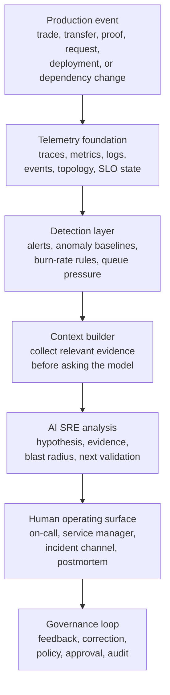
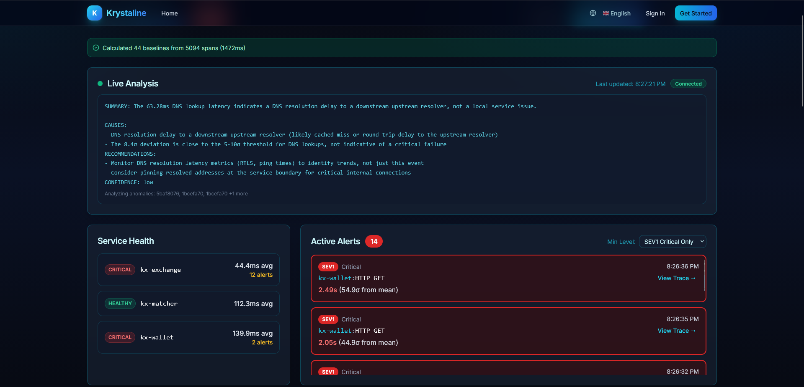
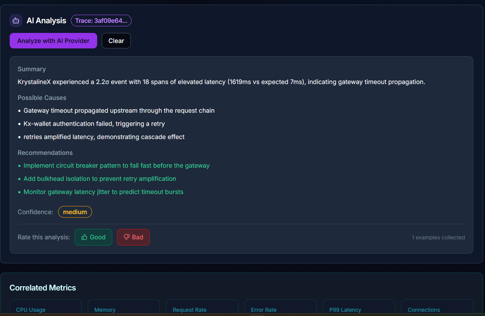
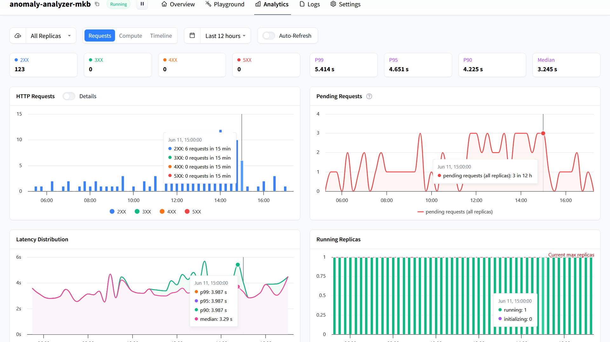
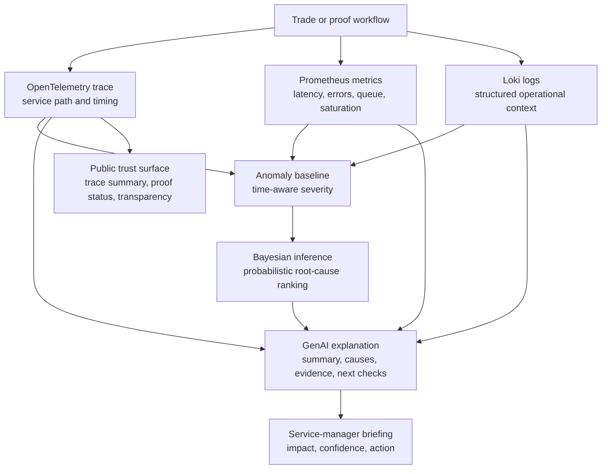
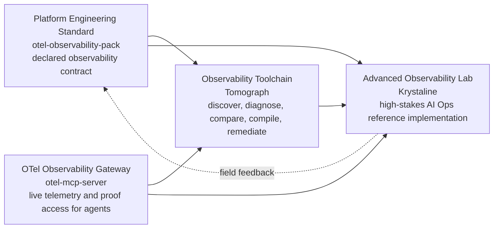

# AI Ops in 2026: The Model Is Not the Monitor

*How to monitor GenAI systems, run AI-assisted incident response, and keep human authority intact.*

Most AI Ops demos still start in the wrong place.

They put a chatbot next to a dashboard. An alert fires. Someone asks, "What happened?" The model writes a plausible incident summary. It looks useful for thirty seconds.

Then the hard questions arrive:

- Which trace did the model inspect?
- Which metrics changed first?
- Did the model call a tool, or did it guess from static context?
- Is the model path itself healthy?
- How much latency did the AI step add?
- Did token usage, queue depth, or tool latency spike during the incident?
- Can the operator inspect the evidence?
- Can the service manager trust the answer?

That is where the demo usually collapses.

AI Ops in 2026 is not a chatbot on top of monitoring. It is an observable operating model for AI-assisted reliability work. The model is not the monitor. The model is one dependency inside the monitoring system.

The practical definition is simple:

> AI Ops is the discipline of turning telemetry into operational understanding while making the AI path itself traceable, measurable, governable, and replaceable.

That last word matters: **replaceable**.

If the model provider is slow, unavailable, expensive, or wrong, deterministic alerting still works. The pager still wakes the human. The runbook still exists. The service owner still has authority.

What changes is the speed of understanding.

## The 2026 AI Ops control loop



This loop is the difference between "AI says something" and "AI assists operations."

The model becomes useful only after the system has assembled an evidence packet: the affected service, recent traces, correlated metrics, active alerts, dependency topology, SLO state, relevant logs, proof status, and runbook context. The model is not being asked to invent the incident. It is being asked to translate verified telemetry into a useful operational narrative.

The pattern is straightforward:

1. Instrument the system.
2. Detect abnormal behavior.
3. Build the evidence packet.
4. Ask the model for a bounded hypothesis.
5. Show the evidence beside the answer.
6. Keep paging, approval, and remediation deterministic.
7. Measure whether the AI path was fast, useful, and correct.

When any of those steps is missing, the result is not AI Ops. It is an expensive autocomplete attached to an incident channel.

## A practical case: from baseline anomaly to bounded RCA

This is what the control loop looks like in practice.

In the Krystaline monitor, the system first establishes a statistical baseline from recent production traces. In one run, the monitor calculated 44 baselines from 5,094 spans before presenting live analysis. That matters because the AI layer is not being asked to decide what is normal from scratch. The telemetry system has already built the operating context.



*Krystaline live monitor showing baseline calculation, fleet-level analysis, service health, and active SEV1 alerts.*

The monitor then exposes the operational state: service health, active alerts, severity, affected services, and trace links. In the example, `kx-exchange` and `kx-wallet` are marked critical while `kx-matcher` remains healthy. The alert surface shows SEV1 events tied to `kx-wallet` HTTP requests, with observed latency around 2.4 seconds — roughly 55 times the baseline mean.

A detail worth noticing: `kx-exchange` is flagged critical at a lower average latency than the healthy `kx-matcher`. Health here is relative to each service's own learned baseline, not an absolute threshold — which is exactly why the baseline step matters.

This is the first important boundary: deterministic monitoring identifies the abnormal condition before the model explains it.

The live analysis layer then provides a fleet-level interpretation. In this case, the system identifies DNS lookup latency as a likely upstream resolver delay rather than a local service failure. That is useful, but it is still a hypothesis attached to evidence, not an autonomous decision.

From there, the operator can pivot into a specific trace. Note that the trace-level analysis below reaches a different hypothesis than the fleet-level one — and that is by design. Each layer reasons over its own evidence scope, the disagreement is visible rather than hidden, and the operator arbitrates with the traces in front of them.



*Trace-level AI analysis showing a bounded RCA hypothesis, possible causes, recommended controls, confidence, and operator feedback.*

At the trace level, the AI analysis becomes more concrete. The selected trace shows a 2.2σ latency event across 18 elevated spans, with observed latency of roughly 1.6 seconds against an expected path of about 7 milliseconds. The model summarizes the likely pattern as gateway timeout propagation, with possible `kx-wallet` authentication retry behavior and retry amplification across the request chain.

The useful part is not that the model produced text. The useful part is that the output is bounded:

- it is attached to a trace;
- it names the affected path;
- it separates possible causes from recommendations;
- it reports medium confidence instead of asserting certainty;
- it leaves the operator with validation steps;
- it captures human feedback on whether the analysis was good or bad, and each rating becomes a collected example for evaluating the AI path itself.

That is the difference between AI-assisted operations and a chatbot beside a dashboard.

The recommendation is also operationally shaped rather than magical: add circuit breaking to fail fast before gateway propagation, add bulkhead isolation to limit retry amplification, and monitor gateway latency jitter so timeout bursts can be detected earlier.

The model does not replace the monitor, the alert, the trace, or the operator. It compresses the time between evidence collection and operational understanding.

Walk back through the control loop and every step is present: the telemetry foundation built the baselines, the detection layer raised the SEV1 alerts, the context builder assembled the trace and its correlated metrics, the model produced a bounded hypothesis, the operator kept the deciding role, and the feedback loop recorded whether the analysis earned trust. Nothing in that chain depends on the model being right — it depends on the model being inspectable.

## What GenAI monitoring actually means

Traditional observability asks one question: **is the service healthy?**

GenAI observability adds another: **is the intelligence path healthy enough to rely on during an incident?**

That means monitoring more than HTTP 200s from a model endpoint. A serious AI Ops dashboard needs at least six signal planes.

| Signal plane | What to monitor | Why it matters |
|---|---|---|
| Service telemetry | Traces, metrics, logs, SLOs, errors, latency, saturation | The model must start from operational facts. |
| GenAI client path | Requests, duration, failures, retries, timeout ratio, token usage, streaming latency | The AI dependency must be operated like production infrastructure. |
| Model/runtime health | Provider status, replica state, pending requests, p95/p99 latency, time to first token or chunk | Slow or saturated AI is not helpful during incident response. |
| Context quality | Trace coverage, tool success, missing signals, stale data, Model Context Protocol (MCP) and backend reachability | A model with bad context produces confident noise. |
| RCA reliability | Analysis success rate, dropped analyses, queue depth, confidence, operator corrections | Teams need to know whether AI outputs are useful, late, or wrong. |
| Governance and privacy | Payload capture state, redaction, provider routing, model identity, approval gates | AI-assisted operations must not weaken control or leak sensitive data. |

The OpenTelemetry GenAI semantic conventions are important because they push the industry toward a shared language for this work: `gen_ai.*` spans and metrics, model and provider attributes, operation duration, token usage, server request duration, GenAI events, and related tool signals. The conventions are still marked as development work, so the right posture is standards-aligned without pretending the space is finished.

In practice, the dashboard should answer:

- Which model or provider handled the analysis?
- How many analyses succeeded, failed, timed out, were skipped, or were dropped?
- How long did analysis take at p50, p95, and p99?
- What was the token burn?
- Was streaming healthy?
- Was the queue backing up?
- Did tool calls succeed?
- Were traces, metrics, and logs available?
- Did the recommendation include evidence?
- Did a human accept, correct, or ignore it?

That is GenAI monitoring. Not "the model returned text." The full path has to be observable.

## The dashboard shape we should expect

Mature AI Ops dashboards should not look like generic infrastructure dashboards with a chat window bolted on. They should look like mission-control surfaces for a reasoning pipeline.


*Example dashboard pack showing GenAI Operations Core, AI RCA Reliability Matrix, and MCP Signal Lattice views.*

The design shift is that the AI path becomes visible as its own operating surface:

- GenAI provider health: requests, latency, tokens, failures, and dropped events.
- RCA reliability: success ratio, timeout ratio, p95/p99 analysis duration, queue depth, and current alert state.
- MCP/tool lattice: tool latency, backend reachability, trace coverage, and privacy posture.

This is how teams avoid the classic AI anti-pattern: trusting an unmonitored model to explain monitored systems.

## Hosted models need runtime observability too

Local-first AI is attractive for sensitive environments because telemetry does not have to leave the operational boundary. Many organizations will still use hosted inference endpoints or managed analysis runtimes for capacity, regional rollout, specialized models, or operational convenience.

That can be fine. But it changes the monitoring requirement.



*Hosted anomaly analyzer analytics showing request volume, pending requests, latency distribution, and running replicas.*

The screenshot above shows the provider and runtime signals that matter when a GenAI or anomaly-analysis path is externalized: request counts, status mix, pending requests, latency distribution, and replica state.

Those are not vanity metrics. They are operational control points.

| Runtime signal | Operational question |
|---|---|
| 2XX / 3XX / 4XX / 5XX | Is the analyzer responding cleanly, failing, or rejecting work? |
| Pending requests | Is the analysis path saturating before operators see timeouts? |
| P99 / P95 / P90 / median | Will RCA arrive during the incident, or after the meeting? |
| Running replicas | Is capacity actually online, initializing, or capped? |

The rule is simple: if a model or analyzer can influence incident response, it must be monitored as a production dependency.

## Why service managers care

For years, observability tools were built mainly for engineers. That made sense: engineers needed traces, metrics, logs, dashboards, and alerts.

AI Ops changes the audience.

The service manager does not want another wall of panels. They want a reliable briefing:

```text
What is happening?
Which service or customer promise is at risk?
Is this our service or a downstream dependency?
What evidence supports the hypothesis?
What action should happen next?
What should I tell leadership?
```

That is not a soft requirement. It is becoming the product surface of modern operations.

The AI SRE layer should produce an answer shaped like this:

```text
Settlement latency is above its current baseline and the latency SLO is at risk.
The slow path is concentrated in wallet persistence after matching, while gateway
and authentication spans remain normal. Queue depth rose during the same window
but is now draining. Customer impact appears limited to delayed settlement
confirmation; trade submission is still healthy. Validate wallet DB latency and
watch queue drain rate before escalating.
```

That answer is useful because it is falsifiable. An engineer can inspect the wallet persistence spans. A service manager can understand customer impact. A leader can understand the risk without reading five dashboards.

## Krystaline as a worked example

Krystaline Observability Lab uses crypto and DeFi workflows as the stress test because the domain makes reliability and trust inseparable.

A slow trade path is not just latency. A stale price feed is not just a vendor integration issue. A missing trace is not just an observability gap. In financial infrastructure, those failures can become questions about fairness, solvency, market integrity, and auditability.

That makes Krystaline a strong place to demonstrate AI Ops:



The pattern is intentionally layered:

- OpenTelemetry carries execution context and trace data across service boundaries.
- Prometheus and SLOs describe operational state.
- Structured logs add runtime context.
- Anomaly detection identifies abnormal behavior.
- Bayesian inference ranks likely causes under uncertainty.
- GenAI turns evidence into a readable RCA hypothesis.
- Deterministic alerting and human approval remain the control plane.
- Public proof and transparency surfaces make trust inspectable.

This is the important reframing: Krystaline is not simply "an exchange with AI." It is a reference architecture for AI Ops when the stakes are high.

## Old AIOps vs. the 2026 model

| Old AIOps pattern | 2026 AI Ops pattern |
|---|---|
| Correlate alerts after they fire. | Build evidence packets from traces, metrics, logs, topology, and SLOs. |
| Treat AI as a black-box explainer. | Monitor AI as a production dependency. |
| Ask the model to infer from logs. | Ground the model in causality through distributed traces. |
| Optimize for impressive summaries. | Optimize for falsifiable hypotheses and next validation steps. |
| Let AI blur accountability. | Keep paging, approval, and remediation deterministic. |
| Hide model quality behind demos. | Track success rate, timeout ratio, queue depth, dropped analyses, and operator corrections. |
| Build one dashboard for engineers. | Build evidence surfaces for engineers, service managers, and leadership. |

The difference is operational maturity.

AI does not remove the need for observability. It raises the bar for observability.

## The minimum viable AI Ops dashboard

If I were reviewing an AI Ops implementation in 2026, I would expect at least these panels:

| Panel | Minimum signal |
|---|---|
| Model request volume | Requests by provider, model, operation, and status. |
| AI latency | p50/p95/p99 duration and time to first token or chunk. |
| Token usage | Input/output token histograms and burn rate. |
| RCA success | Successful, failed, timed-out, skipped, and dropped analyses. |
| Queue pressure | Pending analyses, backlog age, and worker saturation. |
| Tool health | MCP/tool request count, latency, errors, and backend reachability. |
| Context coverage | Trace availability, missing spans, stale metrics, and log availability. |
| Alert linkage | Which alerts generated AI analysis and which did not. |
| Evidence trail | Trace IDs, dashboard links, metric queries, tool calls, and runbook references. |
| Human feedback | Accepted recommendations, corrections, false positives, and postmortem notes. |
| Privacy posture | Prompt capture state, redaction policy, payload retention, and provider route. |
| Control boundary | Which actions are read-only, recommended, approval-gated, or forbidden. |

Without these, the organization is not operating AI. It is hoping AI behaves.

## The design principle

The principle I would put above every AI Ops dashboard is this:

> GenAI should explain verified telemetry, not invent operational reality.

That principle forces the right architecture.

It keeps OpenTelemetry at the foundation. It keeps deterministic paging as the system of record. It keeps model outputs inspectable. It makes external providers measurable. It gives service managers a briefing without taking authority away from on-call engineers.

This is why AI Ops and observability are converging. The more autonomy we add, the more evidence we need.

## A practical implementation checklist

For teams trying to build this, the path is not mysterious:

1. Instrument the business-critical path first.
2. Preserve distributed trace context across queues and async boundaries.
3. Build SLOs and deterministic alerts before adding AI.
4. Add anomaly baselines where static thresholds are too noisy.
5. Create an RCA context packet from traces, metrics, logs, topology, alerts, and runbooks.
6. Use GenAI to summarize evidence, rank hypotheses, and recommend next validation steps.
7. Instrument the GenAI path with spans and metrics.
8. Track model/provider, duration, token usage, failures, timeouts, queue depth, dropped events, and tool-call health.
9. Show evidence beside every AI hypothesis.
10. Keep mutating remediation behind explicit approval.
11. Capture operator feedback and post-incident corrections.
12. Treat missing telemetry as a red signal, not an empty panel.

That is how teams move from observability to AI-assisted operations without turning the model into an unaccountable control plane.

## Closing

The next wave of AI Ops will not be won by the team with the flashiest incident chatbot.

It will be won by the teams that can answer:

- What happened?
- Why do we believe that?
- Which evidence supports it?
- What is the customer or business impact?
- What should happen next?
- Did the AI path itself behave correctly?

In 2026, AI Ops is not about replacing SREs. It is about making operational understanding faster, evidence-backed, and governable.

The model is not the monitor.

The monitored system includes the model.

## Appendix: How the public projects relate

The public work around this article is easiest to understand in dependency order: first the standard, then the live evidence gateway, then the diagnostic toolchain, then the advanced lab that demonstrates the full model.



| Order | Project | Role in the system | Repository |
|---:|---|---|---|
| 1 | Platform Engineering Standard | Defines what diagnostic-grade observability should declare for a service: SLIs, SLOs, telemetry collection, storage, queries, dashboards, alerting, routing, validation, and governance. This is the contract layer. | [MoebiusX/otel-observability-pack](https://github.com/MoebiusX/otel-observability-pack) |
| 2 | The OTel Observability Gateway | Exposes live traces, metrics, logs, alerts, topology, backend health, and proof signals as MCP tools. This is the evidence-access layer for AI SRE and agent workflows. | [MoebiusX/otel-mcp-server](https://github.com/MoebiusX/otel-mcp-server) |
| 3 | The Observability Toolchain | Uses declared packs and live MCP-derived evidence to discover, diagnose, compare declared-vs-live posture, compile gaps, and support remediation. This is the validation and compiler layer. | [MoebiusX/tomograph](https://github.com/MoebiusX/tomograph) |
| 4 | Advanced Observability Lab | Demonstrates the full operating model against realistic crypto and DeFi workflows where latency, proof status, traceability, and explainability are part of trust. This is the reference implementation and public lab. | [MoebiusX/Krystaline](https://github.com/MoebiusX/Krystaline) |

In one sentence: the standard defines the contract, the gateway exposes live evidence, the toolchain verifies and repairs the gap, and the lab proves the model in a high-trust operational domain.

## References

- OpenTelemetry: [Semantic conventions for generative AI systems](https://opentelemetry.io/docs/specs/semconv/gen-ai/)
- OpenTelemetry: [Semantic conventions for generative AI metrics](https://opentelemetry.io/docs/specs/semconv/gen-ai/gen-ai-metrics/)
- OpenTelemetry: [Semantic conventions for generative client AI spans](https://opentelemetry.io/docs/specs/semconv/gen-ai/gen-ai-spans/)
- OpenTelemetry: [Semantic conventions for Model Context Protocol (MCP)](https://opentelemetry.io/docs/specs/semconv/gen-ai/mcp/)
- Krystaline Observability Lab: [GenAI Observability Solution](GENAI_OBSERVABILITY_SOLUTION.md)
