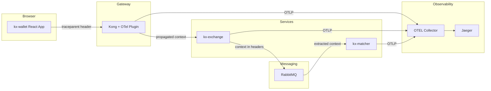
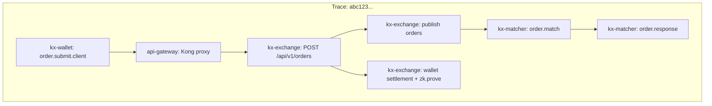

# OpenTelemetry Tracing Implementation Guide

*Part of the Proof of Observability series — foundations in [the whitepaper](../OBSERVABILITY_WHITEPAPER.md).*

**The claim this guide backs up:** one W3C trace context survives from a browser click to trade settlement — typically **17+ spans across 4 services** on the full RabbitMQ trade path (observed in demo traces): `kx-wallet` (browser) → `api-gateway` (Kong) → `kx-exchange` (Express) → `kx-matcher` (order matcher) → back to `kx-exchange` for wallet settlement and the zk proof. [PUBLIC]

The headline technique is **dual-context propagation** over RabbitMQ. The producer injects *two* contexts into every order message:

1. **`traceparent`** — the publish span's context, so the consumer's `order.match` span parents correctly under the producer.
2. **`x-parent-traceparent`** — the original HTTP POST span's context, which the matcher **echoes back as the reply's `traceparent`**, so the async continuation (wallet settlement, zk proof generation) stitches back into the original trace instead of dangling.

Implementation: [`server/services/rabbitmq-client.ts`](../../server/services/rabbitmq-client.ts) (dual inject + reply extraction) and [`payment-processor/index.ts`](../../payment-processor/index.ts) (extract both, echo on reply). This guide walks that chain hop by hop, then covers the failure modes we actually hit in this repo: async context loss in Express handlers, Kong stale plugin config, and CORS stripping `traceparent`.

> **⚠️ IMPORTANT**: Read the Service Naming Convention section when renaming services to avoid breaking trace correlation in Jaeger.

## Service Naming Convention

Krystaline uses a consistent `kx-*` naming convention for all services:

| Service | OTEL Service Name | Tracer Name | Description |
|---------|-------------------|-------------|-------------|
| Web Client | `kx-wallet` | `kx-wallet` | Browser-based React frontend |
| API Gateway | `api-gateway` | (Kong plugin) | Kong gateway for routing |
| Exchange Server | `kx-exchange` | `kx-exchange` | Main Express.js API server |
| Order Matcher | `kx-matcher` | `kx-matcher` | RabbitMQ consumer for order execution |

### Tracer Instances
When creating tracers, **always use the same name as the service**:

```typescript
// ✅ Correct - matches service name
const tracer = trace.getTracer('kx-exchange');

// ❌ Wrong - different from service name
const tracer = trace.getTracer('rabbitmq-client');
```

---

## Architecture Overview



---

## Critical: How Spans Join Into Hierarchy

Spans form a parent-child hierarchy when:
1. **The same Trace ID** is used across all spans
2. **Parent Span ID** is passed to child spans via context

> [!IMPORTANT]
> Without proper context propagation, you get **orphaned spans** - each service creates its own trace instead of joining the parent trace.

---

## 1. Client-Side: Initiating Trace Context

The browser is a first-class traced service: [client/src/lib/otel.ts](../../client/src/lib/otel.ts) boots the OTel Web SDK (`WebTracerProvider` + `FetchInstrumentation` + `ZoneContextManager`) with `service.name: 'kx-wallet'`, exporting OTLP/HTTP to the collector's browser-facing port (`:4319`). The trade form starts a client span named `order.submit.client`, so traces literally begin at the user's click.

### W3C Traceparent Format

```
traceparent: 00-{traceId}-{spanId}-{flags}
             │   │         │        └── 01 = sampled
             │   │         └── 16-char hex span ID
             │   └── 32-char hex trace ID
             └── version
```

### Manual Header Helpers: [client/src/lib/tracing.ts](../../client/src/lib/tracing.ts)

For code paths that construct W3C headers by hand (outside the Web SDK's fetch instrumentation):

```typescript
import { v4 as uuidv4 } from 'uuid';

export function generateTraceId(): string {
  return uuidv4().replace(/-/g, '');  // 32 hex chars
}

export function generateSpanId(): string {
  return uuidv4().replace(/-/g, '').substring(0, 16);  // 16 hex chars
}

export function createTraceHeaders(traceId?: string, spanId?: string) {
  const currentTraceId = traceId || generateTraceId();
  const currentSpanId = spanId || generateSpanId();
  
  return {
    'traceparent': `00-${currentTraceId}-${currentSpanId}-01`,
    'tracestate': `payment-demo=1`,
  };
}
```

Either way, the browser establishes the **root of the trace** before the request ever reaches the gateway.

---

## 2. Kong Gateway: W3C Context Propagation

Kong receives the `traceparent` header and propagates it downstream.

### Plugin Configuration: [scripts/enable-kong-otel.js](../../scripts/enable-kong-otel.js)

```javascript
const pluginConfig = {
  name: 'opentelemetry',
  config: {
    endpoint: 'http://otel-collector:4318/v1/traces',
    resource_attributes: {
      'service.name': 'api-gateway'
    },
    header_type: 'w3c',  // CRITICAL: Use W3C Trace Context format
  }
};
```

> [!TIP]
> `header_type: 'w3c'` ensures Kong uses the standard `traceparent` header format that Node.js SDK understands.

### What Kong Does:
1. Receives `traceparent` from client (or creates one)
2. Creates its own span as **child** of client span
3. Forwards `traceparent` to upstream services with Kong's span as new parent

---

## 3. Node.js SDK: Automatic HTTP Propagation

### Instrumentation Setup: [server/otel.ts](../../server/otel.ts)

The SDK boots **before any other import** (`server/index.ts` imports `./otel` first, and `otel.ts` registers the `import-in-the-middle` ESM hook at the top so built-in modules like `http` can be patched). Exports go via **OTLP/HTTP to `:4318`** — not gRPC:

```typescript
import { NodeSDK } from '@opentelemetry/sdk-node';
import { OTLPTraceExporter } from '@opentelemetry/exporter-trace-otlp-http';
import { getNodeAutoInstrumentations } from '@opentelemetry/auto-instrumentations-node';
import { resourceFromAttributes } from '@opentelemetry/resources';
import { SemanticResourceAttributes } from '@opentelemetry/semantic-conventions';
import { SimpleSpanProcessor, BatchSpanProcessor } from '@opentelemetry/sdk-trace-node';

const jaegerExporter = new OTLPTraceExporter({
  url: `${process.env.OTEL_EXPORTER_OTLP_ENDPOINT || 'http://localhost:4318'}/v1/traces`,
});

const sdk = new NodeSDK({
  resource: resourceFromAttributes({
    [SemanticResourceAttributes.SERVICE_NAME]: 'kx-exchange',
    [SemanticResourceAttributes.SERVICE_NAMESPACE]: 'krystalinex',
  }),
  spanProcessors: [
    new SimpleSpanProcessor(traceCollector),  // in-process buffer for the local UI
    new BatchSpanProcessor(jaegerExporter),   // batched OTLP/HTTP export
  ],
  instrumentations: [getNodeAutoInstrumentations({
    '@opentelemetry/instrumentation-fs': { enabled: false },      // noise
    '@opentelemetry/instrumentation-amqplib': { enabled: true },  // RabbitMQ spans
    '@opentelemetry/instrumentation-undici': { enabled: false },  // duplicates http client spans
  })],
});

sdk.start();
```

### How Auto-Instrumentation Works:

When an HTTP request arrives with `traceparent`:
1. **`http` instrumentation** extracts the context
2. Creates an **Express span** as child of the incoming context
3. Sets this span as the **active context**
4. All spans created during request handling inherit this parent

> [!IMPORTANT]
> Auto-instrumentation only handles HTTP parenting. The **RabbitMQ request/reply pattern** needs the manual dual-context propagation below — that is what keeps the async continuation in the same trace.

---

## 4. RabbitMQ Producer: Dual-Context Injection

This is context #1 (`traceparent`, for consumer parenting) **and** context #2 (`x-parent-traceparent`, for the reply) leaving the server together.

### Implementation: [server/services/rabbitmq-client.ts](../../server/services/rabbitmq-client.ts)

```typescript
import { trace, context, SpanKind, propagation } from '@opentelemetry/api';

// CRITICAL: Capture context BEFORE entering the Promise constructor —
// inside Promise callbacks, context.active() may already be empty
const capturedContext = context.active();

return new Promise((resolve, reject) => {
  // Producer span as CHILD of the HTTP POST span
  const span = this.tracer.startSpan('publish orders', {
    kind: SpanKind.PRODUCER,
    attributes: {
      'messaging.system': 'rabbitmq',
      'messaging.destination': this.LEGACY_QUEUE,  // 'payments' — legacy name, still the active path
      'messaging.operation': 'publish',
      'order.id': order.orderId,
    },
  }, capturedContext);  // <-- CRITICAL: explicit parent context

  const spanContext = trace.setSpan(capturedContext, span);

  context.with(spanContext, () => {
    // Context #1: the publish span — parents the consumer's order.match span
    const publishHeaders: Record<string, string> = {};
    propagation.inject(spanContext, publishHeaders);

    // Context #2: the original POST span — echoed back on the reply
    const parentHeaders: Record<string, string> = {};
    propagation.inject(capturedContext, parentHeaders);

    this.channel!.sendToQueue(this.LEGACY_QUEUE, Buffer.from(message), {
      persistent: true,
      correlationId,
      replyTo: this.replyQueue || undefined,  // exclusive per-instance reply queue
      headers: {
        ...publishHeaders,                                    // traceparent for the consumer
        'x-correlation-id': correlationId,
        'x-parent-traceparent': parentHeaders.traceparent || '',
        'x-parent-tracestate': parentHeaders.tracestate || '',
      },
    });

    span.end();
  });
});
```

### Key Points:
| Step | Purpose |
|------|---------|
| Capture `context.active()` **before** `new Promise()` | Promise callbacks may lose the async context |
| `startSpan(..., capturedContext)` | Creates producer span as child of the POST span |
| `propagation.inject(spanContext, ...)` | Context #1 → `traceparent`: parents the consumer |
| `propagation.inject(capturedContext, ...)` | Context #2 → `x-parent-traceparent`: preserved for the reply |
| `replyTo: this.replyQueue` | Exclusive per-instance queue routes the reply back to this replica |

---

## 5. RabbitMQ Consumer: Extract Both, Echo One

The matcher extracts context #1 to parent its own spans, holds on to context #2, and **echoes context #2 as the reply's `traceparent`**.

### Implementation: [payment-processor/index.ts](../../payment-processor/index.ts)

```typescript
import { trace, context, SpanKind, propagation } from '@opentelemetry/api';

await channel.consume(ORDERS_QUEUE, async (msg) => {
  const headers = msg.properties.headers || {};

  // Context #1: parent the order.match span under the producer's publish span
  const parentContext = propagation.extract(context.active(), headers);

  // Context #2: the original POST span context (held for the reply)
  const originalPostTraceparent = headers['x-parent-traceparent'];
  const originalPostTracestate = headers['x-parent-tracestate'];

  const span = tracer.startSpan('order.match', {
    kind: SpanKind.CONSUMER,
    attributes: {
      'messaging.system': 'rabbitmq',
      'messaging.source': ORDERS_QUEUE,
    },
  }, parentContext);  // <-- CRITICAL: links consumer to producer!

  await context.with(trace.setSpan(parentContext, span), async () => {
    const response = await matchOrder(msg);  // simulated matching, 150-800ms

    // Echo the ORIGINAL POST context on the reply, so the server-side
    // continuation (wallet settlement, zk proof) rejoins the original trace
    const responseHeaders: Record<string, string> = {};
    if (originalPostTraceparent) responseHeaders['traceparent'] = originalPostTraceparent;
    if (originalPostTracestate) responseHeaders['tracestate'] = originalPostTracestate;

    const replyTo = msg.properties.replyTo || RESPONSE_QUEUE;
    channel.sendToQueue(replyTo, Buffer.from(JSON.stringify(response)), {
      persistent: true,
      headers: responseHeaders,
    });
  });

  span.end();
});
```

### Closing the Loop: Reply Extraction on the Server

Back in [server/services/rabbitmq-client.ts](../../server/services/rabbitmq-client.ts), the response consumer extracts that echoed context and invokes the waiting order callback **inside** it:

```typescript
const responseContext = propagation.extract(context.active(), msg.properties.headers || {});

context.with(responseContext, () => {
  callback(executionResponse);  // submitOrder's continuation now runs
});                             // with the POST span as parent
```

This is why the wallet-settlement and `zk.prove` spans appear in the same Jaeger trace as the original click — the Promise continuation was re-entered with the original POST context.

### Key Points:
| Step | Purpose |
|------|---------|
| `propagation.extract()` on the request | Context #1: links `order.match` under the publish span |
| `x-parent-traceparent` held aside | Context #2: never used for parenting in the matcher |
| Reply `traceparent` = context #2 | Reply carries the *original POST* context, not the matcher's |
| `propagation.extract()` + `context.with()` on the reply | Continuation (settlement, zk proof) rejoins the original trace |

---

## 6. Resulting Span Hierarchy



**All spans share the same Trace ID.** Note `S7`: it parents under the original POST span (`S3`), not under the matcher — that is the dual-context echo at work. On the full path this typically comes to **17+ spans** in a single trace (observed in demo traces; span count varies with tail sampling and whether Kong is in the path). [PUBLIC]

---

## 7. CORS Headers for Trace Context

### Server Configuration: [server/middleware/security.ts](../../server/middleware/security.ts)

```typescript
res.header('Access-Control-Allow-Methods', 'GET, POST, PUT, DELETE, OPTIONS');
res.header('Access-Control-Allow-Headers',
  'Origin, X-Requested-With, Content-Type, Accept, Authorization, ' +
  'x-trace-id, x-span-id, traceparent'  // <-- CRITICAL!
);
```

Kong needs the same allowance on its side — [scripts/enable-kong-cors.js](../../scripts/enable-kong-cors.js) configures Kong's CORS plugin with `traceparent` in its allowed headers list.

> [!WARNING]
> Without allowing `traceparent` in CORS headers, browsers will strip it from cross-origin requests!

---

## 8. Debugging Tips

### Check Context Flow
```typescript
// In producer
console.log('[PRODUCER] Parent trace:', trace.getSpan(context.active())?.spanContext().traceId);

// In message headers
console.log('[PRODUCER] Injected:', publishHeaders.traceparent);

// In consumer
console.log('[CONSUMER] Extracted:', trace.getSpan(parentContext)?.spanContext().traceId);
```

### Common Issues:

| Symptom | Cause | Fix |
|---------|-------|-----|
| Orphaned spans | Missing `parentContext` in `startSpan()` | Pass context as 3rd argument |
| Broken chain | `propagation.inject()` not called | Inject before sending message |
| Different trace IDs | `propagation.extract()` failed | Check headers format |
| CORS errors | `traceparent` not allowed | Add to CORS headers |
| Intermittent orphan traces | Auto-instrumentation context loss | Use explicit `propagation.extract()` |

### Express Async Handler Context Loss (Critical Bug)

> [!CAUTION]
> OpenTelemetry's HTTP auto-instrumentation may **intermittently fail** to provide active context in async Express handlers. Before the fix below, the majority of order requests in this repo produced orphan traces (observed during development).

**Symptom**: `trace.getActiveSpan()` returns `undefined` in Express route handlers even when `traceparent` header is present. Some requests work, others create disconnected traces.

**Root Cause**: The Node.js OTEL auto-instrumentation relies on async local storage to track context. In certain async patterns (Promises, circuit breakers, middleware chains), context can be lost before your handler code executes.

**Fix**: Explicitly extract and activate context in route handlers — this is live in [server/api/routes.ts](../../server/api/routes.ts) on the order endpoint:

```typescript
// server/api/routes.ts — order endpoint
app.post("/api/v1/orders", validateUUID('userId'), async (req: Request, res: Response) => {
  // CRITICAL: Explicitly extract trace context from HTTP headers
  const { propagation, context, trace } = await import('@opentelemetry/api');

  // Extract trace context from incoming request headers
  const extractedContext = propagation.extract(context.active(), req.headers);

  // Execute ENTIRE request handling within extracted context
  return context.with(extractedContext, async () => {
    // Now trace.getActiveSpan() will reliably return the HTTP span
    const result = await orderService.submitOrder(orderData);
    return res.status(201).json(result);
  });
});
```

**Key Points**:
1. Use `propagation.extract(context.active(), req.headers)` to parse `traceparent`
2. Wrap handler with `context.with(extractedContext, async () => { ... })`
3. All downstream calls (services, database, RabbitMQ) will inherit this context

**Also applies to**:
- Circuit breakers wrapping async functions
- Promise constructors — capture context **before** `new Promise()` (see the `capturedContext` pattern in [rabbitmq-client.ts](../../server/services/rabbitmq-client.ts))
- Callback-based async operations

---

## Quick Reference: Context Propagation Patterns

### HTTP (Automatic)
```
Client → Kong → Service
         ↓
   [Auto-propagated via `traceparent` header]
```

### RabbitMQ (Manual, Dual-Context)
```typescript
// Producer: inject BOTH contexts
propagation.inject(spanContext, headers);            // traceparent → consumer parenting
propagation.inject(parentContext, parentHeaders);    // x-parent-traceparent → reply routing

// Consumer: extract #1, echo #2
const ctx = propagation.extract(context.active(), message.headers);
tracer.startSpan('name', { kind: SpanKind.CONSUMER }, ctx);
replyHeaders['traceparent'] = message.headers['x-parent-traceparent'];
```

---

## Files Reference

| File | Purpose |
|------|---------|
| [server/otel.ts](../../server/otel.ts) | SDK initialization (`kx-exchange`, OTLP/HTTP :4318) |
| [rabbitmq-client.ts](../../server/services/rabbitmq-client.ts) | Dual-context injection + reply extraction |
| [payment-processor/index.ts](../../payment-processor/index.ts) | Consumer extraction + POST-context echo |
| [client/src/lib/otel.ts](../../client/src/lib/otel.ts) | Browser OTel Web SDK (`kx-wallet`) |
| [client/src/lib/tracing.ts](../../client/src/lib/tracing.ts) | Manual W3C header helpers |
| [server/api/routes.ts](../../server/api/routes.ts) | Explicit context extraction on the order endpoint |
| [enable-kong-otel.js](../../scripts/enable-kong-otel.js) | Kong plugin configuration |

---

## 9. Kong OTEL Plugin: Stale Config Hazard

> [!CAUTION]
> Kong Admin API PATCH operations **do not remove old configuration fields**. Updating the OTEL plugin with PATCH can leave stale config that breaks context propagation.

### Symptom
- Spans appear in the same trace but are **not in proper parent-child hierarchy**
- `kx-exchange` spans reference a parent span ID that doesn't exist in the trace
- Kong OTEL config shows unexpected fields like `propagation: { extract: [...] }` or `headers: { traceparent: 'preserve' }`

### Root Cause
Previous PATCH operations accumulated extra config fields that weren't overwritten by subsequent updates. The conflicting config causes Kong to misbehave with header injection.

### Fix: Delete and Recreate Plugin

```powershell
# 1. Get current plugin ID
$plugins = Invoke-RestMethod -Uri "http://localhost:8001/plugins"
$otel = $plugins.data | Where-Object { $_.name -eq 'opentelemetry' }

# 2. Delete the old plugin
Invoke-RestMethod -Uri "http://localhost:8001/plugins/$($otel.id)" -Method DELETE

# 3. Recreate with clean config
node scripts/enable-kong-otel.js
```

### Verification
After recreation, verify config is clean:

```powershell
$plugins = Invoke-RestMethod -Uri "http://localhost:8001/plugins"
$otel = $plugins.data | Where-Object { $_.name -eq 'opentelemetry' }
$otel.config | ConvertTo-Json
```

Expected output should show:
- `header_type: "w3c"` ✓
- `headers: null` (no stale values)
- `propagation.extract: null` (no stale values)

### Proper Trace Hierarchy

When context propagation is working correctly, traces show a clean parent-child hierarchy with all services connected.

---

*Next in the series → [02 — Anomaly Detection: Time-Aware Adaptive Thresholds](02_ANOMALY_DETECTION_DESIGN.md)*
