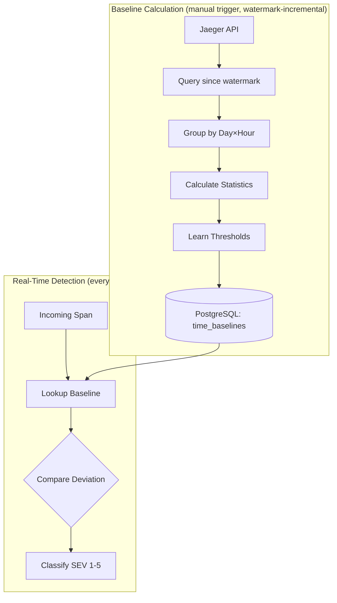
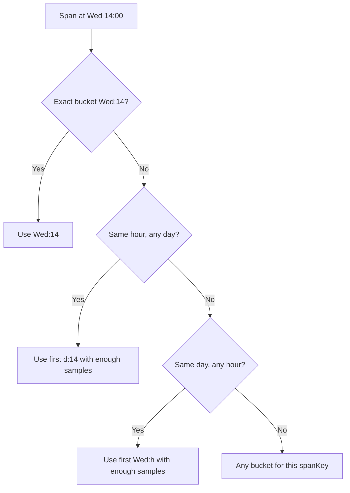

# Anomaly Detection: Time-Aware Adaptive Thresholds

*Part of the Proof of Observability series — foundations in [the whitepaper](../OBSERVABILITY_WHITEPAPER.md).*

Technical design document for the intelligent trace monitoring system: per-bucket baselines learned from 30 days of Jaeger traces, adaptive severity thresholds learned from empirical deviation percentiles, Welford online statistics for whale detection, and watermark-based incremental recalculation. All of it ships in [`server/monitor/`](../../server/monitor/). [PUBLIC]

## Problem Statement

Fixed threshold anomaly detection (e.g., 3σ = warning, 5σ = critical) fails because:
- **Time variance**: A 200ms API call at 2am may be normal, but anomalous at 2pm
- **Static percentiles**: Fixed multipliers don't reflect actual deviation distributions
- **Alert noise at off-hours**: fixed thresholds fire disproportionately during low-traffic periods, when variance is naturally higher — the design below targets this, though **[BACKLOG]: a quantified false-positive comparison** (fixed vs. adaptive, on the same traffic) has not been run yet

---

## Solution: Time-Aware Baselines with Adaptive Thresholds



---

## 1. Time Bucketing Strategy

### 168 Buckets per Span Key (7 days × 24 hours)

Each span is assigned to a bucket based on when it occurred ([`baseline-calculator.ts`](../../server/monitor/baseline-calculator.ts), `getBucketKey`):

```typescript
// Bucket key generation
const dayOfWeek = timestamp.getDay();    // 0-6 (Sun-Sat)
const hourOfDay = timestamp.getHours();  // 0-23
const bucketKey = `${spanKey}:${dayOfWeek}:${hourOfDay}`;
```

### Why Time Buckets?
- **Monday 9am** traffic patterns differ from **Saturday 3am**
- Baselines are specific to each time slot
- Intended to cut false positives during low-traffic periods — **[BACKLOG]: quantified false-positive comparison** to substantiate this with numbers

---

## 2. Baseline Calculation

### Data Source: [baseline-calculator.ts](../../server/monitor/baseline-calculator.ts)

```typescript
// Query up to 30 days of historical data (or since the per-service watermark)
const LOOKBACK_DAYS = 30;
const MONITORED_SERVICES = ['kx-wallet', 'api-gateway', 'kx-exchange', 'kx-matcher'];

// Fetch from Jaeger (limit 5000 traces per service)
const url = `${JAEGER_URL}/api/traces?service=${service}&start=${startTime}&end=${endTime}&limit=5000`;
```

### Statistics Per Bucket

For each time bucket, a **batch two-pass recomputation**: first pass computes the mean, second pass the variance (with Bessel's correction), third pass collects each span's deviation for threshold learning (`groupIntoBuckets`):

| Statistic | Formula | Purpose |
|-----------|---------|---------|
| **Mean (μ)** | `Σx / n` | Expected duration |
| **Std Dev (σ)** | `√(Σ(x-μ)² / (n-1))` | Variability (sample variance, Bessel-corrected) |
| **Sample Count** | `n` | Confidence metric |

```typescript
interface TimeBaseline {
  spanKey: string;        // "service:operation"
  dayOfWeek: number;      // 0-6
  hourOfDay: number;      // 0-23
  mean: number;           // Average duration (ms)
  stdDev: number;         // Standard deviation
  sampleCount: number;    // Data points
  thresholds: AdaptiveThresholds;
}
```

### Incremental Recalculation via DB Watermarks

Recalculation does **not** re-fetch 30 days every time. A per-service watermark — the last processed trace timestamp, in microseconds — is persisted in the `recalculation_state` PostgreSQL table ([`baseline-calculator.ts`](../../server/monitor/baseline-calculator.ts), `getWatermark`/`setWatermark`, lines 100–142). Each run:

1. Reads the watermark for the service
2. Queries Jaeger only for traces **after** it
3. Advances the watermark to the newest trace seen

`POST /recalculate` with body `{ "full": true }` clears all watermarks and rebuilds from the complete 30-day window. New data merges **additively** with existing baselines (see §8 Storage).

---

## 3. Welford Online Baselines (Amounts / Whale Detection)

Duration baselines and transaction-amount baselines use deliberately different algorithms:

- **Amount baselines** — [`server/monitor/amount-profiler.ts`](../../server/monitor/amount-profiler.ts) uses **Welford's online algorithm**: each trade recorded via `recordTransaction()` updates mean and variance in O(1), with no history buffer.
- **Duration baselines** — the 168 time buckets in [`baseline-calculator.ts`](../../server/monitor/baseline-calculator.ts) use **batch two-pass mean/variance recomputation**, because the per-bucket percentile thresholds (§4) need the full sample arrays anyway.

The actual update step, quoted from [`amount-profiler.ts`](../../server/monitor/amount-profiler.ts) (`recordTransaction`, lines 236–241):

```typescript
// Welford's online algorithm for incremental mean/variance
const n = existing.sampleCount + 1;
const delta = amount - existing.mean;
const newMean = existing.mean + delta / n;
const delta2 = amount - newMean;
const newVariance = ((existing.variance * (n - 1)) + delta * delta2) / n;
```

`delta * delta2` is the classic M2 increment; this implementation carries `variance` (= M2/n) directly instead of raw M2, folding the division into each step. Amounts are keyed by `operationType:asset` (e.g. `BUY:BTC`), and deviations are classified by the whale ladder in [`types.ts`](../../server/monitor/types.ts): **3σ (SEV5, large whale) up to 7σ (SEV1, critical)**.

Between real-time updates, the profiler also rebuilds amount baselines from PostgreSQL every 60 s over a 24 h lookback — so a restart never starts from zero.

---

## 4. Adaptive Threshold Learning

### From Fixed to Learned Thresholds

**Old approach (fixed):**
```typescript
const WARNING = 3.0;   // Always 3σ
const CRITICAL = 5.0;  // Always 5σ
```

**Current approach — learned per bucket from empirical percentiles, with floors.** Quoted from [`baseline-calculator.ts`](../../server/monitor/baseline-calculator.ts) (`calculateThresholds`, lines 280–287):

```typescript
// Only positive deviations — we care about slow, not fast
const positiveDeviations = deviations.filter(d => d > 0).sort((a, b) => a - b);

return {
    sev5: Math.max(0.5, this.percentile(positiveDeviations, 80)),
    sev4: Math.max(1.0, this.percentile(positiveDeviations, 90)),
    sev3: Math.max(1.5, this.percentile(positiveDeviations, 95)),
    sev2: Math.max(2.0, this.percentile(positiveDeviations, 99)),
    sev1: Math.max(2.5, this.percentile(positiveDeviations, 99.9)),
};
```

Three details that matter:

- **Empirical, not Gaussian**: thresholds come from the *observed* 80/90/95/99/99.9th percentiles of each bucket's deviation distribution — no normality assumption.
- **Floors (0.5σ–2.5σ)**: `Math.max` prevents a very tight bucket from learning absurdly low thresholds and flagging everything.
- **Minimum evidence**: a bucket needs ≥ 10 positive-deviation samples (`MIN_SAMPLES_FOR_THRESHOLD`); below that it falls back to the defaults in §9.

### Why Adaptive?
- Thresholds reflect **actual** deviation distributions
- Different services can have different natural variability
- Seasonal adjustments happen automatically on recalculation

---

## 5. Severity Classification (SEV 1-5)

### Types: [types.ts](../../server/monitor/types.ts)

```typescript
export type SeverityLevel = 1 | 2 | 3 | 4 | 5;

export const SEVERITY_CONFIG = {
  1: { name: 'Critical', percentile: 99.9, color: '#dc2626' },
  2: { name: 'Major',    percentile: 99,   color: '#ea580c' },
  3: { name: 'Moderate', percentile: 95,   color: '#d97706' },
  4: { name: 'Minor',    percentile: 90,   color: '#ca8a04' },
  5: { name: 'Low',      percentile: 80,   color: '#65a30d' },
};
```

### Classification Logic

```typescript
private getSeverity(deviation: number, thresholds: AdaptiveThresholds) {
  if (deviation >= thresholds.sev1) return { level: 1, name: 'Critical' };
  if (deviation >= thresholds.sev2) return { level: 2, name: 'Major' };
  if (deviation >= thresholds.sev3) return { level: 3, name: 'Moderate' };
  if (deviation >= thresholds.sev4) return { level: 4, name: 'Minor' };
  if (deviation >= thresholds.sev5) return { level: 5, name: 'Low' };
  return null; // Not anomalous
}
```

The real-time detector ([`anomaly-detector.ts`](../../server/monitor/anomaly-detector.ts)) checks every **10 seconds**, keeps anomalies alive in a **5-minute window**, and requires **MIN_SAMPLES = 10** before trusting a baseline. Its own runtime default ladder (used when no adaptive thresholds are available) is **3.0σ → 8.0σ** (SEV5 → SEV1).

> [!NOTE]
> **War story: the detector almost flagged itself.** The anomaly detector polls Jaeger every 10 s, and the trace profiler every 30 s — over plain HTTP, from the same instrumented process. With HTTP auto-instrumentation enabled, each poll would generate a client span, which lands in Jaeger, which the detector reads back on its next poll: one slow poll becomes an "anomaly", which triggers analysis traffic, which creates more spans — a self-sustaining feedback loop. The fix is an `ignoreOutgoingRequestHook` in the OTel SDK ([`server/otel.ts`](../../server/otel.ts), lines 148–161) that drops spans for outgoing calls to Jaeger (`:16686`, `:4318`, `:4317`, `/api/traces`) and Prometheus (`/metrics`, `:9090`). Undici/fetch instrumentation is disabled outright in the same file for the same reason — it would emit unfiltered monitoring-loop spans.

---

## 6. Baseline Lookup with 4-Level Fallback

When checking a span, the most specific baseline wins — but *every* level must carry at least `MIN_SAMPLES_FOR_THRESHOLD` (10) samples to be used:



### Implementation: `getBaselineWithFallback` ([baseline-calculator.ts](../../server/monitor/baseline-calculator.ts), lines 493–524)

```typescript
getBaselineWithFallback(spanKey: string, dayOfWeek: number, hourOfDay: number) {
  // 1. Exact bucket (day + hour)
  let baseline = this.getBaseline(spanKey, dayOfWeek, hourOfDay);
  if (baseline && baseline.sampleCount >= MIN_SAMPLES_FOR_THRESHOLD) return baseline;

  // 2. Same hour, any day
  for (let d = 0; d < 7; d++) { /* first qualifying d:hourOfDay bucket */ }

  // 3. Same day, any hour
  for (let h = 0; h < 24; h++) { /* first qualifying dayOfWeek:h bucket */ }

  // 4. Any bucket for this spanKey
  for (const b of this.timeBaselines.values()) { /* first qualifying bucket */ }

  return null;  // no usable baseline — span is not evaluated
}
```

Note the difference from a naive design: fallback levels 2–4 pick the **first existing bucket with sufficient samples**, they do not average across buckets — cheap, deterministic, and biased toward data that actually exists.

---

## 7. API Endpoints

Mounted at `/api/v1/monitor` (with a backward-compatible `/api/monitor` alias) — see [`server/monitor/routes.ts`](../../server/monitor/routes.ts):

| Endpoint | Method | Purpose |
|----------|--------|---------|
| `/api/v1/monitor/recalculate` | POST | Trigger baseline recalculation (body `{ "full": true }` clears watermarks) |
| `/api/v1/monitor/time-baselines` | GET | View all computed time baselines |
| `/api/v1/monitor/anomalies` | GET | Get active anomalies with SEV levels |
| `/api/v1/monitor/amount-anomalies` | GET | Active whale/amount anomalies |

Recalculation runs **on manual trigger today**; the calculator is designed for a nightly schedule, but no scheduler is wired yet — **[BACKLOG]: scheduled nightly recalculation**.

### Manual Trigger

```bash
curl -X POST http://localhost:5000/api/v1/monitor/recalculate
```

Response (shape from [`routes.ts`](../../server/monitor/routes.ts) / `recalculate()`; counts vary with traffic):

```json
{
  "success": true,
  "baselinesCount": 168,
  "duration": 4523,
  "message": "Calculated 168 baselines from 45000 spans",
  "isIncremental": true
}
```

---

## 8. Storage

### PostgreSQL Tables (Persistent)

Baselines are stored in PostgreSQL for durability across restarts ([`history-store.ts`](../../server/monitor/history-store.ts)):

- **`span_baselines`**: Global span statistics (mean, stdDev, p50/p95/p99, sampleCount)
- **`time_baselines`**: Time-aware baselines (7 days × 24 hours per span key)
- **`recalculation_state`**: Per-service watermarks for incremental recalculation (§2)

### Additive Merge Strategy

When recalculating baselines, new data is **merged additively** with existing baselines ([`history-store.ts`](../../server/monitor/history-store.ts)):

```typescript
// Weighted average based on sample counts
const totalCount = existingCount + newCount;
const mergedMean = existingMean * existingWeight + baseline.mean * newWeight;

// Pooled variance formula for stdDev
const pooledVar = existingVar * existingWeight + newVar * newWeight + 
                  meanDiffSq * existingWeight * newWeight;
```

This ensures baselines grow over time rather than being reset on each recalculation — and combined with watermarks, each incremental run only pays for the new spans.

### Example Time Baseline (illustrative values)

```json
{
  "spanKey": "kx-exchange:POST /api/v1/orders",
  "dayOfWeek": 1,
  "hourOfDay": 14,
  "mean": 45.2,
  "stdDev": 12.3,
  "sampleCount": 1250,
  "thresholds": {
    "sev5": 1.28,
    "sev4": 1.65,
    "sev3": 1.96,
    "sev2": 2.58,
    "sev1": 3.29
  }
}
```

---

## 9. Default Thresholds (Bootstrap)

When a bucket has fewer than 10 usable samples, the calculator falls back to its defaults ([`baseline-calculator.ts`](../../server/monitor/baseline-calculator.ts), lines 33–39):

```typescript
const DEFAULT_THRESHOLDS: AdaptiveThresholds = {
    sev5: 2.0,
    sev4: 3.0,
    sev3: 4.0,
    sev2: 5.0,
    sev1: 6.0,
};
```

The real-time detector carries its own, more conservative runtime defaults of **3.0σ–8.0σ** ([`anomaly-detector.ts`](../../server/monitor/anomaly-detector.ts), lines 24–31) for spans with no adaptive thresholds at all. Both sets are replaced by learned per-bucket thresholds as data accumulates.

---

## Summary

| Component | File | Purpose |
|-----------|------|---------|
| Types | [`types.ts`](../../server/monitor/types.ts) | `TimeBaseline`, `SeverityLevel`, `AdaptiveThresholds`, `WHALE_THRESHOLDS` |
| Calculator | [`baseline-calculator.ts`](../../server/monitor/baseline-calculator.ts) | 30-day query, bucketing, percentile learning, watermarks, fallback chain |
| Detector | [`anomaly-detector.ts`](../../server/monitor/anomaly-detector.ts) | Real-time classification (10s loop) with SEV 1-5 |
| Amount profiler | [`amount-profiler.ts`](../../server/monitor/amount-profiler.ts) | Welford online baselines for whale detection |
| Storage | [`history-store.ts`](../../server/monitor/history-store.ts) | Persistence + additive merge of baselines |
| API | [`routes.ts`](../../server/monitor/routes.ts) | Recalculation trigger, baseline query |
| Loop guard | [`server/otel.ts`](../../server/otel.ts) | `ignoreOutgoingRequestHook` — keeps the detector from tracing itself |

---

*Series: ← [01 — OpenTelemetry Tracing Implementation Guide](01_OTEL_TRACING_GUIDE.md) · Next → [03 — LLM Monitoring & Fine-Tuning Walkthrough](03_LLM_MONITORING_SETUP.md)*
