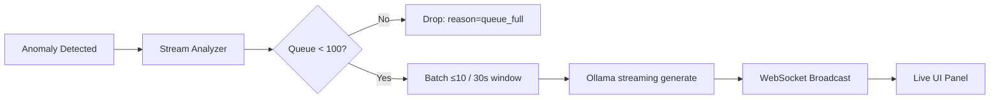
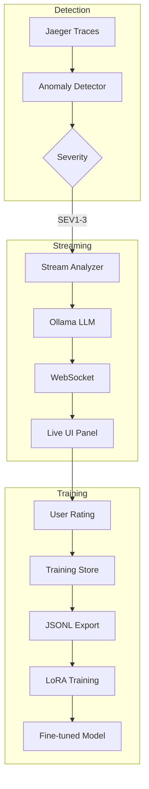

# LLM Observability: Monitoring the AI That Monitors You

*Part of the Proof of Observability series — foundations in [the whitepaper](../OBSERVABILITY_WHITEPAPER.md).*

## Overview

The monitor layer streams anomaly batches to a local LLM for real-time root-cause commentary — and treats that LLM like any other production dependency: metered in Prometheus, bounded by an explicit queue, and load-shedding under pressure with labeled drop reasons. This document covers the local-first design decision, the streaming analysis pipeline, the five `kx_llm_*` metric families that observe it, and the training-data loop that feeds [fine-tuning](04_FINE_TUNING.md).

---

## Why local-first

Analysis runs on Ollama (`llama3.2:1b` by default, overridable via `OLLAMA_MODEL`) as a Docker Compose service — no hosted LLM API anywhere in the loop. Three reasons, in order of importance:

1. **Zero telemetry egress.** [PUBLIC] Analysis prompts embed span attributes, service names, latency numbers, correlated CPU/memory metrics, and log lines. With Ollama on localhost, none of that leaves the host — there is no third-party data-processing relationship to reason about, because there is no third party.

2. **Deterministic paging, unaffected by provider outages.** [PUBLIC] The LLM is advisory, never in the paging critical path. Pages travel Prometheus → Alertmanager → GoAlert/ntfy (see [06 — On-Call Guide](06_TRACING_ONCALL.md)) and fire identically whether the model is up, down, or mid-load. When Ollama is unreachable, [analysis-service.ts](../../server/monitor/analysis-service.ts) returns a placeholder analysis with remediation hints rather than failing the monitor.

3. **An honest CPU budget.** [PUBLIC] Local inference on CPU is slow, and the code says so instead of hiding it: `callOllama` in [analysis-service.ts](../../server/monitor/analysis-service.ts) wraps the request in an `AbortController` with a **300-second timeout**, with the in-code comment *"F16 model on CPU takes ~4-5 minutes per generation"*. Deep RCA is allowed to take minutes; anomaly detection (10-second check cycles) and paging never wait for it.

---

## Real-Time Streaming Analysis

Anomalies flow from the detector into a batching analyzer that streams LLM tokens to the UI over WebSocket:



**Key files:**
- [stream-analyzer.ts](../../server/monitor/stream-analyzer.ts) — batching, use-case detection, Prometheus metrics, load shedding
- [ws-server.ts](../../server/monitor/ws-server.ts) — WebSocket server at `/ws/monitor`
- [analysis-service.ts](../../server/monitor/analysis-service.ts) — deep single-trace RCA (non-streaming, 300 s budget)

**Batching semantics** (constants in [stream-analyzer.ts](../../server/monitor/stream-analyzer.ts)):
- Batches of up to `BATCH_SIZE = 10` anomalies, or whatever accumulated within the `BATCH_TIMEOUT_MS = 30000` (30-second) window
- 9 use-case detection patterns (P0/P1/P2) — payment gateway failure, cert expiry, DoS signature, auth outage, cloud degradation, queue backlog, third-party timeout, DB exhaustion, plus a generic catch-all
- P0 matches fire an immediate WebSocket `critical` alert *before* any LLM call — pattern matching, not inference, guards the urgent path
- Each anomaly's prompt entry embeds its top 5 trace spans by duration so the model can point at the actual bottleneck
- Response tokens stream as NDJSON chunks and broadcast to all connected clients; the completed analysis is also attached to the corresponding Alertmanager alert

---

## The Five `kx_llm_*` Metric Families

The AI layer is itself observed. [stream-analyzer.ts](../../server/monitor/stream-analyzer.ts) exports five Prometheus metric families through the shared registry:

| Metric | Type | Labels | What it tells you |
|--------|------|--------|-------------------|
| `kx_llm_analysis_total` | Counter | `status`, `use_case` | Analysis outcomes per detected use case |
| `kx_llm_events_by_severity_total` | Counter | `severity` (`sev1`–`sev5`) | Anomaly volume reaching the LLM, by severity — the data for tuning the severity threshold |
| `kx_llm_analysis_duration_seconds` | Histogram | — (buckets 1–60 s) | End-to-end batch analysis latency |
| `kx_llm_queue_depth` | Gauge | — | Anomalies waiting for analysis — the saturation indicator |
| `kx_llm_dropped_events_total` | Counter | `reason` (`queue_full` / `llm_error` / `timeout`) | Load shedding, itemized by cause |

All five are **pre-initialized to zero at startup** so they appear in `/metrics` from the first scrape — an absent series means a bug, never ambiguity about whether the counter simply hasn't fired yet.

### Load-shedding semantics

The analysis queue is bounded at `MAX_QUEUE_SIZE = 100`. The failure mode is explicit and measurable:

- **Queue full** → the new anomaly is dropped (never blocks the detector), `kx_llm_dropped_events_total{reason="queue_full"}` increments, and a structured warning is logged with the queue size and anomaly id.
- **Ollama call fails** → the batch is abandoned (no retry into a growing backlog), the failure is broadcast to UI clients, and `reason="llm_error"` increments alongside `kx_llm_analysis_total{status="error"}`.
- `kx_llm_queue_depth` updates on every enqueue and dequeue, so `rate(kx_llm_dropped_events_total[5m]) > 0` is an alertable saturation signal.

The design accepts losing commentary under load rather than losing the monitor.

### Example streamed analysis

Illustrative example in the real output format — the prompt structure below is exactly what `buildBatchPrompt` in [stream-analyzer.ts](../../server/monitor/stream-analyzer.ts) produces; the numbers and the model response are representative, not a captured transcript.

Batch input (2 anomalies):

```
1. [SEV3] kx-exchange:POST /api/v1/orders 1240ms (+5.2σ)
   Trace spans (by duration):
     kx-matcher:process-order 980ms (79%)
     kx-exchange:pg-pool.connect 110ms (9%)
2. [SEV5] kx-wallet:HTTP GET 61ms (+3.1σ)
```

Streamed response:

```
1. Bottleneck: kx-matcher:process-order at 980ms (79% of trace).
   Root cause: order queue backlog — consumer processing slower than publish rate.
   Action: check RabbitMQ queue depth and matcher health; scale the consumer if depth keeps growing.
2. Bottleneck: none dominant; 61ms is only mildly above baseline.
   Root cause: likely cold cache or first-request warmup on kx-wallet.
   Action: monitor; no intervention unless the deviation persists across windows.
```

---

## Training Data Collection

Operators rate each analysis in the Monitor UI (👍 good / 👎 bad, with an optional correction for bad responses). Ratings persist to `data/training-examples.json` via [training-store.ts](../../server/monitor/training-store.ts) and export as JSONL for the [fine-tuning pipeline](04_FINE_TUNING.md).

**Data flow:**
```
Analyze → User Rates → Store to JSON → Export JSONL
```

**API endpoints:**
| Endpoint | Purpose |
|----------|---------|
| `POST /api/v1/monitor/training/rate` | Submit rating |
| `GET /api/v1/monitor/training/stats` | View statistics |
| `GET /api/v1/monitor/training/export` | Download JSONL |

**Export format for corrected examples** — the human correction becomes the training completion, and the model's original answer is kept as `original_completion` for audit:
```json
{
  "prompt": "[full LLM prompt]",
  "completion": "[user's correction]",
  "original_completion": "[LLM's wrong response]",
  "rating": "bad"
}
```

Bad ratings without a correction are skipped at export time — they are noise, not training signal.

---

## Fine-Tuning Pipeline

The full LoRA workflow lives in [04 — Fine-Tuning Guide](04_FINE_TUNING.md). Components:

| File | Purpose |
|------|---------|
| [generate-synthetic-training.cjs](../../scripts/generate-synthetic-training.cjs) | Synthetic data generator (100+ samples) |
| [validate-training-data.cjs](../../scripts/validate-training-data.cjs) | Dataset validation script |
| [generate-training-data.py](../../scripts/generate-training-data.py) | Hand-crafted real examples (22 samples) |
| [axolotl-config.yaml](../../axolotl-config.yaml) | LoRA training config (r=16, α=32) |
| [retrain-model.sh](../../scripts/retrain-model.sh) | End-to-end training pipeline script |

**Training stack:** Axolotl for LoRA fine-tuning · Llama 3.2 1B Instruct as base model · merged model imported into Ollama for deployment.

---

## Architecture Summary



---

## Quick Commands

```bash
# View training stats
curl http://localhost:5000/api/v1/monitor/training/stats

# Export training data from running app
curl http://localhost:5000/api/v1/monitor/training/export > training-data-export.jsonl

# Generate synthetic training data (100 samples) and merge with real data
node scripts/generate-synthetic-training.cjs --count 100

# Validate combined dataset
node scripts/validate-training-data.cjs

# Run training pipeline
./scripts/retrain-model.sh
```

---

## Configuration

| Setting | Value | File |
|---------|-------|------|
| Batch size | 10 anomalies | [stream-analyzer.ts](../../server/monitor/stream-analyzer.ts) |
| Batch window | 30 seconds | [stream-analyzer.ts](../../server/monitor/stream-analyzer.ts) |
| Queue bound | 100 (drops beyond, labeled) | [stream-analyzer.ts](../../server/monitor/stream-analyzer.ts) |
| Streaming generation | temperature 0.7, num_predict 400, repeat_penalty 1.3 | [stream-analyzer.ts](../../server/monitor/stream-analyzer.ts) |
| Deep-RCA timeout | 300 seconds (CPU inference budget) | [analysis-service.ts](../../server/monitor/analysis-service.ts) |
| LLM model | `llama3.2:1b` default, `OLLAMA_MODEL` override | [model-config.ts](../../server/monitor/model-config.ts) |
| LoRA rank | 16 | [axolotl-config.yaml](../../axolotl-config.yaml) |

---

*Previous: [02 — Anomaly Detection: Time-Aware Adaptive Thresholds](02_ANOMALY_DETECTION_DESIGN.md) · Next: [04 — LLM Fine-Tuning Guide](04_FINE_TUNING.md)*
